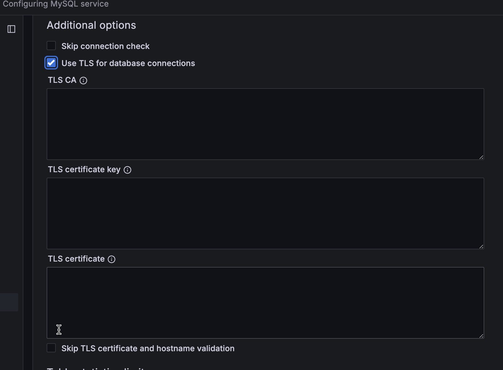

# Connect MySQL databases to PMM

Easily connect your MySQL databases—whether self-hosted or running on AWS EC2—to Percona Monitoring and Management (PMM) for in-depth performance insights.

## Quick setup

Get your MySQL instance connected to PMM in just a few steps:
{.power-number}

1. Create a dedicated MySQL user with the required permissions:

    ```sql
    -- Create PMM user with required permissions
    CREATE USER 'pmm'@'localhost' IDENTIFIED BY 'StrongPassword123!' WITH MAX_USER_CONNECTIONS 10;
    GRANT SELECT, PROCESS, REPLICATION CLIENT, RELOAD ON *.* TO 'pmm'@'localhost';
    FLUSH PRIVILEGES;
    ```

2. Register your MySQL instance with PMM:

    ```sh
    # Add MySQL service to PMM
    pmm-admin add mysql \
      --username=pmm \
      --password=StrongPassword123! \
      --host=localhost \
      --port=3306 \
      --query-source=slowlog \
      --environment=production \
      MySQL-Primary
    ```

3. Verify the connection is working:

    ```sh
    pmm-admin status
    ```

That's it! Your MySQL instance should now appear in PMM dashboards. For advanced configuration options, continue reading below.

## Advanced configuration

PMM Client supports collecting metrics from various MySQL-based database systems:

 - [MySQL][ORACLE_MYSQL]
 - [Percona Server for MySQL][PERCONA_SERVER_MYSQL]
 - [Percona XtraDB Cluster][PERCONA_XTRADB_CLUSTER]
 - [MariaDB][MARIADB]

For monitoring Amazon RDS MySQL instances, see [Connect Amazon RDS instance](../aws.md).

??? info "Setup process at a glance"
    These are the high-level steps for configuring MySQL monitoring in PMM:
    {.power-number}

    1. **[Prerequisites](#prerequisites)**: Ensure PMM Server is running and PMM Client is installed
    2. **[Create PMM user](#create-a-database-account-for-pmm)**: `CREATE USER 'pmm'@'localhost' IDENTIFIED BY '<StrongPassword>'`  
    3. **[Grant permissions](#create-a-database-account-for-pmm)**: `GRANT SELECT, PROCESS, REPLICATION CLIENT, RELOAD ON *.* TO 'pmm'@'localhost'`
    4. **[Configure data source](#configuring-data-sources)**: Enable Slow Query Log or Performance Schema 
    5. **[Add service](#adding-mysql-services-to-pmm)**: Use PMM UI or command line to add the MySQL instance
    6. **[Verify connection](#verifying-the-setup)**: Check PMM Inventory and dashboards for data

### Prerequisites

Before connecting MySQL to PMM, review the prerequisites for your monitoring setup:

=== "Local MySQL monitoring"
    - [PMM Server is installed](../../../install-pmm-server/index.md) and running.
    - [PMM Client is installed](../../../install-pmm-client/index.md) and the [nodes are registered with PMM Server](../../../register-client-node/index.md).
    - `Root`/`sudo` access is required if PMM Client was installed from packages (RPM/DEB) or if you need to access MySQL slow query logs. Non-root access may be sufficient if PMM Client was installed via tarball or if you're only monitoring performance schema metrics

=== "Remote MySQL monitoring"
    - [PMM Server is installed](../../../install-pmm-server/index.md) and running
    - PMM Server has direct network access to the MySQL instance
    - You have a MySQL user with appropriate permissions on the remote MySQL instance.

!!! note "When is `root` access required?"
    Root or `sudo` access on the client host is needed when:
    - PMM Client was installed from RPM or DEB packages
    - you want to monitor MySQL slow query logs (requires file system access)
    - you need to configure system-level monitoring (CPU, memory, disk I/O)

For remote monitoring or when using only Performance Schema metrics, `root` access on the database server itself is not required.

### Security setup

#### Create a database account for PMM

For security best practices, connect PMM Client to your database using a dedicated monitoring user with limited permissions. 

??? info "Password security"
    - Use a strong, unique password for the PMM database user
    - At least 12 characters long
    - Mix of uppercase and lowercase letters
    - Include numbers and special characters
    - Avoid common words or patterns
    - Never use default, test, or example passwords in production

This example creates a pmm user account that has just enough access to collect monitoring data without full administrative privileges:

=== "On MySQL 5.7/MariaDB 10.x"

    ```sql
    CREATE USER 'pmm'@'127.0.0.1' IDENTIFIED BY '<your_strong_password>' WITH MAX_USER_CONNECTIONS 10;
    GRANT SELECT, PROCESS, REPLICATION CLIENT, RELOAD ON *.* TO 'pmm'@'localhost';
    ```

=== "On MySQL 8.0"

    ```sql
    CREATE USER 'pmm'@'localhost' IDENTIFIED BY '<your_strong_password>' WITH MAX_USER_CONNECTIONS 10;
    GRANT SELECT, PROCESS, REPLICATION CLIENT, RELOAD, BACKUP_ADMIN ON *.* TO 'pmm'@'localhost';
    ```

### Choose and configure a source

PMM can collect metrics from two primary sources: Slow query log and Performance Schema.

While you can use both at the same time we recommend using only one--there is some overlap in the data reported, and each incurs a small performance penalty.

The choice depends on the version and variant of your MySQL instance, and how much detail you want to see.

#### Data source comparison

Here are the benefits and drawbacks of Slow query log and Performance Schema metrics sources:

| **Source** | **Best for** | **Advantages** | **Disadvantages** |
|------------|--------------|----------------|-------------------|
| **Slow Query Log** | - Percona Server<br>- When detailed query analysis is critical | ✔ More detailed query information<br>✔ Lower resource impact with query sampling | ⚠ Requires log file access<br>⚠ Log files need management<br>⚠ Higher disk I/O |
| **Performance Schema** | - MySQL 5.6+<br>- MariaDB 10.0+<br>- Production environments with resource constraints | ✔ Lower overhead<br>✔ Faster parsing<br>✔ No file management needed | ⚠ Less detailed query information<br>⚠ Higher memory usage |

#### Version-specific recommendations

| Database server          | Versions       | Recommended source |
|--------------------------|----------------|--------------------|
| MySQL                    | 5.1-5.5        | Slow query log     |
| MySQL                    | 5.6+           | Performance Schema |
| MariaDB                  | 10.0+          | Performance Schema |
| Percona Server for MySQL | 5.7, 8.0       | Slow query log     |
| Percona XtraDB Cluster   | 5.6, 5.7, 8.0  | Slow query log     |

### Configure data source

=== "Slow query log"
        
    The *slow query log* records the details of queries that take more than a certain amount of time to complete. 
    
    With the database server configured to write this information to a file rather than a table, PMM Client parses the file and sends aggregated data to PMM Server via the Query Analytics part of `pmm-agent`.
    
    #### Settings
    
    | Variable | Value | Description |
    |----------|-------|-------------|
    | [`slow_query_log`][sysvar_slow_query_log] | ON | Enables the slow query log. |
    | [`log_output`][sysvar_log_output] | `'FILE'` | Ensures the log is sent to a file. This is the default on MariaDB. |
    | [`long_query_time`][sysvar_long_query_time] | 0 | The slow query threshold in seconds. In heavily-loaded applications, many quick queries can affect performance more than a few slow ones. Setting this value to `0` ensures all queries are captured. |
    | [`log_slow_admin_statements`][sysvar_log_slow_admin_statements] | ON | Includes the logging of slow administrative statements. |
    | [`log_slow_slave_statements`][sysvar_log_slow_slave_statements] | ON | Enables logging for queries that have taken more than `long_query_time` seconds to execute on the replica. |
    
    === "Basic configuration"
    
        Add these settings to your MySQL configuration file (my.cnf/my.ini):
        
        ```ini
        # Enable slow query logging
        slow_query_log = ON
        log_output = FILE
        
        # Log all queries (0 seconds threshold)
        long_query_time = 0
        
        # Include administrative and replica statements
        log_slow_admin_statements = ON
        log_slow_slave_statements = ON
        ```
        
        Alternatively, set these variables at runtime:
        
        ```sql
        SET GLOBAL slow_query_log = 1;
        SET GLOBAL log_output = 'FILE';
        SET GLOBAL long_query_time = 0;
        SET GLOBAL log_slow_admin_statements = 1;
        SET GLOBAL log_slow_slave_statements = 1;
        ```
    
    === "Extended configuration (Percona Server/XtraDB)"
    
        For Percona Server for MySQL (5.7+, 8.0+) and Percona XtraDB Cluster, add these additional settings:
        
        | Variable | Value | Description |
        |----------|-------|-------------|
        | [`log_slow_rate_limit`][log_slow_rate_limit] | 100 | Defines the rate of queries captured by the *slow query log*. A good rule of thumb is 100 queries logged per second. For example, if your Percona Server instance processes 10,000 queries per second, you should set `log_slow_rate_limit` to `100` and capture every 100th query for the *slow query log*. |
        | [`log_slow_rate_type`][log_slow_rate_type] | `'query'` | Set so that it applies to queries, rather than sessions. |
        | [`slow_query_log_always_write_time`][slow_query_log_always_write_time] | 1 | Specifies which queries should ignore sampling. With query sampling this ensures that queries with longer execution time will always be captured by the slow query log. |
        | [`log_slow_verbosity`][log_slow_verbosity] | `'full'` | Ensures that all information about each captured query is stored in the slow query log. |
        | [`slow_query_log_use_global_control`][slow_query_log_use_global_control] | `'all'` | Configure the slow query log during runtime and apply these settings to existing connections. |
        
        ??? example "Configuration file example"
            ```ini
            # Sample 1% of queries (1 out of 100)
            log_slow_rate_limit = 100
            log_slow_rate_type = 'query'
            
            # Always log queries slower than 1 second regardless of sampling
            slow_query_log_always_write_time = 1
            
            # Store comprehensive query information
            log_slow_verbosity = 'full'
            
            # Apply settings to existing connections
            slow_query_log_use_global_control = 'all'
            ```
        
        ??? example "Session example"
            ```sql
            SET GLOBAL log_slow_rate_limit = 100;
            SET GLOBAL log_slow_rate_type = 'query';
            SET GLOBAL slow_query_log_always_write_time = 1;
            SET GLOBAL log_slow_verbosity = 'full';
            SET GLOBAL slow_query_log_use_global_control = 'all';
            ```
    
    #### Slow query log rotation
    
    The slow query log can grow quickly in size, potentially affecting your system performance. To manage this, PMM Client can automatically rotate the log files to prevent them from becoming too large, or you can choose to manage log rotation yourself:
    
    === "Automatic log rotation"
    
        To configure automatic rotation when adding a service, use the `--size-slow-logs` option with the `pmm-admin` command. This option sets the size threshold at which the slow query log file will be rotated. 
        
        The size is specified as a number followed by a suffix (e.g., `10M` for 10 megabytes). For detailed syntax, refer to [pmm-admin add mysql](../../../../use/commands/pmm-admin.md#mysql).
    
        When the log reaches the specified size, PMM Client will:
    
        - Remove the previous `.old` slow query log file.
        - Rename the current log file by appending the `.old` suffix.
        - Execute the MySQL `FLUSH LOGS` command to finalize the rotation.
        - Only one `.old` file is retained at a time, and older versions are automatically deleted.
    
    === "Manual log rotation" 
        If you prefer to handle log rotation manually, such as with [logrotate][LOGROTATE], you can disable PMM Client's automatic log rotation. To do this, set a negative value for the `--size-slow-logs` option when adding a service with the `pmm-admin add` command.

=== "Performance Schema"
        
    To configure a MySQL-based database server to use Performance Schema as a source of metrics:
    
    #### Applicable versions
    
    - **Percona Server for MySQL**: 5.6, 5.7, 8.0
    - **Percona XtraDB Cluster**: 5.6, 5.7, 8.0
    - **MariaDB**: [10.3+][mariadb_perfschema_instr_table]
    
    PMM's [MySQL Performance Schema Details dashboard](../../../../reference/dashboards/dashboard-mysql-performance-schema-details.md) charts the various [`performance_schema`][performance-schema-startup-configuration] metrics.
    
    To use **Performance Schema**, set these variables:
    
    | Variable                                                                                   | Value              | Description
    |--------------------------------------------------------------------------------------------|--------------------|---------------------------------------------------------------------------------
    | [`performance_schema`][sysvar_performance_schema]                                          | `ON`               | Enables *Performance Schema* metrics. This is the default in MySQL 5.6.6 and higher.
    | [`performance-schema-instrument`][perfschema-instrument]                                   | `'statement/%=ON'` | Configures Performance Schema instruments.
    | [`performance-schema-consumer-statements-digest`][perfschema-consumer-statements-digest]   | `ON`               | Configures the `statements-digest` consumer.
    | [`innodb_monitor_enable`][sysvar_innodb_monitor_enable]                                    | all                | Enables InnoDB metrics counters.
    
    ??? info "MySQL Performance Schema configuration examples"
    
        - Configuration file:
    
            ```ini
            performance_schema=ON
            performance-schema-instrument='statement/%=ON'
            performance-schema-consumer-statements-digest=ON
            innodb_monitor_enable=all
            ```
    
        - Session:
    
            (`performance_schema` cannot be set in a session and must be set at server start-up.)
    
            ```sql
            UPDATE performance_schema.setup_consumers
            SET ENABLED = 'YES' WHERE NAME LIKE '%statements%';
            SET GLOBAL innodb_monitor_enable = all;
            ```
    
    #### MariaDB 10.5.7 or lower
    
    There is no **Explain** or **Example** data shown by default in Query Analytics when monitoring MariaDB instances version 10.5.7 or lower. A workaround is to set this variable.
    
    | Variable                                                                  | Value           | Description
    |---------------------------------------------------------------------------|-----------------|-----------------------------
    | [`performance_schema.setup_instruments`][mariadb_perfschema_instr_table]  | `'statement/%'` | List of instrumented object classes.
    
    ##### Session
    
    ```sql
    UPDATE performance_schema.setup_instruments SET ENABLED = 'YES', TIMED = 'YES' WHERE NAME LIKE 'statement/%';
    UPDATE performance_schema.setup_consumers SET ENABLED = 'YES' WHERE NAME LIKE '%statements%';
    ```
    
    ##### Transactions
    
    MariaDB doesn't implement queries history for transactions. All queries executed within a transaction won't have query examples since PMM relies on the `performance_schema.events_statements_history` to grab the query example but that table won't have any query executed as part of a transaction.  
    
    This behavior is because MariaDB doesn't implement these consumers:
    
    ```
    events_transactions_current
    events_transactions_history
    events_transactions_history_long
    ```

### Query response time

**Query time distribution** is a chart in the [**Details** tab of Query Analytics](../../../../use/qan/panels/details.md#details-tab) showing the proportion of query time spent on various activities. It is enabled with the `query_response_time_stats` variable and associated plugins.

#### Supported versions

- **Percona Server for MySQL**: 5.7 (available through Post-EOL support program)
- **NOT** available in Percona Server for MySQL 8.0 ([removed features][PS_FEATURES_REMOVED])
- **MariaDB**: 10.0.4

!!! warning "Limited version support"   
    This feature is not available in current Percona Server 8.0. Use this information only if you are using Percona Server 5.7 through our Post-EOL support program, where it remains actively supported.

### Required variable

To enable query time distribution charts, set the `[query_response_time_stats][ps_query_response_time_stats] = ON` and install the plugin.

#### Plugin installation

Before installing the plugins, ensure you have the necessary plugin files and run these commands in your MySQL session:
{.power-number}

1. Check that `/usr/lib/mysql/plugin/query_response_time.so` exists.
2. Install the plugins and activate:

    === "For MariaDB 10.3" 
        For [MariaDB 10.3][mariadb_query_response_time], run:
        ```sql
        INSTALL PLUGIN QUERY_RESPONSE_TIME_AUDIT SONAME 'query_response_time.so';
        INSTALL PLUGIN QUERY_RESPONSE_TIME SONAME 'query_response_time.so';
        SET GLOBAL query_response_time_stats = ON;
        ```

    ===  "For Percona Server for MySQL 5.7"
     For [Percona Server for MySQL 5.7][ps_query_response_time_stats], run: 
        ```sql
        INSTALL PLUGIN QUERY_RESPONSE_TIME_AUDIT SONAME 'query_response_time.so';
        INSTALL PLUGIN QUERY_RESPONSE_TIME SONAME 'query_response_time.so';
        INSTALL PLUGIN QUERY_RESPONSE_TIME_READ SONAME 'query_response_time.so';
        INSTALL PLUGIN QUERY_RESPONSE_TIME_WRITE SONAME 'query_response_time.so';
        SET GLOBAL query_response_time_stats = ON;
        ```

### Tablestats

Some table metrics are automatically disabled when the number of tables exceeds a default limit of 1000 tables. This prevents PMM Client from affecting the performance of your database server.

You can change the limit [when configuring MySQL performance improvements](../mysql/improve_perf.md) with the following options:

| `pmm-admin` option             | Description
|--------------------------------|--------------------------------------------------------------------------
| `--disable-tablestats`         | Disables tablestats collection when the default limit is reached.
| `--disable-tablestats-limit=N` | Sets the number of tables (`N`) for which tablestats collection is disabled. 0 means no limit. A negative number means tablestats is completely disabled (for any number of tables).

### User statistics

#### Applicable versions

User activity, individual table and index access details are shown on the [MySQL User Details][DASH_MYSQLUSERDETAILS] dashboard when the `userstat` variable is set:

- Percona Server for MySQL: 5.6, 5.7, 8.0
- Percona XtraDB Cluster: 5.6, 5.7, 8.0
- MariaDB: 5.2.0+

??? info "MySQL user statistics configuration examples"

    - Configuration file: `userstat=ON`.

    - Session: `SET GLOBAL userstat = ON;`


### Add service to PMM

After creating your PMM database user, you can quickly add your MySQL service to PMM. You can do this either through the PMM user interface or via the command line.

=== "Using the PMM user interface"

    To add the service from the user interface:
    {.power-number}
    
    1. Go to **PMM Configuration > PMM Inventory > Add Service**.
    
    2. Select **MySQL** service type.
    
    3. Enter or select values for the fields:
        - **Service Name**: A descriptive name for your MySQL instance
        - **Host/Socket**: Use `localhost` for local monitoring or hostname/IP for remote monitoring
        - **Port**: MySQL port (default: 3306)
        - **Username**: The PMM user created earlier
        - **Password**: Your PMM user password
        - **Query Source**: Choose between **Slow Log** or **Performance Schema**
        - **PMM Agent**: Select which PMM agent should monitor this instance
    
    4. Click **Add Service**.

    5. If using TLS, check **Use TLS for database connections** and fill in your TLS certificates and key information. 
    

=== "Using the command line"

    === "Basic setup"
    
        Add a local MySQL instance with default settings:
        
        ```sh
        pmm-admin add mysql \
          --username=pmm \
          --password=StrongPassword \
          --host=localhost \
          --port=3306 \
          --query-source=slowlog \
          MySQL-Primary
        ```
    
    === "Remote monitoring"
    
        Add a remote MySQL instance:
        
        ```sh
        pmm-admin add mysql \
          --username=pmm \
          --password=StrongPassword \
          --host=remote-mysql.example.com \
          --port=3306 \
          --query-source=perfschema \
          --environment=production \
          Remote-MySQL
        ```
    
    === "With custom labels"
    
        Add an instance with environment and custom labels:
        
        ```sh
        pmm-admin add mysql \
          --username=pmm \
          --password=StrongPassword \
          --host=localhost \
          --port=3306 \
          --query-source=slowlog \
          --environment=production \
          --custom-labels="role=primary,datacenter=east" \
          MySQL-Primary
        ```
    
    === "TLS connection"
    
        Add an instance with TLS security:
        
        ```sh
        pmm-admin add mysql \
          --username=pmm \
          --password=StrongPassword \
          --host=mysql-server.example.com \
          --port=3306 \
          --tls \
          --tls-ca=/path/to/ca.pem \
          --tls-cert=/path/to/client-cert.pem \
          --tls-key=/path/to/client-key.pem \
          --query-source=slowlog \
          MySQL-TLS
        ```

### After adding the service

Upon successful addition, PMM Client will display a confirmation message:

```sh
MySQL Service added
Service ID  : /service_id/abcd1234-5678-efgh-ijkl-mnopqrstuvwx
Service name: MySQL-Primary
```

## Verify your MySQL service
After adding your MySQL service to PMM, it's important to verify that it's properly connected and collecting data.

#### Check service status

=== "Via command line"
    Use these commands to manage and monitor your MySQL services:
    {.power-number}

    1. List all MySQL services and their status:
       ```bash
       pmm-admin inventory list services --service-type=mysql
       ```

    2. Find more detailed information about a specific service:
       ```bash
       pmm-admin describe service --service-name="MySQL-Service-Name"
       ```

    3. Check the overall PMM Client status:
       ```bash
       pmm-admin status
       ```

=== "Via web UI"
    To verify your service in the web interface:
    {.power-number}

    1. Navigate to **PMM Configuration > PMM Inventory**.
    2. In the **Services** tab, find your newly added MySQL service.
    3. Verify the **Service Name** and **Address** match your configuration.
    4. Check the **Status** column shows as *Active*.
    5. In the **Options** column, expand the **Details** section to confirm:
        - the correct agents are running
        - your selected query source (Slow Log or Performance Schema) is active

#### Verify data collection

Once the service is confirmed as active, verify that metrics are being properly collected:

=== "General MySQL metrics"
    To verify basic MySQL metrics are being collected:
    {.power-number}

    1. Open the **MySQL Instance Summary** dashboard
    2. Select your MySQL service from the **Service Name** dropdown
    3. Confirm that metrics are appearing on the dashboard
    4. Check that the graphs show recent data (within the last few minutes)

=== "Database-specific metrics"

    **For Percona Server for MySQL or MariaDB:**
    
    If you installed the Query Response Time plugin, verify it:
    {.power-number}

    1. Open the **MySQL Query Response Time Details** dashboard
    2. Select your service from the dropdown
    3. Alternatively, go to **Query Analytics**, select a query, and check for the **Query time distribution** bar
    
    **For Percona XtraDB Cluster:**
    To verify XtraDB Cluster monitoring:
    {.power-number}

    1. Open the [**PXC/Galera Cluster Summary** dashboard][DASH_PXCGALERACLUSTER]
    2. Select your cluster service from the dropdown
    3. Verify that cluster-specific metrics are being displayed

## Related topics

- [Percona Server for MySQL -- slow query log extended][ps_slow_query_ext]
- [Percona Server for MySQL -- user statistics][ps_userstats]
- [MariaDB -- Slow query log overview][mariadb_slow_query_log]
- [MariaDB -- Slow query log extended statistics][mariadb_slow_query_ext]
- [MariaDB -- User statistics][mariadb_userstats]
- [PERFORMANCE_SCHEMA vs Slow Query Log: performance impact][BLOG_PS_VS_SLOW]
- [Understanding MySQL's INNODB_METRICS table][BLOG_INNODB_METRICS]
- [Rotating MySQL slow logs safely][BLOG_LOG_ROTATION]
- [Impact of logging on MySQL's performance][BLOG_LOGGING]
- [Running custom MySQL queries in PMM][BLOG_CUSTOM_QUERIES_MYSQL]

[DASH_MYSQLUSERDETAILS]: ../../../../reference//dashboards/dashboard-mysql-user-details.md
[DASH_PXCGALERACLUSTER]: ../../../../reference/dashboards/dashboard-pxc-galera-cluster-summary.md
[LOGROTATE]: https://linux.die.net/man/8/logrotate
[PERCONA_SERVER_MYSQL]: https://www.percona.com/software/mysql-database/percona-server
[PERCONA_XTRADB_CLUSTER]: https://www.percona.com/software/mysql-database/percona-xtradb-cluster
[ORACLE_MYSQL]: https://www.mysql.com/
[MARIADB]: https://mariadb.org/
[BLOG_CUSTOM_QUERIES_MYSQL]: https://www.percona.com/blog/2020/06/10/running-custom-queries-in-percona-monitoring-and-management/
[BLOG_INNODB_METRICS]: https://www.percona.com/blog/2014/11/18/mysqls-innodb_metrics-table-how-much-is-the-overhead/
[BLOG_LOGGING]: https://www.percona.com/blog/2009/02/10/impact-of-logging-on-mysql%E2%80%99s-performance/
[BLOG_LOG_ROTATION]: https://www.percona.com/blog/2013/04/18/rotating-mysql-slow-logs-safely/
[BLOG_PS_VS_SLOW]: https://www.percona.com/blog/2014/02/11/performance_schema-vs-slow-query-log/
[PS_FEATURES_REMOVED]: https://www.percona.com/doc/percona-server/LATEST/changed_in_version.html
[ps_slow_query_ext]: https://docs.percona.com/percona-server/latest/slow-extended.html
[ps_query_response_time_stats]: https://www.percona.com/doc/percona-server/5.7/diagnostics/response_time_distribution.html#usage
[ps_userstats]: https://docs.percona.com/percona-server/latest/user-stats.html
[mariadb_slow_query_log]: https://mariadb.com/kb/en/slow-query-log-overview/
[mariadb_slow_query_ext]: https://mariadb.com/kb/en/slow-query-log-extended-statistics/
[mariadb_query_response_time]: https://mariadb.com/kb/en/query-response-time-plugin/
[mariadb_perfschema_instr_table]: https://mariadb.com/kb/en/performance-schema-setup_instruments-table/
[mariadb_userstats]: https://mariadb.com/kb/en/user-statistics/
[log_slow_rate_limit]: https://www.percona.com/doc/percona-server/LATEST/slow-extended.html?h=log_slow_rate_limit#log_slow_rate_limit
[log_slow_rate_type]: https://docs.percona.com/percona-server/latest/slow-extended.html?h=log_slow_rate_limit#log_slow_rate_limit
[log_slow_verbosity]: https://docs.percona.com/percona-server/latest/slow-extended.html?h=log_slow_rate_limit#log_slow_verbosity
[slow_query_log_always_write_time]: https://docs.percona.com/percona-server/latest/slow-extended.html?h=log_slow_rate_limit#slow_query_log_always_write_time
[slow_query_log_use_global_control]: https://docs.percona.com/percona-server/latest/slow-extended.html?h=log_slow_rate_limit#slow_query_log_use_global_control
[sysvar_innodb_monitor_enable]: https://dev.mysql.com/doc/refman/5.7/en/innodb-parameters.html#sysvar_innodb_monitor_enable
[sysvar_log_output]: https://dev.mysql.com/doc/refman/8.0/en/server-system-variables.html#sysvar_log_output
[sysvar_log_slow_admin_statements]: https://dev.mysql.com/doc/refman/8.0/en/server-system-variables.html#sysvar_log_slow_admin_statements
[sysvar_log_slow_slave_statements]: https://dev.mysql.com/doc/refman/8.0/en/replication-options-replica.html#sysvar_log_slow_slave_statements
[sysvar_long_query_time]: https://dev.mysql.com/doc/refman/8.0/en/server-system-variables.html#sysvar_long_query_time
[sysvar_slow_query_log]: https://dev.mysql.com/doc/refman/8.0/en/server-system-variables.html#sysvar_slow_query_log
[sysvar_performance_schema]: https://dev.mysql.com/doc/refman/5.7/en/performance-schema-system-variables.html#sysvar_performance_schema
[performance-schema-statement-tables]: https://dev.mysql.com/doc/refman/5.7/en/performance-schema-statement-tables.html
[performance-schema-startup-configuration]: https://dev.mysql.com/doc/refman/5.7/en/performance-schema-startup-configuration.html
[perfschema-instrument]: https://dev.mysql.com/doc/refman/5.7/en/performance-schema-options.html#option_mysqld_performance-schema-instrument
[perfschema-consumer-statements-digest]: https://dev.mysql.com/doc/refman/5.7/en/performance-schema-options.html#option_mysqld_performance-schema-consumer-statements-digest
