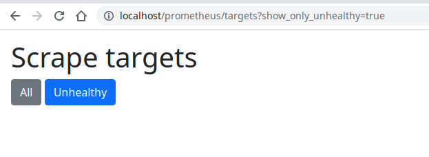
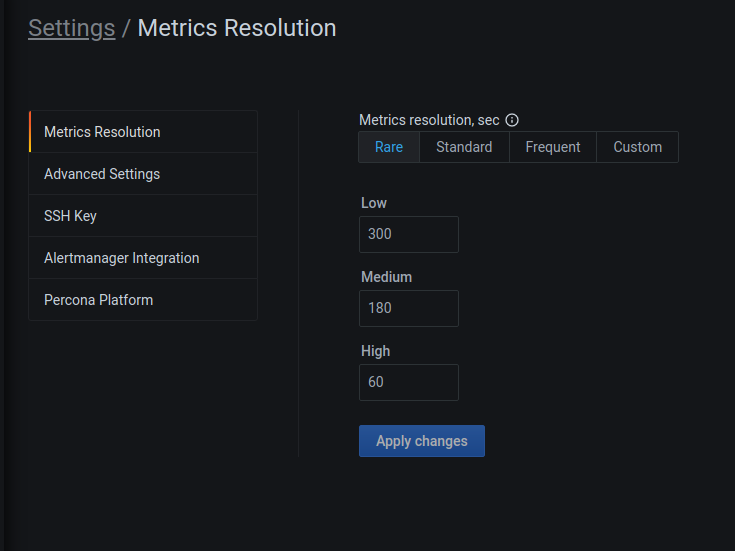

# Connect a remote instance

## Recommended resolution settings
When monitoring remote instances (including RDS and Google Cloud databases), network latency can affect data collection and cause timeout errors. For this reason, it is recommended to [lower the metrics resolution](../../../configure-pmm/metrics_res.md).

PMM dynamically sets scrape timeouts based on the data collection resolution:

- FHigh frequency collection (≤ 2 seconds resolution): 1 second timeout
- Medium frequency collection (≤ 10 seconds resolution): (resolution - 1) second timeout. Example: For 10 second resolution, timeout is 9 seconds
- Low frequency collection (> 10 seconds resolution): 90% of the resolution. Example: For 60 second resolution, timeout is 54 seconds

## Troubleshooting scrape timeouts

If dashboards show no data despite proper setup, check for scrape target failures:
{.power-number}

1. Browse to `http://<your-pmm-server-address>/prometheus/targets`.
2. Click the **Unhealthy** button to filter problematic agents. 

3. Review error messages and scrape durations:

In the example:

- error shows **context deadline exceeded** 
- scrape duration column says the scrape took 10 seconds. This means that the exporter didn't respond in the 10 seconds the scrape process was allowed to run due to the configured metric resolutions and their timeouts.

## Resolving timeout issues
If you see timeout errors, increase the metric resolution values in PMM:

Higher resolution values (lower collection frequency) provide more time for remote agents to respond, reducing timeout errors while maintaining effective monitoring.RetryClaude can make mistakes. Please double-check responses.