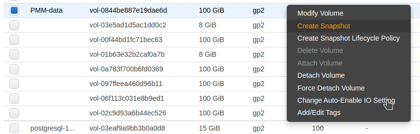

# Backup PMM Server

All data are stored in the `/srv` partition, so it's enough to back the PMM data volume.
You can create a point-in-time snapshot of the volume and use it for data backup.

To create a snapshot, see [Create Amazon EBS snapshots](https://docs.aws.amazon.com/AWSEC2/latest/UserGuide/ebs-creating-snapshot.html) in the Amazon documentation.

