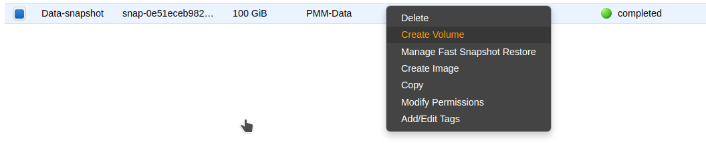
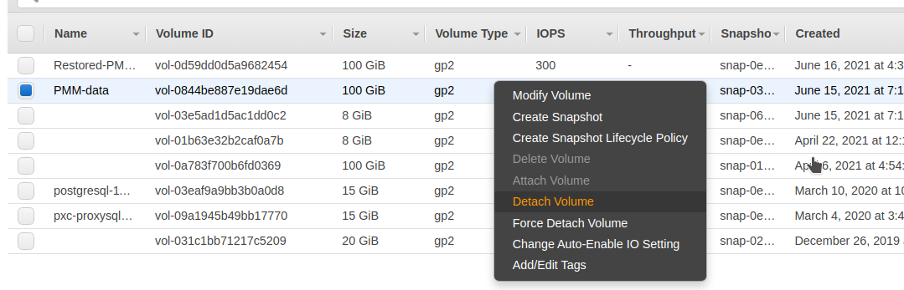
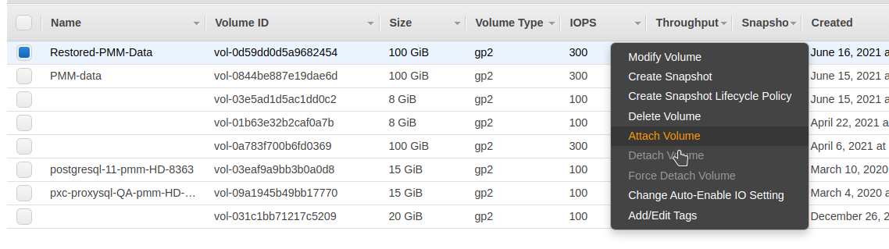
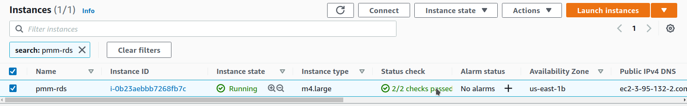
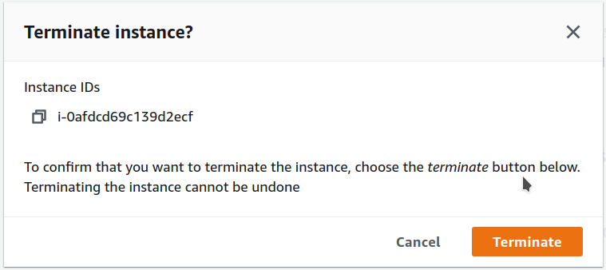

# Configure PMM Server on AWS

Complete the essential security configuration, user management, and ongoing maintenance for your PMM Server deployment on AWS.

## Prerequisites

Before configuring your PMM Server, ensure you have:

- completed [planning your PMM Server deployment](../aws/plan_aws.md) including instance sizing, storage, and network requirements
- successfully [deployed PMM Server from AWS Marketplace](../aws/deploy_aws.md) 
- completed the [initial login and changed default credentials](../aws/deploy_aws.md#initial-pmm-server-access)
- your PMM Server instance running and accessible via HTTPS

## Secure your deployment

### Configure SSL/TLS

Replace the self-signed certificate with a proper SSL certificate for production.

=== "Let's Encrypt certificate (free)"
    {.power-number}

    1. Make sure that the domain name pointing to your PMM Server IP.
    2. Check that port 80 temporarily open for certificate validation.
    3. Install and configure:
    ```bash
    # Install certbot
    sudo apt update
    sudo apt install certbot

    # Stop PMM temporarily
    sudo docker stop pmm-server

    # Obtain certificate (replace yourdomain.com)
    sudo certbot certonly --standalone -d pmm.yourdomain.com

    # Configure PMM to use the certificate
    sudo cp /etc/letsencrypt/live/pmm.yourdomain.com/fullchain.pem /srv/pmm-certs/certificate.crt
    sudo cp /etc/letsencrypt/live/pmm.yourdomain.com/privkey.pem /srv/pmm-certs/certificate.key
    sudo chown pmm:pmm /srv/pmm-certs/certificate.*
    sudo chmod 600 /srv/pmm-certs/certificate.*

    # Restart PMM Server
    sudo docker start pmm-server
    ```

=== "Commercial certificate"
    If you have a commercial SSL certificate:
    {.power-number}

    1. Upload certificate files:
       ```bash
       scp -i /path/to/your-key.pem certificate.crt admin@<instance-ip>:/tmp/
       scp -i /path/to/your-key.pem private.key admin@<instance-ip>:/tmp/
       ```

    2. Install certificates:
       ```bash
       sudo mv /tmp/certificate.crt /srv/pmm-certs/
       sudo mv /tmp/private.key /srv/pmm-certs/certificate.key
       sudo chown pmm:pmm /srv/pmm-certs/certificate.*
       sudo chmod 600 /srv/pmm-certs/certificate.*
       sudo docker restart pmm-server
       ```

### Harden network access

Configure the operating system-level firewall on your PMM Server instance to further restrict access to required ports. This adds an additional layer of security beyond AWS Security Groups.


```sh
# SSH to PMM Server
ssh -i /path/to/your-key.pem admin@<your-instance-ip>

# Configure firewall rules
sudo ufw allow 22/tcp    # SSH access
sudo ufw allow 443/tcp   # HTTPS PMM interface
sudo ufw --force enable
```
## Manage users and access

After the initial setup, create additional user accounts in PMM for your team members. Follow the principle of least privilege when assigning user roles.
{.power-number}

1. Go to **Administration > Users and access > Users**.
2. Click **New user** and configure the user with an appropriate role:

   - **Admin**: Full system access
   - **Editor**: Dashboard editing, no system config
   - **Viewer**: Read-only access

3. Limit access based on job responsibilities and use viewer accounts for stakeholders who only need to see metrics.

## Configure network and IP

By default, your EC2 instance will have a private IP for internal VPC network access. You can configure your PMM Server to use only a private IP or a static Elastic IP.

### Use a private IP only

=== "During EC2 instance creation"
    To use only the private IP for your EC2 instance during EC2 instance creation:
    {.power-number}

    1. In the **Network Settings** section, uncheck **Auto-assign public IP**.
    2. Do not assign an Elastic IP to the instance.
    3. To access PMM Server using only a private IP, ensure you're connected to your VPC and use the private IP address for access. 

=== "For an existing instance"
    To use only the private IP for an existing instance:
    {.power-number}

    1. If a public IP is assigned, remove it by disassociating it in the EC2 console.
    2. If an Elastic IP is assigned, disassociate it from the instance.
    3. To access PMM Server using only a private IP, ensure you're connected to your VPC and use the private IP address for access. 

### Use an Elastic IP 

For a static, public-facing IP address:
{.power-number}

1. Allocate an Elastic IP address in the EC2 console.
2. Associate the Elastic IP address with your EC2 instance's network interface ID. 

Associating a new Elastic IP to an instance with an existing Elastic IP will disassociate the old one, but it will remain allocated to your account.

For detailed information on EC2 instance IP addressing, see the [AWS documentation on using instance addressing](https://docs.aws.amazon.com/AWSEC2/latest/UserGuide/using-instance-addressing.html).


## Resize storage as needed the EBS volume

If more storage is required, increase the available disk space:
{.power-number}

1. Your AWS instance comes with a predefined size which can become a limitation. To increase the size of the EBS volume attached to your instance, see [Modifying the size, IOPS, or type of an EBS volume on Linux](https://docs.aws.amazon.com/AWSEC2/latest/UserGuide/ebs-modify-volume.html).

2. After updating the EBS volume, PMM Server will auto-detect changes within approximately 5 minutes and reconfigure itself.

## Configure PMM Clients 

### Set server URL 

Configure the PMM Server URL for client connections:

=== "Public deployment"
    ```bash
    PMM_SERVER_URL="https://<elastic-ip-or-domain>:443"
    ```

=== "Private deployment"
    ```bash
    PMM_SERVER_URL="https://<private-ip>:443"
    ```

### Configure authentication

PMM Client authentication uses the same credentials you set for the web interface:

```bash
# Example PMM Client configuration command
pmm-admin config --server-insecure-tls --server-url=https://admin:your-password@<pmm-server-ip>:443
```

### Test connection

Test PMM Client connectivity:

```bash
# Test PMM Server connectivity
curl -k https://<pmm-server-ip>:443/ping
# Expected response: "OK"

# Test API authentication
curl -k -u admin:your-password https://<pmm-server-ip>:443/v1/readyz
# Expected response: {"status":"ok"}
```

## Set up RDS monitoring

To configure security groups for RDS access:
{.power-number}

1. Modify your RDS security group to add inbound rule: MySQL/Aurora (3306) from PMM security group.
2. Test connectivity:
   ```bash
   # From PMM Server
   nc -zv your-rds-endpoint.amazonaws.com 3306
   ```
3. Add RDS instance in PMM using the RDS endpoint hostname. 


## Optimize memory allocation

To optimize memory allocation based on instance size:

```bash
# Check current memory usage
free -h
docker stats pmm-server

# For t3.medium (4GB RAM), adjust memory limits:
# Prometheus: 1GB, ClickHouse: 1GB, Grafana: 512MB
```
Scale memory allocations proportionally for larger instances.

## Back up and restore 

To restore PMM Server from a backup:
{.power-number}

1. Create a new volume using the latest snapshot of the PMM data volume:



2. Stop the PMM Server instance.

3. Detach the current PMM data volume:



4. Attach the new volume:



5. Start the PMM Server instance.

!!! note "Recovery time"
    The restore process typically takes 5-15 minutes depending on volume size and AWS region performance.

## Remove or terminate your instance

To permanently delete PMM Server:
{.power-number}

1. Create final backup:
   ```bash
   aws ec2 create-snapshot --volume-id $DATA_VOLUME_ID --description "Final backup before termination"
    ```
2. Disconnect all PMM clients:
   ```bash
    # On each monitored server
    pmm-admin remove --all
    ```
3. Export configuration:
   ```bash
    sudo docker exec pmm-server pmm-admin summary > pmm-final-config.txt
    ```
4. Stop PMM services:
   ```bash
   sudo docker stop pmm-server
   ```
5. Terminate the instance:
   ```bash
   aws ec2 terminate-instances --instance-ids i-1234567890abcdef0
   ```
6. Clean up resources:

   ```bash
   # Release Elastic IP if using one
   aws ec2 release-address --allocation-id eipalloc-12345678\
   ```
!!! danger alert alert-danger "Data loss warning"
    Instance termination permanently deletes all data. Ensure you have completed all backup procedures before terminating an instance.

## Remove PMM Server from AWS

To permanently delete your PMM Server instance and clean up resources:

=== "From the AWS console (UI)"
{.power-note}

1. Go to the **EC2 Console**.
2. Find the instance you want to remove.

    

3. Open the **Instance state** menu and select **Terminate instance**.

    

4. Confirm termination.

    

=== "From AWS CLI"
{.power-note}

1. Create a final backup:
   ```bash
   aws ec2 create-snapshot --volume-id $DATA_VOLUME_ID --description "Final backup before termination"
   ```
2. Disconnect all PMM clients:
   ```bash
    # On each monitored server
    pmm-admin remove --all
    ```

3. Export configuration:
   ```bash
    sudo docker exec pmm-server pmm-admin summary > pmm-final-config.txt
   ```
4. Stop PMM services:
   ```bash
   sudo docker stop pmm-server
   ```

5. Terminate the instance:
   ```bash
   aws ec2 terminate-instances --instance-ids i-1234567890abcdef0
   ```
6. Clean up AWS resources (optional):
   ```bash
    # Release Elastic IP if allocated
    aws ec2 release-address --allocation-id eipalloc-12345678
   ```
   
## Next steps

With your PMM Server fully configured and secured:

- [Configure PMM clients](../../../install-pmm-client/index.md) to start monitoring your infrastructure
- [Register client nodes](../../../register-client-node/index.md) with your PMM Server
- [Configure SSL certificates](../../../../admin/security/ssl_encryption.md) for production use
- [Set up monitoring alerts](../../../../alert/index.md) for proactive monitoring


