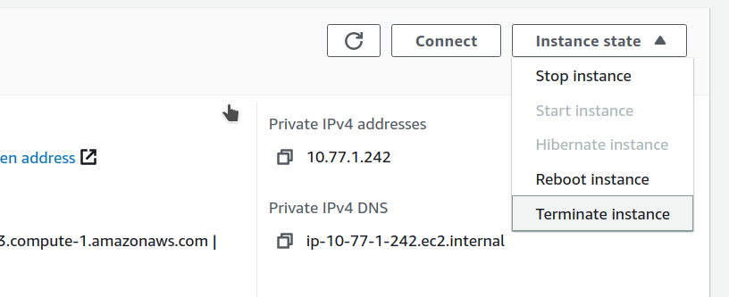

# Configure PMM Server on AWS

Complete the essential security configuration, user management, and ongoing maintenance for your PMM Server deployment on AWS.

## Prerequisites

Before configuring your PMM Server, ensure you have:

- completed [planning your PMM Server deployment](../aws/plan_aws.md) including instance sizing, storage, and network requirements
- successfully [deployed PMM Server from AWS Marketplace](../aws/deploy_aws.md) 
- completed the [initial login and changed default credentials](../aws/deploy_aws.md#initial-pmm-server-access)
- your PMM Server instance running and accessible via HTTPS

## Secure your deployment

### Configure SSL/TLS

Replace the self-signed certificate with a proper SSL certificate for production.

=== "Let's Encrypt certificate"
    If you want to use a free Let's Encrypt certificate:
    {.power-number}

    1. Make sure that the domain name is pointing to your PMM Server's IP address.
    2. Check that port 80 is temporarily opened for certificate validation.
    3. Install and configure:
    ```bash
    # Install certbot
    sudo apt update
    sudo apt install certbot

    # Stop PMM temporarily
    sudo docker stop pmm-server

    # Obtain certificate (replace yourdomain.com)
    sudo certbot certonly --standalone -d pmm.yourdomain.com

    # Configure PMM to use the certificate
    sudo cp /etc/letsencrypt/live/pmm.yourdomain.com/fullchain.pem /srv/pmm-certs/certificate.crt
    sudo cp /etc/letsencrypt/live/pmm.yourdomain.com/privkey.pem /srv/pmm-certs/certificate.key
    sudo chown pmm:pmm /srv/pmm-certs/certificate.*
    sudo chmod 600 /srv/pmm-certs/certificate.*

    # Restart PMM Server
    sudo docker start pmm-server
    ```

=== "Commercial certificate"
    If you have a commercial SSL certificate:
    {.power-number}

    1. Upload certificate files:
       ```bash
       scp -i /path/to/your-key.pem certificate.crt admin@<instance-ip>:/tmp/
       scp -i /path/to/your-key.pem private.key admin@<instance-ip>:/tmp/
       ```

    2. Install certificates:
       ```bash
       sudo mv /tmp/certificate.crt /srv/pmm-certs/
       sudo mv /tmp/private.key /srv/pmm-certs/certificate.key
       sudo chown pmm:pmm /srv/pmm-certs/certificate.*
       sudo chmod 600 /srv/pmm-certs/certificate.*
       sudo docker restart pmm-server
       ```

### Harden network access

Configure the operating system-level firewall on your PMM Server instance to further restrict access to required ports. This adds an additional layer of security beyond AWS Security Groups.

```sh
# SSH to PMM Server
ssh -i /path/to/your-key.pem admin@<your-instance-ip>

# Configure firewall rules
sudo ufw allow 22/tcp    # SSH access
sudo ufw allow 443/tcp   # HTTPS PMM interface
sudo ufw --force enable
```
## Manage users and access

After the initial setup, create additional user accounts in PMM for your team members. Follow the principle of least privilege when assigning user roles.
{.power-number}

1. Go to **Administration > Users and access > Users**.
2. Click **New user** and configure the user with an appropriate role:

    - **Admin**: Full system access
    - **Editor**: Dashboard editing, no system config
    - **Viewer**: Read-only access

3. Limit access based on job responsibilities and use viewer accounts for stakeholders who only need to see metrics.

## Configure network and IP

By default, your EC2 instance will have a private IP for internal VPC network access. You can configure your PMM Server to use only a private IP or a static Elastic IP.

=== "Use private IP only"
    **During EC2 instance creation:**

    1. In the **Network Settings** section, uncheck **Auto-assign public IP**.
    2. Do not assign an Elastic IP to the instance.
    3. To access PMM Server using only a private IP, ensure you're connected to your VPC and use the private IP address for access.

    **For an existing instance:**

    1. If a public IP is assigned, remove it by disassociating it in the EC2 console.
    2. If an Elastic IP is assigned, disassociate it from the instance.
    3. To access PMM Server using only a private IP, ensure you're connected to your VPC and use the private IP address for access.

=== "Use Elastic IP"
    For a static, public-facing IP address:

    1. Allocate an Elastic IP address in the EC2 console:

    

    2. Associate the Elastic IP address with your EC2 instance's network interface ID:

    

    !!! note
        Associating a new Elastic IP to an instance with an existing Elastic IP will disassociate the old one, but it will remain allocated to your account.

For detailed information on EC2 instance IP addressing, see the [AWS documentation on using instance addressing](https://docs.aws.amazon.com/AWSEC2/latest/UserGuide/using-instance-addressing.html).

## Expand storage capacity

### Resize PMM data volume

When monitoring more hosts or extending data retention, you may need additional storage space:

{.power-number}

1. [Increase the EBS volume size](https://docs.aws.amazon.com/AWSEC2/latest/UserGuide/ebs-modify-volume.html) in the AWS Console following the AWS documentation. 

2. Expand the file system to use the additional space:

    ```sh
    # SSH to your PMM instance
    ssh -i /path/to/your-key.pem admin@<pmm-server-ip>

    # Verify the volume size increase was detected
    sudo dmesg | grep "capacity change"

    # Resize the physical volume to use new space
    sudo pvresize /dev/xvdb

    # Extend the thin pool to use all available space
    sudo lvextend /dev/mapper/DataVG-ThinPool -l 100%VG

    # Extend the data volume to use remaining space
    sudo lvextend /dev/mapper/DataVG-DataLV -l 100%FREE

    # Grow the XFS filesystem
    sudo xfs_growfs /srv

    # Verify the expansion
    df -h /srv

    ```

3. PMM automatically detects the storage increase within ~5 minutes and adjusts its configuration.


## Resize root volume

If the root filesystem runs low on space:
{.power-number}

1. Increase the root EBS volume in the AWS Console.
2. Expand the disk from AWS Console/CLI to the desired capacity.

    - Log in to the PMM EC2 instance and verify that the disk capacity has increased. For example, if you have expanded disk from 8G to 10G, `dmesg` output should look like below:

        ```sh
        # dmesg | grep "capacity change"
        [63175.044762] nvme0n1: detected capacity change from 8589934592 to 10737418240
        ```

    -  Use the `lsblk` command to see that our disk size has been identified by the kernel correctly, but LVM2 is not yet aware of the new size.

        ```sh
        # lsblk
        NAME                      MAJ:MIN RM   SIZE RO TYPE MOUNTPOINT
        nvme0n1                   259:1    0    10G  0 disk
        └─nvme0n1p1               259:2    0     8G  0 part /
        ...
        ```

    -  For volumes that have a partition, such as the root volume shown in the previous step, use the `growpart` command to extend the partition.

        ```sh
        # growpart /dev/nvme0n1 1
        CHANGED: partition=1 start=2048 old: size=16775168 end=16777216 new: size=20969439 end=20971487
        ```

    - To verify that the partition reflects the increased volume size, use the `lsblk` command again.

        ```txt
        # lsblk
        NAME                      MAJ:MIN RM   SIZE RO TYPE MOUNTPOINT
        nvme0n1                   259:1    0    10G  0 disk
        └─nvme0n1p1               259:2    0    10G  0 part /
        ...
        ```

    -  Extend the XFS file system on the root volume by `xfs_growfs` command. I

        ```sh
        # xfs_growfs -d /
        meta-data=/dev/nvme0n1p1         isize=512    agcount=4, agsize=524224 blks
                =                       sectsz=512   attr=2, projid32bit=1
                =                       crc=1        finobt=0 spinodes=0
        data     =                       bsize=4096   blocks=2096896, imaxpct=25
                =                       sunit=0      swidth=0 blks
        naming   =version 2              bsize=4096   ascii-ci=0 ftype=1
        log      =internal               bsize=4096   blocks=2560, version=2
                =                       sectsz=512   sunit=0 blks, lazy-count=1
        realtime =none                   extsz=4096   blocks=0, rtextents=0
        data blocks changed from 2096896 to 2621120
        ```

    -  Verify that file system reflects the increased volume size

        ```sh
        # df -hT /
        Filesystem     Type  Size  Used Avail Use% Mounted on
        /dev/nvme0n1p1 xfs    10G  5,6G  4,5G  56% /
        ```

### Upgrade EC2 instance class
Scale your PMM Server by upgrading to a larger instance when CPU or memory usage becomes a bottleneck. 

PMM fully supports resizing EC2 instances, as long as you follow the steps outlined in the [AWS EC2 resizing guide](https://docs.aws.amazon.com/AWSEC2/latest/UserGuide/ec2-instance-resize.html).


!!! note "Data safety"
    PMM uses a separate EBS volume for monitoring data, so changing instance types doesn't affect your collected metrics or dashboards.

To upgrade the instance type:

{.power-number}

1. Open the Amazon EC2 console.

2. In the navigation pane, choose **PMM Server Instances**.

3. Select the instance and choose **Actions > Instance state > Stop instance**.

4. In the **Change instance type** dialog box, select the instance type that you want.

    

5. Choose **Apply** to accept the new settings and start the stopped instance.

## Configure PMM Clients 

### Set Server URL 

Configure the PMM Server URL for client connections:

=== "Public deployment"
    ```bash
    PMM_SERVER_URL="https://<elastic-ip-or-domain>:443"
    ```

=== "Private deployment"
    ```bash
    PMM_SERVER_URL="https://<private-ip>:443"
    ```

### Configure authentication

PMM Client authentication uses the same credentials you set for the web interface:

```bash
# Example PMM Client configuration command
pmm-admin config --server-insecure-tls --server-url=https://admin:your-password@<pmm-server-ip>:443
```

### Test connection

Test PMM Client connectivity:

```bash
# Test PMM Server connectivity
curl -k https://<pmm-server-ip>:443/ping
# Expected response: "OK"

# Test API authentication
curl -k -u admin:your-password https://<pmm-server-ip>:443/v1/readyz
# Expected response: {"status":"ok"}
```

## Set up RDS monitoring

To configure security groups for RDS access:
{.power-number}

1. Modify your RDS security group to add inbound rule: MySQL/Aurora (3306) from PMM security group.
2. Test connectivity:
   ```bash
   # From PMM Server
   nc -zv your-rds-endpoint.amazonaws.com 3306
   ```
3. Add RDS instance in PMM using the RDS endpoint hostname. 

## Optimize memory allocation

To optimize memory allocation based on instance size:

```bash
# Check current memory usage
free -h
docker stats pmm-server

# For t3.medium (4GB RAM), adjust memory limits:
# VictoriaMetrics: 1GB, ClickHouse: 1GB, Grafana: 512MB
```
Scale memory allocations proportionally for larger instances.

## Back up and restore 

To restore PMM Server from a backup:
{.power-number}

1. Create a new volume using the latest snapshot of the PMM data volume:

    

2. Stop the PMM Server instance.

3. Detach the current PMM data volume:


4. Attach the new volume:

    

5. Start the PMM Server instance. 
The restore process typically takes 5-15 minutes depending on volume size and AWS region performance.

## Remove PMM Server from AWS

!!! danger "Data loss warning"
    Instance termination permanently deletes all data. Ensure you have completed all backup procedures before terminating an instance.

To permanently delete your PMM Server instance and clean up resources:

=== "From the AWS console (UI)"
    Use the AWS console for a visual, step-by-step termination process:
    {.power-number}

    1. Go to the **EC2 Console**.

    2. Find the instance you want to remove.
        

    3. Open the **Instance state** menu and select **Terminate instance**.

        

    4. Confirm termination.

        

=== "From AWS CLI"
    Use the AWS CLI when you want to automate termination with cleanup:
    {.power-number}

    1. Create a final backup:
       ```bash
       aws ec2 create-snapshot --volume-id $DATA_VOLUME_ID --description "Final backup before termination"
       ```

    2. Disconnect all PMM clients:
       ```bash
       # On each monitored server
       pmm-admin remove --all
       ```

    3. Export configuration:
       ```bash
       sudo docker exec pmm-server pmm-admin summary > pmm-final-config.txt
       ```

    4. Stop PMM services:
       ```bash
       sudo docker stop pmm-server
       ```

    5. Terminate the instance:
       ```bash
       aws ec2 terminate-instances --instance-ids i-1234567890abcdef0
       ```

    6. Clean up AWS resources (optional):
       ```bash
       # Release Elastic IP if allocated
       aws ec2 release-address --allocation-id eipalloc-12345678
       ```

## Next steps

With your PMM Server fully configured and secured:

- [Configure PMM clients](../../../install-pmm-client/index.md) to start monitoring your infrastructure
- [Register client nodes](../../../register-client-node/index.md) with your PMM Server
- [Configure SSL certificates](../../../../admin/security/ssl_encryption.md) for production use
- [Set up monitoring alerts](../../../../alert/index.md) for proactive monitoring


