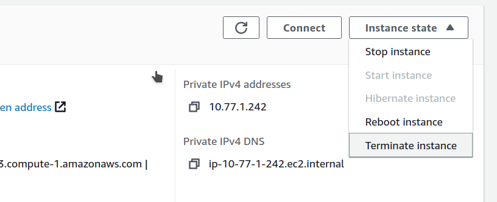

# Deploy PMM Server on AWS
After [planning your instance size, storage, and network requirements](../aws/plan_aws.md), deploy PMM Server from AWS Marketplace to get monitoring running.

## Launch PMM Server from  AWS Marketplace
To launch  PMM Server via AWS Marketplace:
{.power-number}

1. Go to [AWS Marketplace](https://aws.amazon.com/marketplace) and search for **Percona Monitoring and Management Server** or [access the PMM Server listing](https://aws.amazon.com/marketplace/pp/prodview-uww55ejutsnom) directly.

2. Click **Continue to Subscribe** on the PMM Server listing page, review the terms and conditions, then click **Continue to Configuration**.

3. Select the latest version (recommended), choose the AWS region where you want to deploy PMM, then click **Continue to Launch**.

4. Choose **Launch from Website** to configure and launch directly from the AWS Marketplace or **Launch through EC2** if you prefer launching via the EC2 Management Console for more customization.

5. In the **EC2 Instance Type** field, select an appropriate instance type based on your monitoring needs and anticipated load. For information on instance sizing and storage, see [Plan PMM Server deployment from AWS](../aws/plan_aws.md).

6. In the **VPC Settings** field, choose an existing VPC or create a new one to host your PMM Server.

7. In the **Subnet Settings** field, select an existing subnet or create a new one within your VPC.

8. In the **Security Group Settings** field, choose an existing security group or create a new one. Make sure the security group allows inbound traffic on the [Required Ports](#required-ports) listed below.
9. In the **Key Pair Settings** field, select an existing key pair for SSH access, or create a new one if necessary.

10. Click **Launch** to deploy the PMM Server instance. Once the instance is launched, it will appear in the EC2 console.

11. Assign a meaningful name to the instance to help distinguish it from others in your environment.

### Access the EC2 console

{.power-number}

1. Click the **EC2 Console** link that appears at the top of the confirmation page after launching, or go directly to the [EC2 Console](https://console.aws.amazon.com/ec2/).
2. Locate your new PMM instance in the EC2 instances table. Initially, its Status shows "Pending" while launching and the Name will be empty. 

#### Monitor instance status

Monitor your instance deployment progress through its status checks:

| Status | Description | Expected duration |
|--------|-------------|-------------------|
| **Pending** | Instance is being created | 1-2 minutes |
| **Running** | Instance is active and accessible | Ready for use |
| **Status Checks** | System and instance checks | 2-5 minutes |

## Initial PMM Server access

Once your instance status show "Running" and passes all status checks in the AWS console:
{.power-number}

1. In the EC2 console, select your instance and copy its **IPv4 Public IP** in the instance details or the **Public IP** field from the **Properties** panel:

    

2. Open the IP address in a web browser and log into PMM using the default credentials `admin`/`your instance ID`.

    

3. Change the default credentials then use the new ones to log in to the PMM Server home page. You will reuse these credentials when configuring PMM Clients on other hosts.

    

## Configure PMM Server and IP settings
After initial access, configure your PMM Server's security groups and IP addressing.

### Required ports

For proper PMM Server functionality and access, ensure your security group allows communication via the following ports:

- Port 22 (SSH): Administrative access to the instance
- Port 80 (HTTP): Initial PMM web interface access
- Port 443 (HTTPS): Secure PMM web interface access
- Port 3306 (MySQL): If monitoring RDS instances directly

!!! warning "Security reminder"
    Your PMM instance is now accessible via the internet. Ensure your security group settings restrict access to trusted IP addresses only.

### Configure PMM Server IP settings (Optional)

By default, your EC2 instance will have a private IP for internal VPC network access. You can configure your PMM Server to use only a private IP or a static Elastic IP.

#### To use a private IP only

=== "During EC2 instance creation"
    To use only the private IP for your EC2 instance during EC2 instance creation:
    {.power-number}

    1. In the **Network Settings** section, uncheck **Auto-assign public IP**.
    2. Do not assign an Elastic IP to the instance.
    3. To access PMM Server using only a private IP, ensure you're connected to your VPC and use the private IP address for access. 

=== "For an existing instance"
    To use only the private IP for an existing instance:
    {.power-number}

    1. If a public IP is assigned, remove it by disassociating it in the EC2 console.
    2. If an Elastic IP is assigned, disassociate it from the instance.
    3. To access PMM Server using only a private IP, ensure you're connected to your VPC and use the private IP address for access. 

#### To use an Elastic IP (for a static, public-facing IP address)

For a static, public-facing IP address:
{.power-number}

1. Allocate an Elastic IP address in the EC2 console.
2. Associate the Elastic IP address with your EC2 instance's network interface ID. 

Associating a new Elastic IP to an instance with an existing Elastic IP will disassociate the old one, but it will remain allocated to your account.

For detailed information on EC2 instance IP addressing, see the [AWS documentation on using instance addressing](https://docs.aws.amazon.com/AWSEC2/latest/UserGuide/using-instance-addressing.html).

## Post-deployment tasks

Performed these tasks after your PMM Server is up and running.

### Resize the EBS volume

To increase available disk space:
{.power-number}

1. Your AWS instance comes with a predefined size which can become a limitation. To increase the size of the EBS volume attached to your instance, see [Modifying the size, IOPS, or type of an EBS volume on Linux](https://docs.aws.amazon.com/AWSEC2/latest/UserGuide/ebs-modify-volume.html).

2. After updating the EBS volume, PMM Server will auto-detect changes within approximately 5 minutes and reconfigure itself.

## Remove PMM server from AWS

To permanently remove your PMM Server instance:
{.power-number}

1. Find the instance in the EC2 Console:

    

2. Select **Instance state** menu and **Terminate instance**:

    

3. Confirm termination:

    

!!! warning "Data loss warning"
    Terminating an instance permanently deletes all data stored on the instance. Ensure you have created backups before termination.

   

## Next steps
- [Configure PMM server](../aws/configure_aws.md) for security and authentication
- [Configure PMM clients](../../../install-pmm-client/index.md) to start monitoring your infrastructure
- [Register client nodes](../../../register-client-node/index.md) with your PMM Server
- [Improve PMM EC2 instance resilience using CloudWatch Alarm actions](https://www.percona.com/blog/2021/04/29/improving-percona-monitoring-and-management-ec2-instance-resilience-using-cloudwatch-alarm-actions/)
- [Simplify use of ENV eariables in PMM AMI](https://www.percona.com/blog/simplify-use-of-env-variables-in-percona-monitoring-and-management-ami/)