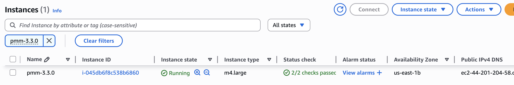
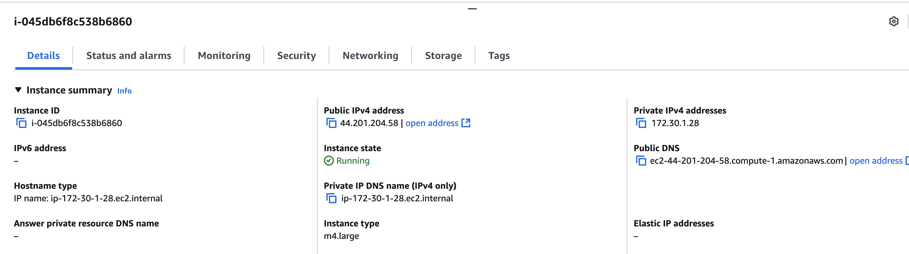
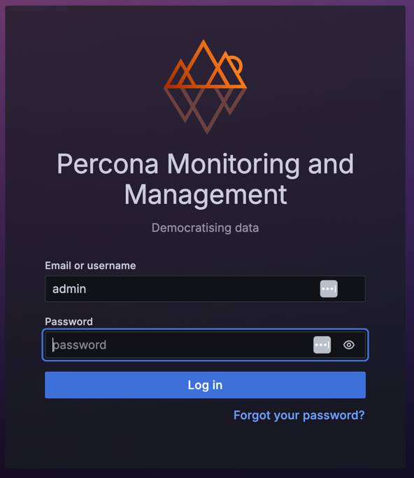

# Deploy PMM Server on AWS

After [planning your instance size, storage, and network requirements](../aws/plan_aws.md), deploy PMM Server from AWS Marketplace to get monitoring running.

## Launch PMM Server from  AWS Marketplace
To launch  PMM Server via AWS Marketplace:
{.power-number}

1. Go to [AWS Marketplace](https://aws.amazon.com/marketplace) and search for **Percona Monitoring and Management Server** or [access the PMM Server listing](https://aws.amazon.com/marketplace/pp/prodview-uww55ejutsnom) directly.

2. Click **View purchase options** on the PMM Server listing page, review the terms and conditions, then click **Continue to Configuration**.

3. Select the latest version (recommended), choose the AWS region where you want to deploy PMM, then click **Continue to Launch**.

4. Choose **Launch from Website** to configure and launch directly from the AWS Marketplace or **Launch through EC2** if you prefer launching via the EC2 Management Console for more customization.

5. In the **EC2 Instance Type** field, select an appropriate instance type based on your monitoring needs and anticipated load. For information on instance sizing and storage, see [Plan PMM Server deployment from AWS](../aws/plan_aws.md).

6. In the **VPC Settings** field, choose an existing VPC or create a new one to host your PMM Server. Ensure that the selected VPC has an [Internet Gateway](https://docs.aws.amazon.com/vpc/latest/userguide/VPC_Internet_Gateway.html) attached to it to be reachable over the Internet

7. In the **Subnet Settings** field, select an existing subnet or create a new one within your VPC.

8. In the **Security Group Settings** field, choose an existing security group or create a new one. Make sure the security group allows inbound traffic on the [Required ports](#required-ports) listed below.
9. In the **Key Pair Settings** field, select an existing key pair for SSH access, or create a new one if necessary.

10. Click **Launch** to deploy the PMM Server instance. Once the instance is launched, it will appear in the EC2 console.

11. Assign a meaningful name to the instance to help distinguish it from others in your environment.

### Access the EC2 console
Monitor the deployment progress and access your instance through the EC2 console:
{.power-number}

1. Click the **EC2 Console** link that appears at the top of the confirmation page after launching, or go directly to the [EC2 Console](https://console.aws.amazon.com/ec2/).
2. Locate your new PMM instance in the EC2 instances table. Initially, its Status shows **Pending** while launching and the Name will be empty. 

#### Monitor instance status

Monitor your instance deployment progress through its status checks:

| Status | Description | Expected duration |
|--------|-------------|-------------------|
| **Pending** | Instance is being created | 1-2 minutes |
| **Running** | Instance is active and accessible | Ready for use |
| **Status Checks** | System and instance checks | 2-5 minutes |

## Initial PMM Server access

Once your instance status shows "Running" and passes all status checks in the AWS console:
{.power-number}

1. In the EC2 console, select your instance and copy its **IPv4 Public IP** in the instance details or the **Public IP** field from the **Properties** panel:

    

2. Open the IP address in a web browser and log into PMM using the default credentials:
   - **Username:** `admin` 
   - **Password:** Your EC2 instance ID  available in the **Instance ID** field in the EC2 console.
   
    

3. Change the default credentials then use the new ones to log in to the PMM Server home page. You will reuse these credentials when configuring PMM Clients on other hosts.

    

## Configure PMM Server and IP settings
After initial access, configure your PMM Server's security groups and IP addressing.

### SSH access
For SSH access instructions, see [Connecting to Your Linux Instance Using SSH](https://docs.aws.amazon.com/AWSEC2/latest/UserGuide/AccessingInstancesLinux.html).

Replace the user name `ec2-user` with `admin`. You can also add SSH keys later through the **PMM Configuration > Settings > SSH Key** page.

## Next steps

With your PMM Server deployed and accessible:

- [Configure PMM Server](../aws/configure_aws.md) for security and authentication
- [Configure PMM Clients](../../../install-pmm-client/index.md) to start monitoring your infrastructure
- [Register client nodes](../../../register-client-node/index.md) with your PMM Server
- [Improve PMM EC2 instance resilience using CloudWatch Alarm actions](https://www.percona.com/blog/2021/04/29/improving-percona-monitoring-and-management-ec2-instance-resilience-using-cloudwatch-alarm-actions/)
- [Simplify use of ENV eariables in PMM AMI](https://www.percona.com/blog/simplify-use-of-env-variables-in-percona-monitoring-and-management-ami/)