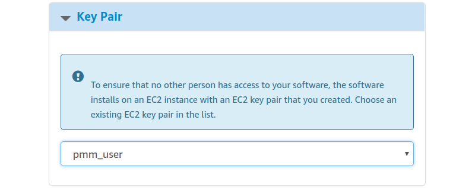

# Limit Access to an AWS instance

In the **Security Group** section, which acts like a firewall, you may use the preselected option `Create new based on seller settings` to create a security group with recommended settings. In the **Key Pair** select an already set up EC2 key pair to limit access to your instance.

!!! caution alert alert-warning "Important"
    The security group should allow communication via the the following ports: *22*, *80*, and *443*. PMM should also be able to access port *3306* on the RDS that uses the instance.

    
