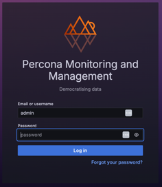

# Launch PMM Server on AWS

After [installing PMM Server from AWS Marketplace](../aws/aws.md), access your PMM Server:
{.power-number}

1. Wait until the AWS console shows the instance is in "Running" state.
2. In the EC2 console, select your instance and copy its **IPv4 Public IP** in the instance details or the **Public IP** field from the **Properties** panel:
    
3. Open the IP address in a web browser and log into PMM using the default credentials:
     - username: `admin`
     - password: `your instance ID`
    
4. Change the default credentials then use the new ones on the PMM Server home page:

   

   These credentials not only manage access to the PMM web interface but also facilitate authentication between the PMM Server and PMM Clients. You will need to reuse these credentials when configuring PMM Clients on other hosts.

!!! note alert alert-primary ""
    For SSH access instructions, see [Connecting to Your Linux Instance Using SSH](https://docs.aws.amazon.com/AWSEC2/latest/UserGuide/AccessingInstancesLinux.html). Replace the user name `ec2-user` with `admin`. You can also add SSH keys later through the **PMM Configuration > Settings > SSH Key** page. 

## Configure PMM Server IP Settings

### Configure PMM Server to use a private IP only

By default, your EC2 instance will have a private IP for internal VPC network access. 
To use only the private IP:

=== "During EC2 instance creation"
    To use only the private IP for your EC2 instance during EC2 instance creation:
    {.power-number}

    1. In the **Network Settings** section, uncheck **Auto-assign public IP**.
    2. Do not assign an Elastic IP to the instance.

=== "For an existing instance"
    To use only the private IP for an existing instance EC instance:
    {.power-number}

    1. If a public IP is assigned, remove it by disassociating it in the EC2 console.
    2. If an Elastic IP is assigned, disassociate it from the instance.

### Access PMM Server using only a private IP

To access your PMM Server using only a private IP:
{.power-number}

1. Ensure you're connected to your VPC.
2. Use the private IP address to access the PMM Server dashboard.

### Configure PMM Server to use an Elastic IP (Optional)

For a static, public-facing IP address:
{.power-number}

1. Allocate an Elastic IP address in the EC2 console.
2. Associate the Elastic IP address with your EC2 instance's Network interface ID.

!!! note alert alert-primary ""
    Associating a new Elastic IP to an instance with an existing Elastic IP will disassociate the old one, but it will remain allocated to your account.

For detailed information on EC2 instance IP addressing, see the [AWS documentation on using instance addressing](https://docs.aws.amazon.com/AWSEC2/latest/UserGuide/using-instance-addressing.html).

## Resize the EBS volume

To increase available disk space:
{.power-number}

1. Your AWS instance comes with a predefined size which can become a limitation. To make more disk space available to your instance, increase the size of the EBS volume as needed. For instructions, see [Modifying the Size, IOPS, or Type of an EBS Volume on Linux](https://docs.aws.amazon.com/AWSEC2/latest/UserGuide/ebs-modify-volume.html).
2. After updating the EBS volume, PMM Server will auto-detect changes within approximately 5 minutes and reconfigure itself.