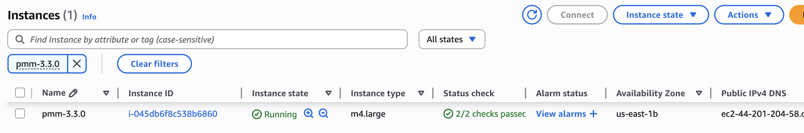

# Apply settings
Review your configuration, deploy the instance, and complete the initial setup in the EC2 Console.
{.power-number}

1. Scroll to the top of the page to review all your instance settings.

2. Click the **Launch with 1 click** button to deploy your PMM instance with the configured settings.

The launch button may be labeled as **Accept Software Terms & Launch with 1-Click** depending on your AWS Marketplace view.

## Configure your instance in EC2 console

### Access the EC2 Console

After clicking **Launch with 1 click**, your PMM instance will begin deploying. To continue configuration:
{.power-number}

1. Click the **EC2 Console** link that appears at the top of the confirmation page.
2. Alternatively, navigate to the [EC2 Console](https://console.aws.amazon.com/ec2/) directly.

### Locate and name your instance

Your new PMM instance will appear in the EC2 instances table with the following details:

- **Status**: Initially shows "Pending" while launching.
- **Name**: Empty by default (shows as "-").
- **Instance Type**: Matches your selected configuration
- **State**: "Running" once fully deployed.

### Instance status monitoring

Monitor your instance deployment progress:

| Status | Description | Expected Duration |
|--------|-------------|-------------------|
| **Pending** | Instance is being created | 1-2 minutes |
| **Running** | Instance is active and accessible | Ready for use |
| **Status Checks** | System and instance checks | 2-5 minutes |

## Next steps

Once your instance status shows "Running" and passes all status checks:
{.power-number}

1. Note the Public IP for PMM access
2. Configure DNS (optional) to set up a custom domain name
3. Access the PMM web interface at `http://your-instance-ip`
4. Consider configuring SSL/TLS for production use

!!! warning "Security reminder"
    Your PMM instance is now accessible via the internet. Ensure your security group settings restrict access to trusted IP addresses only.