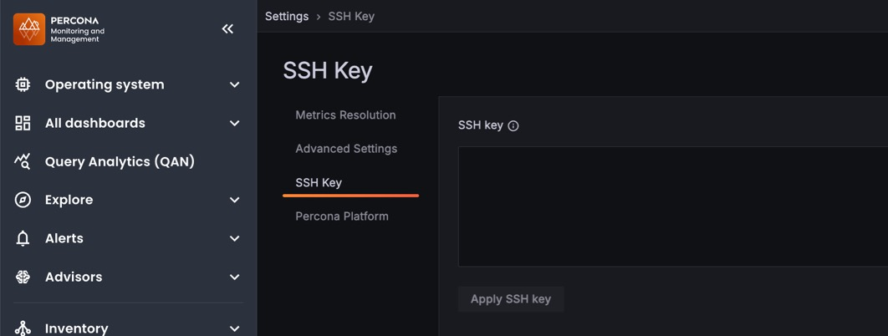

# SSH key

When you run PMM Server as an AWS AMI instance, you can upload your public SSH key to enable SSH access for direct management and troubleshooting.



## Configure SSH access

To configure SSH access:
{.power-number}

1. Go to **Configuration > Settings > SSH key**.
2. Enter your public key in the **SSH Key** field.
3. Click **Apply changes**.

## Connect via SSH

Once your public key is configured, connect using the `admin` user:

```bash
ssh -i your-private-key admin@<pmm-server-ip>
```

=== "AWS EC2 instance"
    ```bash
    ssh -i ~/keys/my-aws-key.pem admin@ec2-203-0-113-42.compute-1.amazonaws.com
    ```

=== "Default key location"
    If your private key is in the default location (`~/.ssh/id_rsa` or `~/.ssh/id_ed25519`), you can omit the `-i` flag:
    ```bash
    ssh admin@<pmm-server-ip>
    ```
