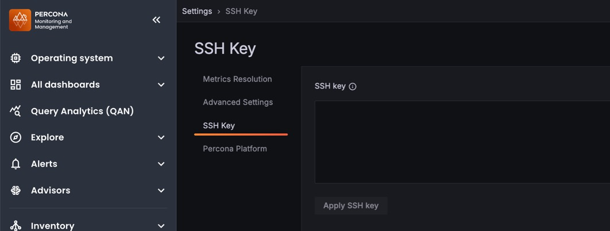

# SSH key

Upload your public SSH key to enable direct SSH access to your PMM Server AMI instance. On other deployment types, the **SSH key** tab doesn't appear in **Configuration > Settings**.



## Configure SSH access

PMM Server stores a single SSH key. Applying changes on this tab overwrites the whole `authorized_keys` file, so the key you submit replaces the previously configured one, which can no longer be used to log in.

To configure SSH access:
{.power-number}

1. Go to **Configuration > Settings > SSH key**.
2. Enter your public key in the **SSH key** field.
3. Click **Apply changes**.

!!! caution alert alert-warning "Keep a session open while you test"
    PMM won't warn you if you apply a key whose private key you don't have. Applying a new key doesn't disconnect active connections, so you can verify access before closing the old session.


## Connect via SSH

Once your public key is configured, connect using the `admin` user:

```bash
ssh -i your-private-key admin@<pmm-server-ip>
```

=== "AWS EC2 instance"
    ```bash
    ssh -i ~/keys/my-aws-key.pem admin@ec2-203-0-113-42.compute-1.amazonaws.com
    ```

=== "Default key location"
    If your private key is in the default location (`~/.ssh/id_rsa` or `~/.ssh/id_ed25519`), you can omit the `-i` flag:
    ```bash
    ssh admin@<pmm-server-ip>
    ```
