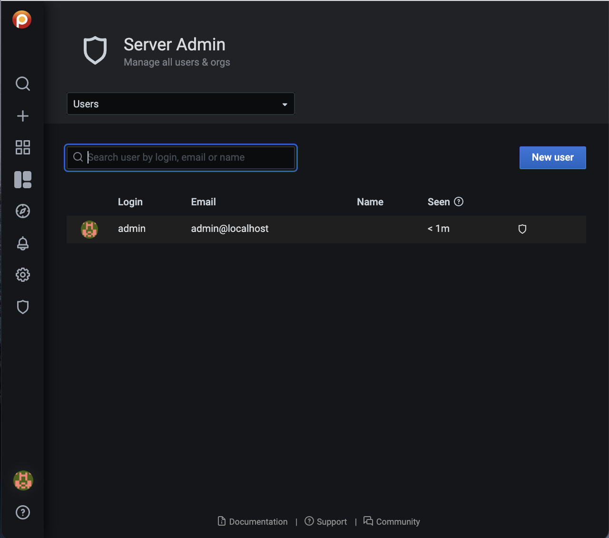

# Add users

You can add a user in PMM from **Administration > Users and access > Users** tab.

To add a new user in PMM:
{.power-number}

1. On the **Users** tab, click **New user**.
2. On the **Add new user** dialog box, enter the following:
    - Name
    - email address or username (if this is an existing grafana user)
    - Username
    - Password

3. Click **Create user**.
