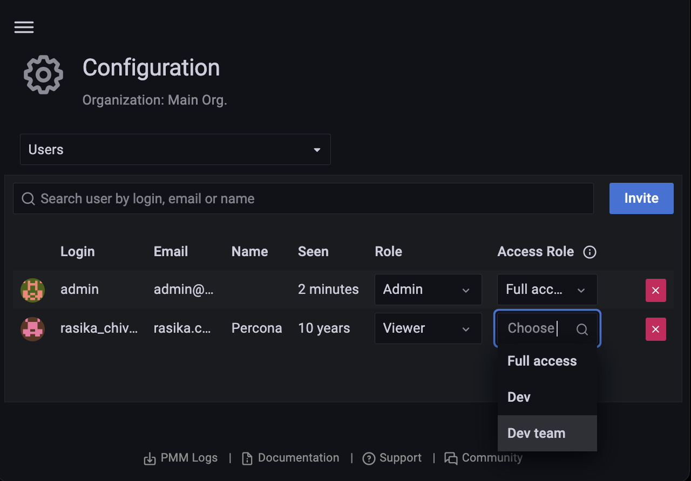

# Assign roles to users

To assign access roles to users:
{.power-number}

1. From [main menu](../../../reference/ui/ui_components.md), go to **PMM Configuration > Settings > Advanced Settings** and enable the **Access Roles** option.
2. Go to **Administration > Users and access > Users**.

3. Select the **User** you want to assign to a role from the dropdown. You can assign several roles to a user.

    