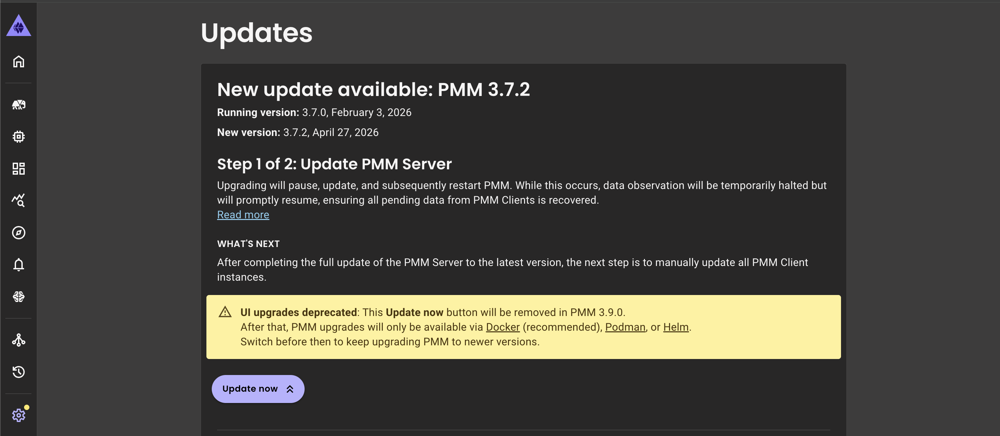
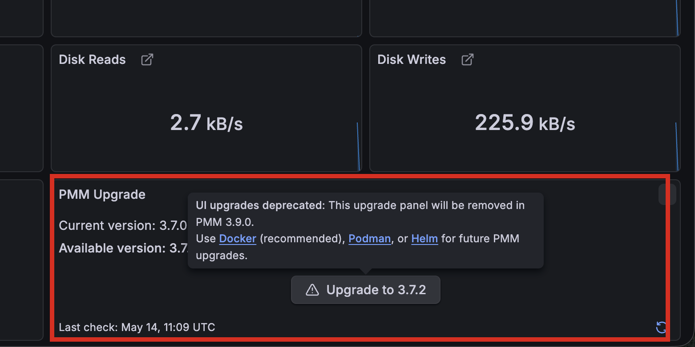

# Upgrade PMM Server from the UI

!!! warning "GUI-based upgrades ending in PMM 3.9.0"
    GUI-based upgrades are deprecated and will be removed in PMM 3.9.0 (end of July 2026).

    To continue upgrading PMM after version 3.9.0, use [Docker](upgrade_docker.md) (recommended), [Podman](upgrade_podman.md), or [Helm](upgrade_helm.md). 

PMM Server and Client components are installed and updated separately.

PMM 3 Server can run natively, as a Docker image, a virtual appliance, or an AWS cloud instance. While each environment has its own specific installation and update steps, you can also upgrade from the PMM web interface using Watchtower. 

However, since this method is deprecated, we recommend switching to a manual upgrade workflow as described above.

## Prerequisites

To use the UI upgrade feature, you must have Watchtower installed and properly configured with your PMM Server.

If Watchtower is not installed, the UI upgrade options will not be available. See [Running PMM Server with Watchtower](../install-pmm/install-pmm-server/deployment-options/docker/index.md) for setup instructions.

!!! note
    Since Watchtower is no longer actively maintained, new installations should use CLI or container-based upgrade methods instead.

## Upgrade process

1. Go to **Configuration > Updates** in your PMM web interface. Here you can check the current PMM Server version, the timestamp of the last update check, and whether your instance is up to date.
2. Click **Check Updates now**. If an update is available, click the **Update now** button to install the latest version.

## Quick upgrade check

For a quick overview of your PMM v3 Server's update status, you can also check the **Upgrade** panel on the **Home** page.

!!! note
    The **Upgrade** panel on the Home dashboard will be removed when GUI upgrades are removed in PMM 3.9.0. After that, use `docker pull` or your container runtime's equivalent to check for updates.