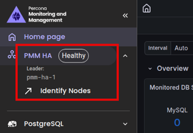

# Upgrade PMM HA Cluster using Helm

!!! warning "Technical Preview: Not production-ready"
    PMM HA Cluster is in **Technical Preview**. Test this upgrade procedure in non-production environments only.

This topic covers upgrading the PMM Server version running in a [PMM HA Cluster](../install-pmm/HA-clustered.md) deployment. For a single-instance PMM Server on Kubernetes, see [Upgrade PMM Server using Helm](upgrade_helm.md) instead.

A PMM HA release runs three PMM server replicas as a Kubernetes `StatefulSet` behind HAProxy, with one replica elected leader through Raft consensus at any time. `helm upgrade` updates the replicas one at a time (in reverse ordinal order: `pmm-ha-2`, then `pmm-ha-1`, then `pmm-ha-0`) and waits for each replacement pod to become ready before moving to the next, which is the default Kubernetes `StatefulSet` rolling-update behavior—no extra `maxUnavailable` configuration is required to get this one-pod-at-a-time sequencing.

!!! caution alert alert-warning "This is not a zero-downtime upgrade"
    HAProxy only routes traffic to the current Raft leader, so when the pod being restarted is the leader, requests fail until a new leader is elected on one of the two remaining replicas and HAProxy's health check picks it up. In testing, this window was brief (around 5-10 seconds) and self-recovering, but plan for a short interruption per rolling update rather than assuming true zero downtime.

## Before you begin

Before starting the upgrade, complete these preparation steps:
{.power-number}

1. Confirm all three replicas are healthy before you start:

    ```sh
    kubectl get pods -n <namespace> -l app.kubernetes.io/component=pmm-server
    ```

    !!! danger "Don't upgrade a degraded cluster"
        The rolling update always takes one more replica down as part of the normal rollout. If a replica is already down when you start (only 2 of 3 healthy), upgrading takes you to 1 of 3—below the majority Raft needs to elect a leader. Confirmed in testing: this leaves the cluster fully unreachable (`503` from HAProxy) until a majority is restored, not just briefly interrupted. Fix the unhealthy replica first. If you do end up in this state, see [No quorum: cluster is unreachable after losing multiple replicas](../troubleshoot/ha_issues.md#no-quorum-cluster-is-unreachable-after-losing-multiple-replicas).

2. Back up your data before upgrading—downgrades are not possible, so a backup taken beforehand is required to recover a previous state. PMM HA stores all data in the shared ClickHouse, VictoriaMetrics, and PostgreSQL clusters (not on the PMM server pods themselves), and each is backed up separately today:

    - **PostgreSQL** is backed up automatically: the chart enables scheduled [pgBackRest](https://pgbackrest.org/) backups by default. Confirm a recent backup exists before upgrading:
        ```sh
        kubectl get perconapgbackup -n <namespace>
        ```
    - **ClickHouse** and **VictoriaMetrics** have no built-in backup in the chart—back them up yourself (for example with [clickhouse-backup](https://github.com/Altinity/clickhouse-backup) and VictoriaMetrics' [`vmbackup`](https://docs.victoriametrics.com/vmbackup/)) if you need to be able to restore their data.

3. To reduce downtime, pre-pull the new image on every node that can run a PMM HA pod:

    ```sh
    # Replace <version> with the version you're upgrading to
    docker pull percona/pmm-server:<version>
    ```

4. Keep your exposure and other custom settings in a `values.yaml` file (or repeat them as `--set` flags on every `helm upgrade`), not as a one-off `kubectl patch` on the generated Service or other resources.

    !!! danger "kubectl patches don't survive a helm upgrade"
        A `helm upgrade` re-renders every resource the chart manages, including the HAProxy `Service`. If you exposed PMM HA externally by patching `pmm-ha-haproxy` to type `LoadBalancer` directly with `kubectl patch` instead of setting `haproxy.service.type: LoadBalancer` in your values, the upgrade reconciles the Service back to the chart's default (`ClusterIP`) and silently drops external access—including for PMM Clients still sending metrics. Always set `haproxy.service.type` (and any other externally-visible setting) through values so it's reapplied on every upgrade. See [Configure external access](../install-pmm/install-HA-clustered.md#configure-external-access).

## Upgrade steps

Follow these steps to upgrade the PMM Server image in your PMM HA release:
{.power-number}

1. Update the Helm repository:

    ```sh
    helm repo update percona
    ```

2. Upgrade PMM HA, keeping your existing configuration and reapplying any values that expose the cluster externally:

    ```sh
    helm upgrade pmm-ha percona/pmm-ha \
      --namespace pmm \
      --reuse-values \
      --set image.tag=<version>
    ```

    `--reuse-values` keeps the rest of your current release configuration (replica counts, resource limits, external access settings already recorded in a values file, and so on) and only changes the image tag. If you manage your configuration as a `values.yaml` file instead, pass `-f values.yaml` with the updated `image.tag` in it.

3. Monitor the rollout as it proceeds one replica at a time:

    ```sh
    kubectl rollout status statefulset/pmm-ha -n pmm
    ```

4. After the rollout completes, verify all three replicas are running the new version:

    ```sh
    kubectl get pods -l app.kubernetes.io/name=pmm -n pmm -o jsonpath='{range .items[*]}{.metadata.name}{"\t"}{.status.containerStatuses[0].image}{"\n"}{end}'
    ```

5. Confirm PMM Server is reachable and reporting the new version through the HAProxy endpoint:

    ```sh
    curl -k https://<pmm-ha-haproxy-endpoint>/v1/server/version
    ```

6. Check the logs on each replica for errors:

    ```sh
    kubectl logs -l app.kubernetes.io/name=pmm -n pmm --tail=100
    ```

!!! caution alert alert-warning "helm upgrade can fail with \"field is immutable\""
    If your upgrade changes a value the chart's `pmm-token-init` Job depends on (for example `secret.name`), Helm can fail with `Job.batch "<release>-pmm-token-init" is invalid: spec.template: ... field is immutable`. See [Troubleshoot upgrade issues](../troubleshoot/upgrade_issues.md#pmm-ha-helm-upgrade-fails-with-field-is-immutable) for the fix.

## Verify the leader after upgrade

The rolling update changes which replica is the active leader. After the upgrade completes, confirm a leader is elected and identify it in the UI or through the Inventory page—see [Identify the leader node](../install-pmm/install-HA-clustered.md#identify-the-leader-node).

Expand the **PMM HA** status badge in the side menu to see the current leader and cluster health at a glance:



## Upgrade the underlying databases

The steps above upgrade the PMM Server application only. PMM HA's three data stores—PostgreSQL (Grafana metadata), ClickHouse (Query Analytics), and VictoriaMetrics (metrics)—are deployed and versioned separately by their own Kubernetes operators (installed via the `pmm-ha-dependencies` chart), and `helm upgrade pmm-ha` does not touch them. Their versions are pinned in `pmm-ha`'s `values.yaml` precisely so that an operator upgrade can't silently move a database version out from under you.

!!! info "Upgrading an operator never upgrades its database"
    This holds for all three data stores, but for a different reason each time: PostgreSQL and ClickHouse image tags are explicit chart values with no operator-side default to fall back to. VictoriaMetrics is different—its operator ships a built-in default version and *will* move the data plane if the chart's `victoriaMetrics.version` pin is ever removed. Don't remove it.

Only upgrade a data store version when you have a specific reason to (a supported-version deadline, a feature you need); otherwise leave the pins as the chart sets them. When you do:

| Data store | Manual upgrade required | Downtime | Start here |
|---|---|---|---|
| PostgreSQL | Yes—driven by a `PerconaPGUpgrade` CR for major versions | **Yes**, full cluster stop for a major version upgrade (minor versions roll) | [Major version upgrade](https://docs.percona.com/percona-operator-for-postgresql/latest/update-db-major.html), [minor version upgrade](https://docs.percona.com/percona-operator-for-postgresql/latest/update-database.html), [certified image tags](https://docs.percona.com/percona-operator-for-postgresql/latest/images.html) |
| ClickHouse | Yes—an image tag change on the `ClickHouseInstallation` | No, rolls one host at a time | [Update the ClickHouse version](https://github.com/Altinity/clickhouse-operator/blob/master/docs/chi_update_clickhouse_version.md) ([operator upgrade](https://docs.altinity.com/altinitykubernetesoperator/upgrade/) is a separate, narrower step and does not change the server version) |
| VictoriaMetrics | Yes—an image tag/version change in the chart's `victoriaMetrics.version` | No, rolls (vmstorage as a StatefulSet restart) | [Operator configuration](https://docs.victoriametrics.com/operator/configuration/) (default-version mechanism), [Operator API reference](https://docs.victoriametrics.com/operator/api/) (which CRD field each component uses) |

A PostgreSQL major version upgrade is not reversible and stops the whole cluster for its duration—plan it as its own maintenance window, independent of a PMM Server `helm upgrade`. Take a full backup first regardless of which data store you're upgrading.

## Roll back a failed upgrade

`helm rollback` reverts the Helm release (chart values and the resulting Kubernetes manifests) to a previous revision, but it does **not** undo a PMM Server data migration that already ran against the shared databases. Because downgrades aren't supported, treat a rollback as a way to restore your previous *configuration* only, and restore your database backups if the new version already wrote incompatible data:
{.power-number}

1. List available revisions:

    ```sh
    helm history pmm-ha -n pmm
    ```

2. Roll back to the revision before the upgrade:

    ```sh
    helm rollback pmm-ha <revision-number> -n pmm
    ```

!!! seealso alert alert-info "See also"
    - [Understand PMM High Availability Cluster](../install-pmm/HA-clustered.md)
    - [Install PMM HA Cluster](../install-pmm/install-HA-clustered.md)
    - [Troubleshoot PMM HA Cluster issues](../troubleshoot/ha_issues.md)
    - [Upgrade PMM Server using Helm](upgrade_helm.md) (single-instance deployments)
