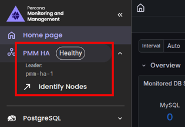

# Upgrade PMM High Availability (HA) cluster using Helm

Upgrade a [PMM HA Cluster](../install-pmm/HA-clustered.md) deployed with the `percona/pmm-ha` chart (three pods) when you want to move to a new PMM release. For single-instance deployments using the `percona/pmm` chart, see [Upgrade PMM Server using Helm](upgrade_helm.md) instead.

## How PMM HA Helm upgrades work

The upgrade restarts each of the three PMM Server pods one at a time, waiting for each to become ready before restarting the next. HAProxy, PostgreSQL, VictoriaMetrics, ClickHouse, and the operators are not restarted and remain running throughout.

Traffic flows only to the active leader pod. When that pod restarts, your PMM dashboards, alerts, and metric collection are briefly unavailable until a new leader takes over. This typically takes around 5-10 seconds per pod and resolves on its own.

## Before you begin

Complete these steps before upgrading to avoid data loss or extended downtime:
{.power-number}

1. Check that all three PMM Server pods are running and ready. If one is already down, the cluster cannot elect a leader and PMM becomes unreachable:

    ```sh
    kubectl get pods -n <namespace> -l app.kubernetes.io/component=pmm-server
    ```

2. Back up your PMM HA Cluster before upgrading. Downgrades are not supported, so a backup is your only recovery option:

    === "Built-in backups"

        If you [turned on backups](../install-pmm/backup-restore-HA-clustered.md#turn-on-backups), take a backup of all components:

        ```sh
        kubectl exec -n <namespace> deploy/<release>-backup-tools -- pmm-backup.sh backup
        ```

        If the upgrade fails, you can [restore this backup](../install-pmm/backup-restore-HA-clustered.md#restore-pmm-ha-cluster).

    === "Without built-in backups"

        If you haven't turned on backups, back up each database cluster separately:

        - **PostgreSQL** is backed up automatically by default. Confirm a recent backup exists:

            ```sh
            kubectl get perconapgbackup -n <namespace>
            ```

        - **ClickHouse and VictoriaMetrics** have no automatic backup. Back them up manually if you need to restore your Query Analytics data and metrics, for example with [clickhouse-backup](https://github.com/Altinity/clickhouse-backup) and VictoriaMetrics' [`vmbackup`](https://docs.victoriametrics.com/vmbackup/).

3. Keep all custom settings in your `values.yaml` file. Settings applied with `kubectl patch` are silently reset on every upgrade.

4. Pull the new PMM Server image on your cluster nodes in advance to reduce upgrade time:

    ```sh
    # Replace <version> with the version you're upgrading to
    docker pull percona/pmm-server:<version>
    ```

## Upgrade

Once you've completed the steps in [Before you begin](#before-you-begin), run the upgrade:
{.power-number}

1. Update the Helm repository:

    ```sh
    helm repo update percona
    ```

2. Run the upgrade, replacing `<version>` with the target PMM version. Use `--reuse-values` to keep your existing configuration, or `-f values.yaml` if you manage settings in a values file:

    ```sh
    helm upgrade pmm-ha percona/pmm-ha \
      --namespace pmm \
      --reuse-values \
      --set image.tag=<version>
    ```

    If this fails with `Job.batch "<release>-pmm-token-init" is invalid: spec.template: ... field is immutable`, see [Troubleshoot upgrade issues](../troubleshoot/upgrade_issues.md#pmm-ha-helm-upgrade-fails-with-field-is-immutable).

3. Track the rollout progress. Expect a brief interruption when the leader pod restarts:

    ```sh
    kubectl rollout status statefulset/pmm-ha -n pmm
    ```

4. Confirm all three pods are running the new version:

    ```sh
    kubectl get pods -l app.kubernetes.io/name=pmm -n pmm -o jsonpath='{range .items[*]}{.metadata.name}{"\t"}{.status.containerStatuses[0].image}{"\n"}{end}'
    ```

5. Confirm PMM Server is reachable and returning the new version:

    ```sh
    curl -k https://<pmm-ha-haproxy-endpoint>/v1/server/version
    ```

6. Check the logs across all pods for errors:

    ```sh
    kubectl logs -l app.kubernetes.io/name=pmm -n pmm --tail=100
    ```

## Confirm the cluster is healthy

After the upgrade, verify that a leader is active and the cluster is healthy. Open the **PMM HA** status badge in the side menu to see the current leader and cluster status at a glance:



You can also check through the Inventory page. See [Identify the leader node](../install-pmm/install-HA-clustered.md#identify-the-leader-node).

If you cannot log in after upgrading, see [Cannot log in with the admin password](../troubleshoot/ha_issues.md#cannot-log-in-with-the-admin-password).

## Upgrade the underlying databases

The `helm upgrade pmm-ha` command above upgraded PMM Server only. PostgreSQL, ClickHouse, and VictoriaMetrics are managed by their own operators and were not changed. Only upgrade a database when you have a specific reason, such as a version deadline or a required feature.

If you need to upgrade one:

| Database | Downtime | Instructions | Planning notes |
|---|---|---|---|
| PostgreSQL | Yes for major versions (full cluster stop); no for minor versions | [Major version upgrade](https://docs.percona.com/percona-operator-for-postgresql/latest/update-db-major.html), [minor version upgrade](https://docs.percona.com/percona-operator-for-postgresql/latest/update-database.html) | Cannot be reversed. Plan as a separate maintenance window and take a full backup first. |
| ClickHouse | No, rolls one instance at a time | [Update the ClickHouse version](https://github.com/Altinity/clickhouse-operator/blob/master/docs/chi_update_clickhouse_version.md) | |
| VictoriaMetrics | No | [Operator configuration](https://docs.victoriametrics.com/operator/configuration/) | Do not remove `victoriaMetrics.version` from your values. The operator falls back to a built-in default if not set, so an operator upgrade can silently change the version. |

## Roll back to a previous version

If the upgrade causes issues, you can restore your previous Helm configuration. Keep in mind that this only restores the PMM Server configuration, not any database changes PMM made during the upgrade. 

To fully return to the pre-upgrade state, also restore your databases from the backups you took in [Before you begin](#before-you-begin):

- If you used built-in backups, roll back the Helm release first, then [restore the backup](../install-pmm/backup-restore-HA-clustered.md#restore-in-place). A backup can only be restored into the same PMM version it was taken from.
- Otherwise, restore each database separately:
    - [Restore PostgreSQL](https://docs.percona.com/percona-operator-for-postgresql/latest/backups-restore.html)
    - [Restore ClickHouse](https://github.com/Altinity/clickhouse-backup?tab=readme-ov-file#usage)
    - [Restore VictoriaMetrics](https://docs.victoriametrics.com/vmrestore/)

To roll back the Helm release to the previous version:
{.power-number}

1. List available revisions:

    ```sh
    helm history pmm-ha -n pmm
    ```

2. Roll back to the revision before the upgrade:

    ```sh
    helm rollback pmm-ha <revision-number> -n pmm
    ```

## Related topics

- [Understand PMM High Availability Cluster](../install-pmm/HA-clustered.md)
- [Install PMM HA Cluster](../install-pmm/install-HA-clustered.md)
- [Troubleshoot PMM HA Cluster issues](../troubleshoot/ha_issues.md)
- [Upgrade PMM Server using Helm](upgrade_helm.md) (single-instance deployments)
