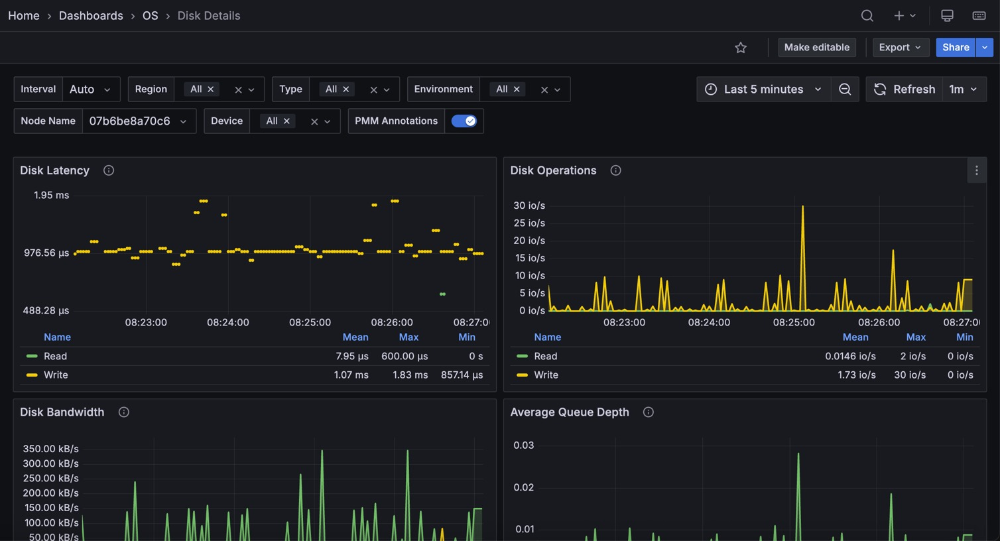

# Disk Details

## Mountpoint Usage

Shows the percentage of disk space utilization for every mountpoint defined on the system. Having mountpoints close to 100% space utilization is not good because of the risk of a "disk full" error that can block services or cause a system crash.

If a mountpoint is close to 100%, consider removing unused files or expanding the space allocated to the mountpoint.

## Mountpoint

Shows disk space usage for the specified mountpoint. Disk space is displayed in gigabytes (GB) for easier interpretation.

**Used** is the amount of space used.

**Free** is the amount of space not in use.

**Total** is the total disk space allocated to the mountpoint.

Having *Free* close to zero is not good because of the risk of a "disk full" error that can block services or cause a system crash.

If Free is close to zero, consider removing unused files or expanding the space allocated to the mountpoint.

## Disk Latency

Shows average latency for read and write IO operations. Higher than typical latency for highly loaded storage indicates saturation (overload) and is a frequent cause of performance problems. Higher than normal latency can also indicate internal storage problems.

## Disk Operations

Shows the number of physical IOs (reads and writes) different devices are serving. Spikes in the number of IOs served often correspond to performance problems due to IO subsystem overload.

## Disk Bandwidth

Shows the volume of reads and writes the storage is handling. This can be a better measure of IO capacity usage for network-attached and SSD storage, as it is often bandwidth limited. The amount of data being written to disk can be used to estimate flash storage lifetime.

## Disk Load

Shows how much disk was loaded for reads or writes as the average number of outstanding requests over different time periods. High disk load is a good measure of actual storage utilization. Different storage types handle load differently—some will show latency increases at low loads, while others can handle higher loads without problems.

## Disk IO Utilization

Shows disk utilization as the percentage of time when there was at least one IO request in flight. It is designed to match utilization available in the iostat tool. It is not a very good measure of true IO capacity utilization. Consider looking at the **Disk Latency** and **Disk Load** panels instead.

## Avg Disks Operations Merge Ratio

Shows how effectively the operating system is able to merge logical IO requests into physical requests. This is a good measure of IO locality, which can be used for workload characterization.

## Disk IO Size

Shows the average size of a single disk operation.