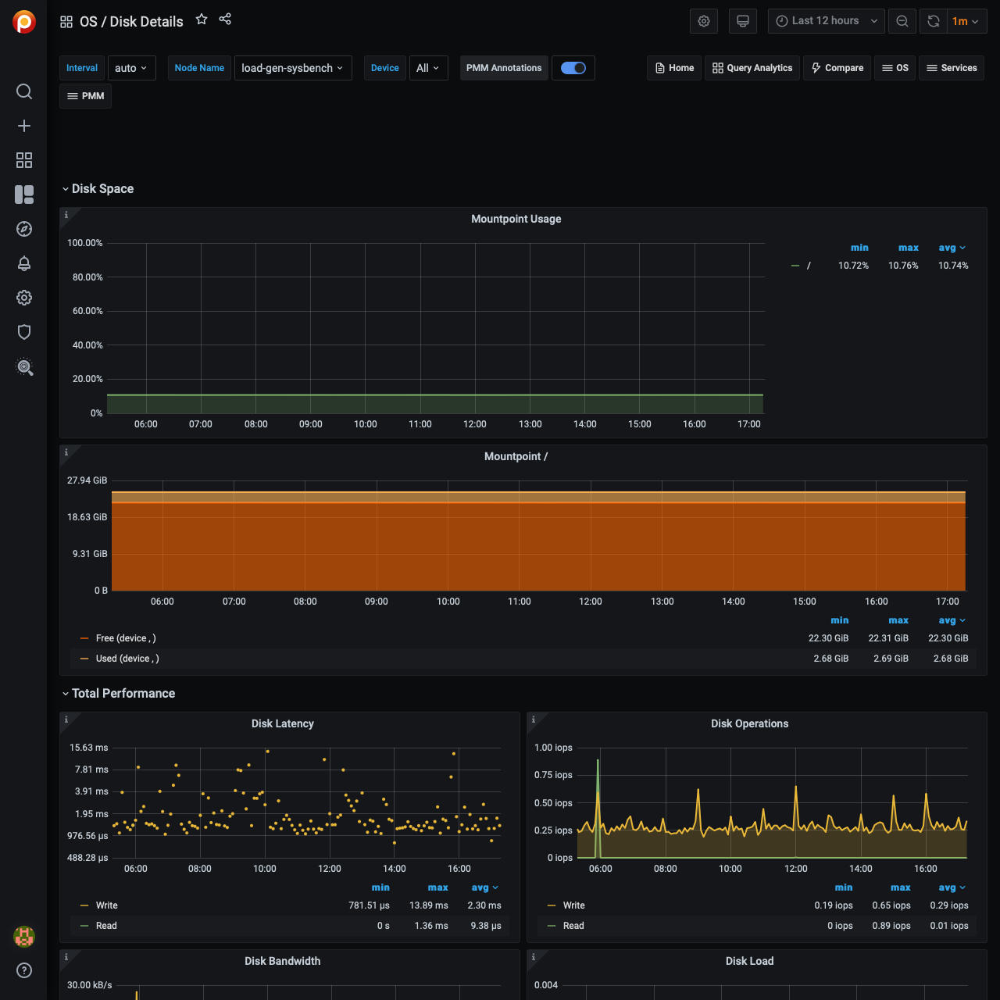

# Disk Details

## mount point Usage

Shows the percentage of disk space utilization for every mount point defined on the system. Having some of the mount points close to 100% space utilization is not good because of the risk of a “disk full” error that can block one of the services or even cause a crash of the entire system.

In cases where the mount point is close to 100% consider removing unused files or expanding the space allocated to the mount point.

## mount point

Shows information about the disk space usage of the specified mount point.

**Used** is the amount of space used.

**Free** is the amount of space not in use.

**Used+Free** is the total disk space allocated to the mount point.

Having *Free* close to 0 B is not good because of the risk of a “disk full” error that can block one of the services or even cause a crash of the entire system.

In cases where Free is close to 0 B consider removing unused files or expanding the space allocated to the mount point.

## Disk Latency

Shows average latency for Reads and Writes IO Devices.  Higher than typical latency for highly loaded storage indicates saturation (overload) and is frequent cause of performance problems.  Higher than normal latency also can indicate internal storage problems.

## Disk Operations

Shows amount of physical IOs (reads and writes) different devices are serving. Spikes in number of IOs served often corresponds to performance problems due to IO subsystem overload.

## Disk Bandwidth

Shows volume of reads and writes the storage is handling. This can be better measure of IO capacity usage for network attached and SSD storage as it is often bandwidth limited.  Amount of data being written to the disk can be used to estimate Flash storage life time.

## Disk Load

Shows how much disk was loaded for reads or writes as average number of outstanding requests at different period of time.  High disk load is a good measure of actual storage utilization. Different storage types handle load differently - some will show latency increases on low loads others can handle higher load with no problems.

## Disk IO Utilization

Shows disk Utilization as percent of the time when there was at least one IO request in flight. It is designed to match utilization available in iostat tool. It is not very good measure of true IO Capacity Utilization. Consider looking at IO latency and Disk Load Graphs instead.

## Avg Disks Operations Merge Ratio

Shows how effectively Operating System is able to merge logical IO requests into physical requests.  This is a good measure of the IO locality which can be used for workload characterization.

## Disk IO Size

Shows average size of a single disk operation.
