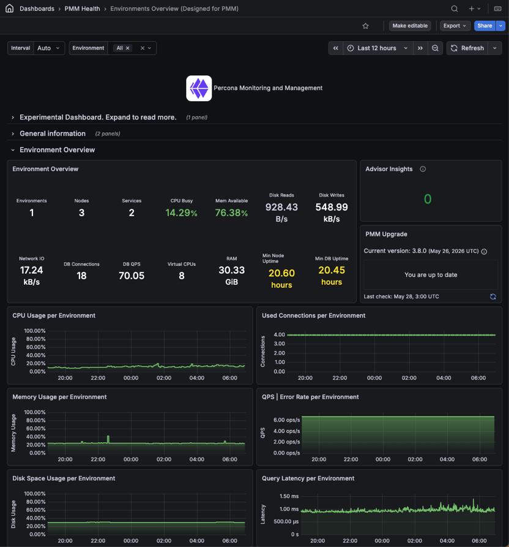

# Environments Overview

!!! caution alert alert-warning "Disclaimer"
    This is an Experimental Dashboard that is not part of the official Percona Monitoring and Management (PMM) deployment and might be updated. We ship this Dashboard to obtain feedback from our users
    

The **Environments Overview** dashboard gives you a high-level view of all environments monitored by PMM. Use it to quickly see how your infrastructure is doing and drill into individual environments or services.

## Before you use this dashboard

- Make sure your nodes and services have a consistent `environment` label set. Without it, per-environment charts and totals may be incomplete.
- Database metrics come from the MySQL, MongoDB, and PostgreSQL exporters.
- Node metrics cover the `generic`, `remote_rds`, `container`, and `remote` node types.

## Filters and drilldowns

- The **Environment** filter applies to all charts and tables on the dashboard.
- The dashboard also uses hidden **Node Name** and **Service Name** variables that update automatically based on the selected environments.
- In the per-environment time series panels, click a series to open the **Environment Summary** dashboard for that environment.

## Environment Overview

A summary panel with key numbers across all monitored environments:

- **Environments**: How many distinct environments are being monitored.
- **Nodes**: How many nodes are registered with PMM. If a node you expect is missing, it may have lost its PMM agent connection.
- **Services**: How many database services are registered with PMM across all environments.
- **CPU Busy**: Average CPU utilization across all nodes. A high value means load is spread widely, not just on one node.
- **Mem Available**: Average available memory across all nodes. A low value means multiple nodes are under memory pressure at the same time.
- **Disk Reads**: Average read throughput across all nodes. Spikes often indicate backups, large index scans, or replication catching up.
- **Disk Writes**: Average write throughput across all nodes. Sustained high values can point to write-heavy workloads or log growth.
- **Network IO**: Average combined inbound and outbound throughput across all nodes. Sudden jumps often indicate data migration, replication, or backup traffic.
- **DB Connections**: Total active connections across all database services. Check this against your configured connection limits to catch pressure early.
- **DB QPS**: Total query throughput across all databases. Compare against your normal baseline to spot unusual load.
- **Virtual CPUs**: Total vCPU count across all nodes. Useful context when reading CPU and load metrics.
- **RAM**: Total installed RAM across all nodes. Useful context when reading memory metrics.
- **Min Node Uptime**: How long the most recently restarted node has been running. A very low value may mean an unexpected restart or crash.
- **Min DB Uptime**: How long the most recently restarted database has been running. A low value may point to a crash or a restart you weren't aware of.

## Advisor Insights

Shows how many Advisor checks failed in their last run. Use it to quickly spot configuration or security issues across your environments.

## PMM Upgrade

Shows whether a newer version of PMM is available and lets you upgrade directly from the dashboard.

## Percona News

Shows the latest posts from the Percona blog.

## Per-environment time series panels

The following panels show trends over the selected time range, broken down by environment. Click a series to open the Environment Summary dashboard for that environment.

A few things to keep in mind:

- **QPS \| Error Rate per Environment** has dual axes: QPS on the left and error rate on the right.
- **Disk Space Usage per Environment** shows the most-utilized filesystem per node, so a short spike can come from a single filesystem filling up.
- **Query Latency per Environment** relies on Query Analytics data. If QAN isn't collecting data, this panel will be empty.

| Panel | Metric | Unit |
|-------|--------|------|
| **CPU Usage per Environment** | Average CPU usage | % |
| **Used Connections per Environment** | Active database connections | count |
| **Memory Usage per Environment** | Average memory usage | % |
| **QPS \| Error Rate per Environment** | Query rate (left axis) and error rate (right axis) | ops/s, % |
| **Disk Space Usage per Environment** | Disk space used on the most-utilized filesystem per node | % |
| **Query Latency per Environment** | Average query latency from Query Analytics data | seconds |

## Services table

A table listing all monitored database services:

- **Status**: Whether PMM can reach the service. Red means monitoring has lost contact, so check the agent connection or the database itself.
- **Service**: The name of the database service as registered in PMM.
- **Environment**: Which environment this service belongs to, based on its `environment` label.
- **Region**: The `region` label assigned to this service. Useful for grouping services across geographic locations.
- **DB QPS**: Current query throughput. A sudden drop to zero can mean the database stopped accepting connections; an unexpected spike may indicate runaway queries.
- **DB conns**: Current active connections. Compare against your database's connection limit to catch saturation before it causes failures.
- **DB uptime**: How long the database has been running since its last restart. A low value may mean the database crashed or was restarted recently.
- **Avail memory**: How much memory is still free on the host node. Values consistently below 10–15% suggest the host is under memory pressure.
- **Disk reads**: Current read throughput on the host. Spikes often point to backups, large index scans, or a replica catching up.
- **Disk writes**: Current write throughput on the host. Sustained high values can indicate heavy write workloads or runaway logging.
- **Network IO**: Current combined inbound and outbound throughput. Unexpected spikes can reveal replication lag, a backup in progress, or unusual client traffic.
- **vCPU**: Number of virtual CPUs on the host. Useful as context when comparing CPU load across services with different instance sizes.
- **RAM**: Total installed RAM on the host. Useful as context when comparing memory usage across services.

The table footer shows how many services are listed in total.
