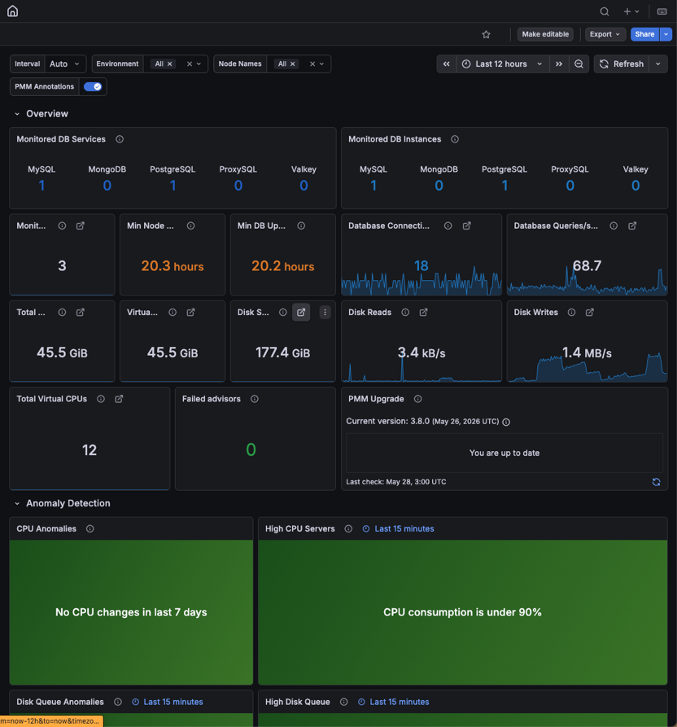

# Home Dashboard

The Home Dashboard is the default landing page in PMM. It gives you a unified view of your monitored databases and infrastructure, highlights unusual behavior, and helps you spot trends by comparing current resource usage with the same time last week.

Use this dashboard as your starting point, then drill down into technology-specific dashboards (such as MySQL, MongoDB, or PostgreSQL) or node-level dashboards when you need more detail.

## Overview

The Overview section shows key counts and capacity metrics across all monitored services and nodes.

### Monitored DB Services

Shows how many database services PMM is actively collecting data from, broken down by technology: MySQL, MongoDB, PostgreSQL, ProxySQL, and Valkey.

This count can be higher than **Monitored DB Instances** because a single database may have more than one monitoring connection. For example, if you have multiple exporters or nodes reporting for the same service, each one counts separately here.

Use this to quickly see which technologies are in your environment and jump directly to their overview dashboards. Click MySQL, MongoDB, PostgreSQL, ProxySQL, or Valkey to open that technology's Instances Overview.

### Monitored DB Instances

Shows the number of distinct database services per technology. Unlike Monitored DB Services, this count is not inflated by multiple exporters reporting for the same service.

Use this alongside Monitored DB Services to confirm whether a high service count reflects genuine instances or just multiple exporters for the same service.

### Monitored Nodes

Shows the total number of infrastructure nodes matching the current dashboard filters. A node is either a physical server, VM, or Kubernetes node.

Use this to confirm all expected nodes are registered with PMM. Click to open the **Nodes Overview** dashboard.

### Min Node Uptime

Shows the minimum uptime across all filtered nodes. Red means less than 1 hour, orange means 1-24 hours, green means over 24 hours.

Use this to spot recently restarted nodes at a glance. Pay attention when the value turns red. An unexpected restart may need investigation.

### Min DB Uptime

Shows the minimum uptime across all monitored database processes (MySQL, MongoDB, PostgreSQL). Color thresholds match **Min Node Uptime**.

Use this to spot recently restarted database instances. A low value after a planned maintenance window is expected. A low value at other times warrants investigation.

### Database Connections

Shows the total number of active connections aggregated across all monitored database services, including MySQL, MongoDB, PostgreSQL, ProxySQL, HAProxy, and Valkey.

Use this to gauge overall connection load. A sudden spike may indicate a connection leak or unusual traffic surge. Click to drill down to per-technology instance overviews.

### Database Queries/s (QPS)

Shows the combined query rate per second across all your monitored databases, regardless of technology.

Use this to understand your overall workload at a glance. A sudden jump often points to a traffic spike or a scheduled job kicking in, while an unexpected drop may mean a service went down or queries are getting stuck somewhere.

### Total RAM

Shows the total physical memory across all filtered nodes.

Use this to quickly understand the total memory capacity across your environment. Click to open **Memory Details**.

### Virtual Memory Total

Shows total memory capacity including swap space across all filtered nodes.

Use this to check whether swap is being used heavily, which can indicate memory pressure across the environment.

### Disk Space Total

Shows total filesystem capacity across all filtered nodes.

Use this to confirm sufficient storage capacity. Watch for this value remaining flat while data volumes grow.

### Disk Reads

Shows aggregate disk read throughput (bytes/sec) across all filtered nodes.

Use this to spot I/O spikes that may affect database read performance. Click to open **Disk Details**.

### Disk Writes

Shows aggregate disk write throughput (bytes/sec) across all filtered nodes.

Use this to spot I/O spikes that may affect database write performance. Click to open **Disk Details**.

### Total Virtual CPUs

Shows the total number of virtual CPUs across all filtered nodes.

Use this to understand total compute capacity across your environment. Click to open the **Nodes Overview** dashboard.

### Failed Advisors

Shows the number of advisor checks that failed during the most recent run.

Use this to stay on top of advisor findings. A non-zero count means PMM has flagged conditions that need your attention. 

Click to open the **Advisors** page and see which specific checks need attention.

### PMM Upgrade

Shows the current PMM version and whether a newer version is available. Use this to stay current. You can start an upgrade directly from the dashboard.

## Anomaly Detection

The **Anomaly Detection** section highlights two types of conditions: nodes that currently exceed a resource threshold, and nodes whose usage has changed significantly compared to the same time last week.

For each metric, one panel shows nodes with a notable week-over-week change, and a paired panel shows nodes that currently exceed a fixed threshold.

### CPU Anomalies

Shows nodes where CPU usage is above 60% and has increased by more than 30 percentage points compared to the same time last week, up to 10 nodes.

Use this to catch servers that have recently become CPU-intensive, for example after a deployment, a query regression, or a new batch job. 

If nothing appears, no significant CPU spikes have been detected in the last 7 days.

### High CPU Servers

Shows nodes with CPU usage above 90% over the last 15 minutes, up to 10 nodes.

Use this to quickly find servers that need immediate CPU investigation. Click a node name to open its **CPU Utilization Details** dashboard. If nothing appears, all nodes are below 90% CPU.

### Disk Queue Anomalies

Shows nodes where disk I/O queue depth is above 2 and has grown significantly compared to the same time last week.

Use this to catch storage pressure that has developed recently. A growing queue compared to last week is an early warning before latency becomes visibly impacted. 

A sustained queue above 1 per physical disk may indicate storage saturation.

### High Disk Queue

Shows nodes with a disk I/O queue depth above 2 over the last minute, up to 10 nodes.

Use this to identify storage that is currently saturated or approaching its limits. A sustained queue above 1 per physical disk often indicates saturation, though high-throughput devices like NVMe SSDs can handle deeper queues without latency impact.

### Used Memory Anomaly

Shows up to 10 nodes where memory usage is above 80% and more than 30 percentage points higher than at the same time last week.

Use this to detect memory growth trends that may indicate a leak, a growing dataset, or unexpected load.

### High Memory Used

Shows nodes with memory usage above 80%, up to 10 nodes.

Use this to find nodes with active memory pressure. Check **Memory Details** to understand whether the usage is from application data or OS buffers, and whether it requires action. If nothing appears, all nodes are below 80%.

### Low CPU Anomalies

Shows nodes where CPU usage is below 30% and has dropped significantly compared to the same time last week.

This can help you identify servers that were previously busy but are now mostly idle. This may indicate a service that went down, traffic that was redirected, or a workload that finished.

### Low CPU Servers

Shows nodes with CPU usage below 30% over the last 15 minutes, up to 10 nodes.

Use this to identify chronically underutilized servers that could be rightsized or consolidated.

## Command Center

The Command Center shows time series data for the top 20 nodes across key performance metrics. Each metric is displayed as a set of three panels: current usage, the delta from the same time last week, and the previous week's usage for direct side-by-side comparison.

Use this section to go deeper after the Anomaly Detection section flags a problem. The time series view shows you whether an issue is persistent or a spike, and the week-over-week comparison tells you whether it's a new pattern or business as usual.

Click any series name to drill down to that node's details dashboard.

### Top 20 CPU Usage

Shows CPU utilization for the 20 most CPU-intensive nodes over the last hour.

### CPU Anomaly
Shows the change in CPU utilization compared to the same time last week. Positive bars mean CPU usage has increased. Negative bars mean it has decreased. 

Use this alongside **Top 20 CPU Usage** to distinguish a sustained load increase from a one-time spike.

### Top 20 CPU Usage (prev week)

Shows CPU utilization for the same nodes from one week ago. Use this as a baseline to judge whether current CPU usage is normal for these nodes.

### Top 20 Disk Queue
Shows the average number of outstanding I/O requests for the 20 busiest nodes over the last hour. A higher queue depth means more I/O operations are waiting.

### Disk Queue Anomaly
Shows the change in disk queue depth compared to the same time last week. Positive bars indicate increased I/O pressure. Use this to distinguish new I/O load from steady-state behavior.

### Top 20 Disk Queue (prev week)
Shows disk queue depth from one week ago. Use this to confirm whether the current queue depth is unusual for these nodes.

### Top 20 Write Latency
Shows average disk write latency for the 20 nodes with the highest write latency over the last hour. 

Latency above typical values on heavily loaded storage may indicate saturation or internal storage problems.

### Write Latency Anomaly
Shows the change in write latency compared to the same time last week. Positive bars mean latency has increased. Use this to spot storage degradation that may not stand out from absolute values alone.

### Top 20 Write Latency (prev week)
Shows write latency from one week ago, for baseline comparison.

### Top 20 Read Latency
Shows average disk read latency for the 20 nodes with the highest read latency over the last hour.

### Read Latency Anomaly
Shows the change in read latency compared to the same time last week. Positive bars mean latency has increased. 

Use this to detect read performance degradation, such as after storage configuration changes or increased read load.

### Top 20 Read Latency (prev week)
Shows read latency from one week ago, for baseline comparison.

### Top 20 Used Memory
Shows memory utilization as a percentage for the 20 most memory-intensive nodes over the last hour.

### Used Memory Anomaly
Shows the change in memory usage compared to the same time last week. Only nodes where usage has increased are shown. 

Use this to identify memory growth trends that may indicate a leak or an expanding workload.

### Top 20 Used Memory (prev week)
Shows memory usage from one week ago. Use this to confirm whether current memory consumption is higher than the previous week's baseline.

## Service Summary

This table lists all monitored database services with their current status and resource metrics.

Use this to get a per-service health snapshot without navigating to individual dashboards. Pay attention to services with a red Status or a low DB Uptime value. 

These indicate services that are down or have recently restarted and may need investigation.

Each row represents a service, with these columns:

- **Status**: Up (green) or Down (red).
- **Environment**: The environment label assigned to the service.
- **Region**: The region label assigned to the service.
- **DB QPS**: Current query rate per second.
- **DB Conns**: Current connection count.
- **DB Uptime**: Time since the database process last started, color-coded: red for under 1 hour, yellow for 1-24 hours, green for over 24 hours.
- **Avail Memory**: Available memory as a percentage of total RAM on the host node.
- **Disk Reads**: Current disk read throughput on the host node.
- **Disk Writes**: Current disk write throughput on the host node.
- **Network IO**: Combined inbound and outbound network throughput on the host node.
- **vCPU**: Number of virtual CPUs on the host node.
- **RAM**: Total physical memory on the host node.

The row count at the bottom shows the total number of services currently displayed.