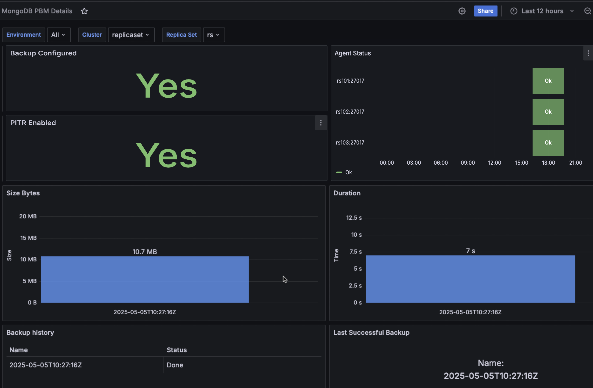

# MongoDB PBM Details dashboard
The MongoDB PBM Details dashboard offers an integrated view of your Percona Backup for MongoDB (PBM) environment directly within Percona Monitoring and Management (PMM).

The dashboard consolidates key information—such as backup configuration, status, performance metrics, and agent health—into a single, easy-to-use interface.

By accessing PBM insights directly from PMM, you can efficiently monitor and manage your MongoDB backups without switching between tools.

## Backup Configured
Shows whether backups are properly configured for your MongoDB environment. A green "Yes" indicates that PBM is properly set up and functioning, while a **No** in red signals that backups are not configured. 

## PITR Enabled
Displays whether Point-in-Time Recovery (PITR) is enabled for your MongoDB environment. A green **Yes** confirms PITR is active, while a **No** in red indicates this feature is not currently enabled.

PITR allows for more granular recovery options, enabling restoration to any point in time rather than just to specific backup points. 

## Agent Status
This panel monitors the operational status of each PBM agent connected to your MongoDB cluster nodes using a color-coded timeline visualization.

Each replica set node (e.g., `rs101:27017`, `rs102:27017`, `rs103:27017`) is shown with an **OK** status in green when the PBM agent is functioning correctly. This allows you to quickly identify any agents that may be experiencing issues and potentially affecting backup operations.

Arbiter nodes, whether in replica sets or sharded clusters, will appear with a **Fail** status. This is expected behavior—arbiters are designed only to participate in elections and do not store data, so they do not and cannot run PBM agents. In future updates, this status will be clarified with a message such as "Arbiter node is not supported" to avoid confusion.

## Size Bytes
Displays the size of your MongoDB backups in a bar chart format. 

The panel shows the exact size of each backup (e.g., 10.7 MB), helping you track storage requirements and identify any unusual changes in backup size that might indicate problems with your data or backup process.

## Duration
Shows how long each backup operation takes to complete, displayed in seconds.

By monitoring backup times, you can quickly pinpoint any backups that are taking an unusually long time to complete, which may signal underlying performance problems within your MongoDB setup.

## Backup History
Provides a tabular view of recent backup operations with columns for **Name** (timestamp of the backup) and **Status** (Done, Error, etc.). 

This historical record helps you verify that scheduled backups are running successfully and lets you quickly identify any failed backup operations that may require attention.

The current status reporting in this panel may not yet capture the full range of error states available in PBM's native tools (including "stuck" or "incompatible" backups). This will be improved with an upcoming release to provide a more complete picture of your backup status.

## Last Successful Backup
Shows details of the most recent successful backup operation, including its timestamp. This gives you confidence in your recovery capabilities by confirming when your last good backup was taken, ensuring you know your current recovery point objective (RPO) status.

This dashboard works with both replica sets and sharded clusters, providing unified visibility into your MongoDB backup infrastructure. 

To use it effectively, select the appropriate environments, clusters, and replica sets using the filters at the top of the dashboard.