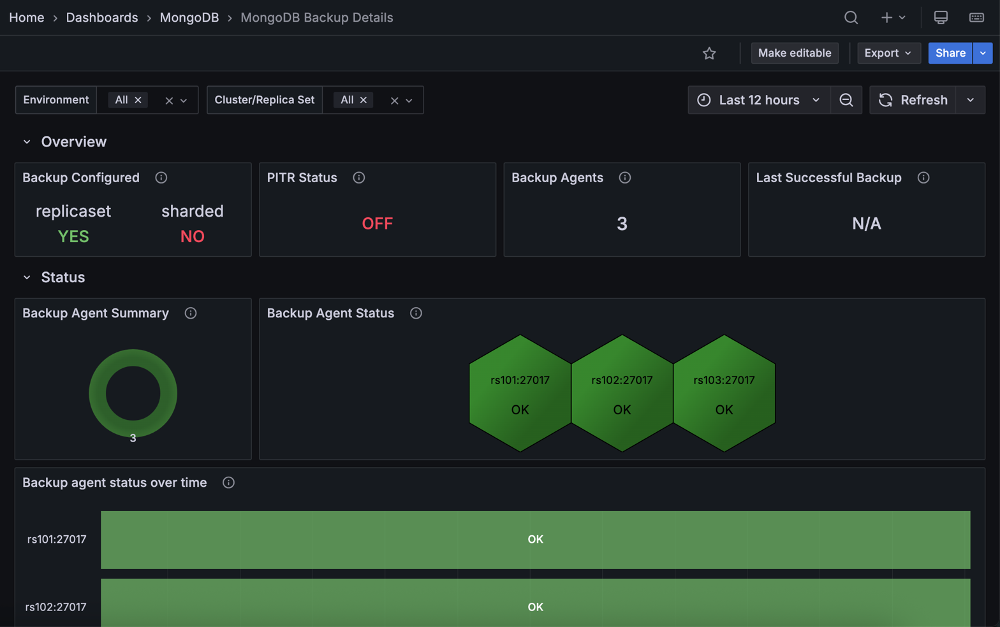

# MongoDB Backup Details dashboard

This dashboard helps you monitor your Percona Backup for MongoDB (PBM) environment directly within PMM. 

It brings together backup configuration, agent health, and backup history in one place, so you don't need to switch between tools.

The dashboard works with both replica sets and sharded clusters. 

Use the filters at the top to narrow down to specific environments, clusters, or replica sets.

!!! note
    This dashboard requires MongoDB services to be added with the `--cluster` parameter. If panels show no data, see [Add MongoDB service to PMM](../../install-pmm/install-pmm-client/connect-database/mongodb.md#step-2-add-mongodb-service-to-pmm).

## Overview 

### Backup Configured

Shows whether PBM has a remote storage location configured. A green **YES** means backup storage is set up while a red **NO** means it isn't.

Check this first when opening the dashboard. If it shows **NO**, no backups are running regardless of what other panels show. Configure a remote storage location (S3, Azure Blob, or filesystem) in PBM before relying on this dashboard for backup monitoring. 

See [Configure backup storage](https://docs.percona.com/percona-backup-mongodb/install/backup-storage.html).

### PITR Status

Shows whether Point-in-Time Recovery (PITR) oplog streaming is enabled. A green **ON** means PITR is active; a red **OFF** means it isn't.

PITR lets you restore to any moment in time, not just to the nearest backup snapshot. If your recovery objectives require granular restores, and this shows **OFF**, enable PITR in your PBM configuration.

### Backup Agents

Shows the total number of PBM agents currently monitored by PMM.

Compare this against the number of nodes you expect to be covered. A lower count means some agents have gone offline or failed to register. Any node without a running agent won't be backed up, so investigate immediately if the count doesn't match.

### Last Successful Backup

Shows the name of the most recent backup that completed successfully.

Use this as your quick recovery point check: it tells you exactly how far back you'd need to restore if something went wrong right now. 

If it shows an old backup or **N/A**, investigate why backups stopped completing.

## Status

### Backup Agent Summary

Shows the distribution of PBM agent statuses across your environment as a donut chart. Green represents agents with **OK** status; red represents agents that need attention (**CHECK**).

A predominantly green chart means your backup infrastructure is healthy. Any red segments mean some agents have issues and backups on those nodes are at risk. 

When you see red, move to the **Backup Agent Status** panel to find out which specific hosts are affected.

### Backup Agent Status

Shows the current status of each individual PBM agent as a hexagon grid, with one hexagon per host. Green means **OK**; red means **CHECK**.

Use this to pinpoint exactly which nodes have agent problems after the **Backup Agent Summary** flags an issue. Hover over a hexagon to see the hostname.

Arbiter nodes always show **FAIL** here. This is expected, because the PBM agent can't run on arbiters.

### Backup Agent Status Over Time

Shows each agent's status history over the selected time range as a color-coded timeline. Green bars indicate **OK**; red bars indicate **FAIL** or **DOWN**.

Use this to tell the difference between a one-off failure and a recurring problem. Repeated red bars on the same node point to an underlying issue rather than a transient blip. 

You can also use the timeline to correlate failures with events like deployments, network changes, or maintenance windows, and to confirm that a previously failing agent has fully recovered.

## Details

### Backup History

Shows a record of backup operations across your MongoDB infrastructure, including environment, cluster, backup name, size, and duration.

Use this to verify your backup schedule is running and to catch failures before they affect your recovery options. 

Watch for two things: unusually small backups can mean data wasn't fully captured, and longer-than-normal durations can point to storage or network problems.

Note that status reporting here may not cover all PBM error states, such as "stuck" or "incompatible" backups. Use PBM's native tools for a complete picture until this is improved in a future release.

### Backup Sizes

Shows the size of each backup as a bar chart.

Use this to track storage consumption over time and plan capacity. A sudden drop in size can mean a backup didn't capture all your data; a sudden increase may signal unexpected data growth that needs storage planning.

### Backup Duration

Shows how long each backup operation took to complete, in seconds.

Use this to catch performance problems early. If a backup that normally takes a few minutes suddenly takes much longer, something changed: your dataset may have grown, storage may be slower, or there may be a network issue worth investigating. 

Tracking duration trends also helps you schedule maintenance windows accurately.
