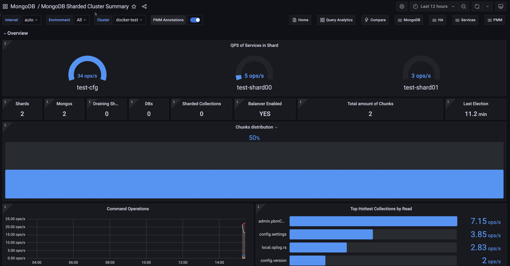

# MongoDB Sharded Cluster Summary



This dashboard provides a comprehensive view of your MongoDB sharded cluster's performance, health, and resource utilization. It displays essential data for individual nodes organized by component type (shards, config servers, and mongos routers), offering insights into:

- shard distribution and balance
- query operations and performance
- resource utilization (CPU, memory, disk, network)
- replication status across the cluster
- component-specific health indicators

For MongoS (Router) specific monitoring, see the [MongoDB Router Summary](dashboard-mongodb-router-summary.md) dashboard.

### QPS of Services in Shard

Displays the Queries Per Second (QPS) for each shard and the config server replica set in your MongoDB cluster. It shows the rate of operations (excluding commands) for each component, helping you quickly assess the query load distribution across your sharded environment.

The chart uses the most recent non-null value and updates based on your selected time interval. This visualization allows you to easily identify which shards are handling the most queries and spot any potential load imbalances. 

### Shards

Reports the number of shards in your MongoDB cluster. The number of shards indicates how your data is distributed across the cluster, which is crucial for understanding your database's scalability and performance.

A shard contains a subset of sharded data for a sharded cluster. Together, the cluster's shards hold the entire data set for the cluster.

### Mongos

Number of mongos routers registered as part of the cluster.

### Draining Shards

Displays a single number representing the current count of shards that are in the process of being drained from your MongoDB cluster.

When you run `removeShard`, MongoDB drains the shard by using the balancer to move the shard's chunks to other shards in the cluster. Once the shard is drained, MongoDB removes the shard from the cluster. The number shown here indicates how many shards are currently undergoing this draining process.

### DBs

Shows the number of user-created databases in your MongoDB sharded cluster. It provides a quick view of how many databases your cluster is managing, updating every 5 minutes.

This simple count helps you track database growth and understand the scale of your MongoDB deployment at a glance.

### Sharded Collections

Provides a quick view of how many collections in your MongoDB cluster are sharded. This is an important metric for understanding the scale and distribution of your data across the sharded cluster. 

A higher number indicates more collections are distributed across multiple shards, which can improve performance for large datasets.
However, it also implies more complex data management.

### Balancer Enabled

Background process that monitors the number of chunks on each shard and whether the MongoDB Balancer is currently enabled in your sharded cluster.

The balancer is crucial for maintaining an even distribution of chunks across shards, so knowing its status is important for cluster health and performance.

A **YES** indicates that the balancer is active and working to keep your data evenly distributed, while a **NO** might indicate a manual override or a potential issue that needs investigation.

### Total amount of Chunks

Provides a quick view of the total number of chunks in your sharded MongoDB cluster to give you an idea of how your data is distributed across the cluster.

A high number of chunks could indicate a well-distributed dataset, while a sudden increase might suggest increased data volume or changes in your sharding strategy.

### Last Election

Provides a quick view of how long it has been since the last election in your MongoDB replica set.

Elections occur when a new primary node needs to be chosen, which can happen during normal operations (like planned maintenance) or due to issues (like a primary node failure).

A very recent election might indicate a recent change or issue in your cluster that warrants investigation, while a long time since the last election suggests stability in the primary node assignment.

### Chunks distribution

Displays the distribution of chunks across different shards in a MongoDB cluster as a series of horizontal bars. It updates every minute, showing the percentage of total chunks each shard holds.

Use this to quickly identify any imbalances in data distribution among shards, which is crucial for maintaining optimal performance in a sharded MongoDB setup.

### Command Operations

Provides a comprehensive overview of MongoDB operation rates across your deployment. It displays the frequency of primary operations (query, insert, update, delete, and getmore), replicated operations on secondary nodes, and document deletions by Time-To-Live (TTL) indexes. 

By aggregating data from selected environments, clusters, and replica sets over customizable time intervals, the graph enables you to quickly identify workload patterns, potential replication lags, and the impact of automated data cleanup processes.

### Top Hottest Collections by Read

Displays the five MongoDB collections with the highest read rates. It shows the number of read operations per second for each collection, aggregated across your selected environment and cluster. 

The bar gauge visualization helps quickly identify which collections are experiencing the most read activity, useful for performance monitoring and resource planning. Data is updated regularly to reflect recent changes in read patterns.

### Query execution times

Shows the average time taken for MongoDB to execute read, write, and other operations. It displays latency in microseconds over time, helping you spot performance trends or issues across different operation types. 

Use this to quickly identify any unusual delays in database operations.

### Top Hottest Collections by Write

Displays the five MongoDB collections with the highest write activity. It shows the number of write operations (inserts, updates, and deletes) per second for each collection, aggregated across your selected environment and cluster. 

The bar gauge visualization helps quickly identify which collections are experiencing the most write activity, useful for performance monitoring and resource planning. Data is updated regularly to reflect recent changes in write patterns.

### Operations Per Shard

Shows the total number of operations per second for each shard in your MongoDB cluster. 

It combines all types of operations (queries, inserts, updates, deletes, and getmore) into a single metric for each shard. The stacked area chart allows you to see both individual shard activity and total cluster activity over time. 

This visualization helps you monitor the distribution of workload across shards and identify any imbalances or unusual patterns in operation rates.

### MongoDB Versions

Displays the current MongoDB version for each service in your cluster.

This information helps you quickly identify which version of MongoDB is running on each service, ensuring all parts of your cluster are using consistent and up-to-date software.

Use this to track version differences across your MongoDB deployment and plan upgrades as needed.

## Current Topology

Displays a visual representation of your MongoDB sharded cluster's architecture, organizing nodes into their respective functional groups. Each node is represented by a hexagonal icon with color-coding to indicate its role:

- Green: Primary nodes or "UP" status for mongos routers
- Yellow: Secondary nodes
- Orange: Arbiter nodes (when present)
- Red: Nodes in "DOWN" state

This visualization provides a clear overview of your cluster's structure, making it easy to verify configuration, monitor health status, and ensure replication sets maintain the expected primary-secondary relationships.

### Config Servers
Displays config server nodes that store metadata and configuration settings for the entire cluster. These servers maintain the mapping of chunks to shards.

### Mongos Routers
Shows router instances that direct queries to appropriate shards. These routers process queries from the application layer and determine the location of data within the sharded cluster.

### Shards
Groups data-bearing nodes by shard name (e.g., `Shard - rs1`, `Shard - rs2`). Each shard contains a subset of the sharded data.

### Configuration for visualizing MongoDB cluster topology correctly

To ensure your MongoDB sharded cluster components appear in the correct sections of the dashboard, follow these configuration guidelines when adding MongoDB instances using the `pmm-admin add mongodb` command or via the PMM UI:

 - use the same `--cluster` name for all components of your sharded cluster
 - add each component (config servers, shard nodes, and mongos routers) as a separate service. 
 
 For detailed instructions on adding MongoDB nodes, see [Add MongoDB services via CLI](../../install-pmm/install-pmm-client/connect-database/mongodb.md#on-the-command-line).


??? info "Example command for adding a MongoDB shard node" 

    ```sh
     pmm-admin add mongodb --username=pmm --password=password \
     --service-name=rs-0-1 --replication-set=shard0 \
     --host=127.0.0.1 --port=27018 --cluster=myMongoCluster
    ```

## Node States

Displays a timeline of each node's status in your MongoDB replica set over the selected time period. Node states (PRIMARY, SECONDARY, ARBITER, etc.) are color-coded for easy monitoring, with green indicating healthy states and red showing potential issues.

Use this visualization to track role changes, identify replica set instability, and monitor the overall health of your MongoDB cluster at a glance.

## Collection Details

### Size of Collections in Shards

Displays the storage size of MongoDB collections across different shards in your cluster, excluding system databases, excluding system databases. The data is organized by database and collection, with separate columns for each shard.

This visualization helps you understand how your data is distributed and identify which collections are using the most storage space. Use this information to optimize data distribution and storage usage in your MongoDB cluster.

### Number of Collections in Shards

Shows how many collections each database has across different shards in your MongoDB cluster, excluding system databases. It lists database names in rows and shard names in columns, with the number of collections at each intersection.

This overview helps you quickly see how your data is spread out, identify databases with many collections, and check if collections are evenly distributed across shards. 

Use this information to optimize your database structure and sharding strategy for better performance and resource usage.

## Connections

### Current Connections Per Shard

Shows the number of current TCP connections for each shard in your MongoDB cluster over time. It uses a stacked area chart to display incoming connections across different shards, allowing you to see both individual shard activity and total cluster connections at a glance. 

This visualization helps you monitor connection load distribution, identify any shards experiencing unusual connection patterns, and track overall cluster usage. Use this information to balance workloads, plan for capacity, and ensure your MongoDB cluster is handling connections efficiently.

### Available Connections

Displays the number of available connections for each service in your MongoDB cluster over time. It uses a stacked area chart to show how many connections are still open for new client requests across different services.

This visualization helps you monitor connection capacity, identify services that might be reaching their connection limits, and track overall cluster availability. Use this information to ensure your MongoDB cluster has sufficient capacity to handle incoming connections, plan for scaling, and prevent potential connection-related issues before they impact performance or availability.

## Chunks in Shards

### Amount of Chunks in Shards

Shows how data chunks are distributed across shards in your MongoDB cluster. It displays the shard names and the number of chunks each shard contains. Chunks are subsets of your sharded data, and their distribution indicates how evenly your data is spread across the cluster.

This overview helps you quickly identify any imbalances in data distribution, which could affect query performance and storage utilization. Use this information to assess your sharding strategy and determine if rebalancing is needed to optimize your MongoDB cluster's performance and resource usage.

### Dynamic of Chunks

Shows how the number of data chunks changes over time for each shard in your MongoDB cluster. It displays the rate of change in chunks per second, helping you visualize the balancer's activity in redistributing data across shards.

This dynamic view allows you to monitor how your cluster adapts to data growth and changing query patterns. Use this information to assess the effectiveness of your sharding strategy, identify periods of high balancing activity, and ensure that your data remains evenly distributed for optimal performance and scalability.

### Chunks Move Events

Displays the frequency of chunk movement events in your MongoDB sharded cluster over time. It shows how often chunks are being migrated between shards to maintain an even data distribution. The graph helps you visualize the balancer's activity, with higher bars indicating periods of more frequent chunk migrations. 

This information is crucial for understanding your cluster's balancing behavior, identifying times of high data redistribution activity, and ensuring that your sharded data remains optimally distributed for efficient query performance and storage utilization across all shards.

### Chunk Split Activity

Shows how frequently chunks are being split in your MongoDB sharded cluster over time. It visualizes the rate at which chunks grow beyond their configured size limit and need to be divided, typically due to data insertions or updates.

Higher bars indicate periods of more frequent chunk splits, which can signal rapid data growth or changes in data distribution.

This information helps you understand your cluster's data growth patterns, assess the effectiveness of your current chunk size configuration, and anticipate when you might need to adjust your sharding strategy or add capacity to maintain optimal performance.

## Replication

### Replication Lag by Shard

Displays the maximum replication lag for each shard in your MongoDB cluster over time. Replication lag shows how far behind secondary nodes are in applying operations from the primary node. 

The chart helps you visualize lag trends across different shards, with higher values indicating longer delays in data replication. This information is crucial for monitoring the health of your replica sets, identifying potential performance issues, and ensuring data consistency across your sharded cluster.

Use this graph to quickly spot any shards experiencing significant replication delays, which could impact read operations directed to secondary nodes and overall cluster reliability.

### Oplog Range by Shard

Shows the time span covered by the oplog (operation log) for each shard in your MongoDB cluster. It displays the duration between the oldest and newest operations stored in the oplog, measured in seconds. 

This information is crucial for understanding your cluster's replication capacity and resilience. A larger time range indicates a longer history of operations is available for replication, which can be beneficial for recovery scenarios or when secondary nodes fall behind.

Monitor this graph to ensure your oplogs maintain sufficient history across all shards, helping you manage replication health and plan for potential adjustments to oplog size if needed.

### Oplog GB/Hour
Shows the size of the MongoDB oplog generated by the Primary server. Use this to track oplog growth, plan storage needs, and detect high-write periods. Values are displayed in bytes with hourly intervals.

