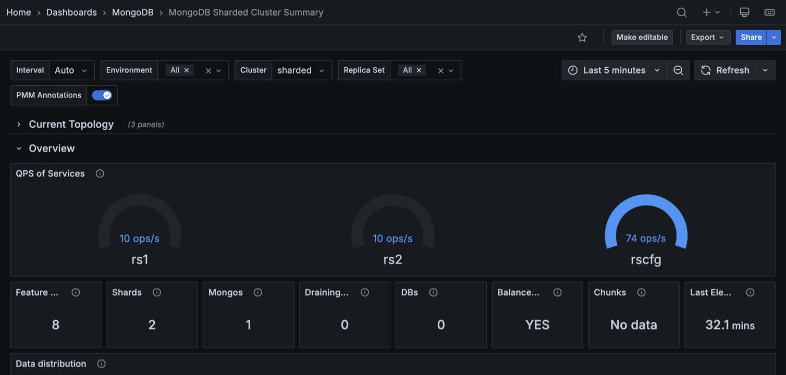

# MongoDB Cluster Summary

This dashboard gives you a unified view of your MongoDB sharded cluster, covering topology, query load, chunk distribution, replication health, and resource usage across config servers, mongos routers, and all shards. Use it as your starting point when investigating cluster-wide performance or confirming the cluster is balanced and healthy.

For mongos-specific monitoring, see the [MongoDB Router Summary](dashboard-mongodb-router-summary.md) dashboard.



## Current Topology

### Config Servers

A hexagon grid showing the current status of each config server. Green means UP, red means DOWN.

Config servers run as a replica set (typically 3 nodes) and store the cluster's metadata and chunk mappings. One red hexagon means reduced redundancy but the cluster is still operational. Two or more red hexagons in a 3-node config server set means quorum is lost and the cluster can no longer route queries or perform metadata operations. This panel shows UP/DOWN status only, not which node is the primary.

### Mongos Routers

A hexagon grid showing the current status of each mongos router. Green means UP, red means DOWN.

### Shards

A hexagon grid per shard, showing the status of each replica set member. Green means PRIMARY or SECONDARY and reachable. Red means the node is unreachable or in an error state.

Use these grids to confirm all cluster components are healthy before investigating performance metrics.

??? info "Configuration for correct topology display"

    To ensure each component appears in the correct section when adding MongoDB services with `pmm-admin add mongodb` or via the PMM UI:

    - use the same `--cluster` name for all components of your sharded cluster.
    - add config servers, shard nodes, and mongos routers as separate services.

    For details, see [Add MongoDB services via CLI](../../install-pmm/install-pmm-client/connect-database/mongodb.md#step-3-add-mongodb-service-to-pmm).

    Example:

    ```sh
    pmm-admin add mongodb --username=pmm --password=password \
      --service-name=rs-0-1 --replication-set=shard0 \
      --host=127.0.0.1 --port=27018 --cluster=myMongoCluster
    ```

## Overview

### QPS of Services

Shows the current query rate per second for each replica set in the cluster, excluding commands. Use this to quickly see which shards are carrying the most query load and spot any that stand out.

### Feature Compatibility Version

Shows the Feature Compatibility Version (FCV) currently active in the cluster. The FCV controls which MongoDB features are available and determines the data file format. Check this after upgrades to confirm the FCV has been updated as expected. An FCV that lags the binary version means some new features are not yet enabled.


### Shards

Shows the total number of shards in the cluster.

### Mongos

Shows the number of mongos routers registered in the cluster.

### Draining Shards

Shows how many shards are currently being drained via `removeShard`. A non-zero value means the balancer is actively moving chunks off a shard being removed. Watch this alongside **Chunks Move Events** to track progress.

### DBs

Shows the number of user-created databases in the cluster. Watch this over time to track database growth.

### Balancer Enabled

Shows whether the cluster balancer is currently enabled. YES means the balancer is active and will redistribute chunks when shards become unbalanced. NO means balancing is paused, which may cause chunk distribution to drift over time. Investigate if the balancer is unexpectedly disabled.

### Chunks

Shows the total number of chunks across all shards. A sudden increase may indicate rapid data growth or a change in sharding key selectivity.

### Last Election

Shows how long ago the most recent primary election occurred in the cluster. A very recent election may indicate an unexpected failover or replica set instability. Click to open the **MongoDB ReplSet Summary** for more context.

### Data distribution

Shows the total storage size of user-created collections per shard in bytes. 

A balanced cluster should show roughly equal bars across shards. Large differences between shards indicate data is not evenly distributed, which can cause some shards to become storage or query hotspots.

### Command Operations

Shows operation rates per second broken down by type: query, insert, update, delete, getmore, replicated write operations, and TTL index document deletions. Use this to understand the overall workload mix. A spike in any operation type helps correlate with latency changes in **Operations Latencies**.

### Top Hottest Collections by Read

Shows the five collections with the highest read rates, in operations per second. Use this to identify collections that may need index tuning or caching improvements.

### Operations Latencies

Shows average operation latency in microseconds over time, broken down by reads, writes, and commands. Rising latency on one operation type while others remain stable usually points to a query or index problem specific to that operation type.

### Top Hottest Collections by Write

Shows the five collections with the highest write rates, in operations per second. Use this to identify collections that may be driving lock contention or replication lag.

### Operations Per Shard

Shows total operations per second for each shard as a stacked area chart, combining all operation types. Use this to see how query load is distributed across shards and whether any shard is taking a disproportionate share of the work.

### MongoDB Versions

Shows the MongoDB version running on each service in the cluster. Check this after upgrades to confirm all nodes are on the expected version. Mixed versions in a cluster can indicate a rolling upgrade is in progress or stalled.

## Node States

### All Node States

Shows the PRIMARY, SECONDARY, ARBITER, or other state of each node in a replica set over time as a state timeline. One timeline is shown per replica set. Use this to identify when role changes happened and whether any node has been in an unexpected state for an extended period.

### Fragmentation Analysis

Shows the estimated fragmentation percentage for each collection, broken down by shard. The value is calculated as the ratio of free (unused) storage to total allocated storage, and the table is sorted from most to least fragmented. Only the top 100 collections are shown; admin and config databases are excluded.

Fragmentation builds up when documents are deleted or moved, leaving gaps in storage blocks that MongoDB has not yet reclaimed. A value of 30% means roughly 30% of that collection's allocated space is wasted. 

Use this table to identify collections worth compacting — run `compact` on the affected nodes during a maintenance window to reclaim disk space.

## Connections

### Current Connections Per Shard

Shows the number of incoming connections per shard over time as a stacked area chart. Use this to spot shards that are receiving significantly more connections than others, which can indicate uneven client routing.

### Available Connections

Shows the number of remaining available connections per service over time. When available connections approach zero for a service, that service is near its connection limit and new client connections will be rejected. Use this to plan connection pool sizing and scaling.

## Collection Details

### Number of Collections in Shards

Shows the number of collections per database in each shard, excluding system databases. Use this to verify collections are distributed as expected across shards.

### Size of Collections in Shards

Shows the storage size of collections per shard, excluding system databases. Use this to identify which collections are consuming the most storage and whether data is evenly distributed.

### Fragmentation Analysis

Shows the fragmentation ratio for collections across shards. A high fragmentation value means a collection has significant wasted space from deleted or moved documents. Use this to identify collections that would benefit from a compact operation.

### Count of Documents in Shards

Shows the number of documents per collection across shards. Use this alongside **Size of Collections** to detect unusually large average document sizes or collections growing faster than expected.

## Chunks in Shards 

### Chunk distribution 

Shows the percentage of total chunks held by each shard as a bar chart. Use this to confirm chunk distribution matches your expected layout.

With standard sharding, chunks should spread roughly evenly, but zoned sharding intentionally concentrates chunks on specific shards. If distribution looks uneven and you are not using zones, check whether the balancer is enabled and running.

### Amount of Chunks in Shards

Shows the number of chunks per shard as a bar chart and table. Use this alongside **Chunk distribution** in the Overview to confirm the balancer is keeping chunks evenly spread.

### Dynamic of Chunks

Shows the rate of change in chunks per shard over time. Positive values mean chunks are being added to a shard. Negative values mean chunks are being moved away. Elevated activity here indicates the balancer is actively rebalancing data.

### Chunks Move Events

Shows the rate of chunk migrations between shards over time. Sustained high migration rates can consume network and disk I/O on the affected shards and increase replication lag. Investigate if chunk moves are frequent during peak traffic hours.

### Chunk Split Events

Shows the rate at which chunks are being split over time. Splits happen automatically when a chunk grows beyond the configured maximum size. A high split rate indicates rapid data growth or a sharding key with low cardinality that is causing hotspots.

## Replication

### Replication Lag by Shard

Shows the maximum replication lag across replica set members for each shard over time. Any shard with consistently rising lag may be under disk or CPU pressure on its secondaries, or the primary may be generating more write traffic than the secondaries can keep up with.

### Oplog Range by Shard

Shows the time span covered by the oplog for each shard, representing the effective recovery window. If the oplog range is shorter than your backup window, a secondary that falls behind cannot be recovered to a consistent point in time without a full resync. A shrinking range means the oplog is rolling over faster than expected. Increase the oplog size if this occurs.

### Flow Control

Shows the flow control throttle rate per shard over time. Flow control is a mechanism MongoDB uses to keep replica set lag below a configurable threshold by slowing write operations on the primary. A non-zero throttle rate means the primary is being intentionally slowed to allow secondaries to catch up. Persistent flow control activity is a signal that secondaries are struggling to keep pace with the primary.

### Oplog GB/Hour

Shows the average gigabytes of oplog data generated per hour by the primary for each shard. Use this to validate oplog sizing. If this value is high relative to your configured oplog size, the recovery window in **Oplog Range by Shard** will shrink quickly. A rising trend means write activity is increasing.

## Nodes Summary

### Nodes Overview

A table listing all nodes across the cluster with their current status and key metrics, including replication state, uptime, and version. 

Use this to get a per-node health snapshot without navigating to individual dashboards. Click a node name to open its **Node Summary** dashboard.
