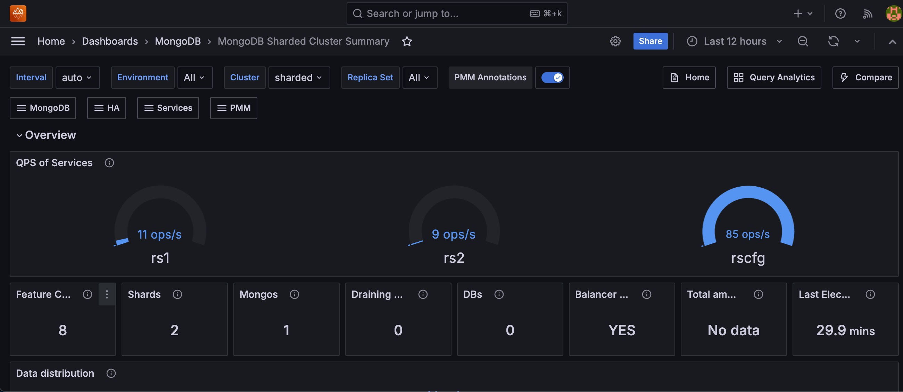

# MongoDB Sharded Cluster Summary

## Overview

Displays essential data for individual nodes, such as their role, CPU usage, memory consumption, disk space, network traffic, uptime, and the current MongoDB version.

## Node States
Shows the state timeline of MongoDB replica set members during the selected time range. Each node's state (PRIMARY, SECONDARY, ARBITER, etc.) is color-coded for easy monitoring, with green indicating healthy states and red showing potential issues. 

Use this to track role changes and identify stability problems across your replica set.

## Collection Details

### Size of Collections in Shards
Visualizes the storage size distribution across MongoDB collections in different shards, excluding system databases. Use this metric to monitor space utilization across collections and plan capacity based on storage growth patterns in your MongoDB cluster.

### Number of Collections in Shards
Displays the total number of collections per database across different shards in your MongoDB cluster, excluding system databases. 

Use this to track collection growth and identify databases that may need optimization based on their collection count.

## Connections

### Current Connections Per Shard
Displays the current number of incoming TCP connections for each MongoDB shard, showing trends over time with mean, maximum, and minimum values.

Use this to monitor connection patterns and ensure your MongoDB cluster maintains healthy connection levels across all shards.

### Available Connections
Tracks the number of available MongoDB connections across your replica sets over time, with statistical breakdowns. 

Use this metric to monitor connection capacity and ensure your MongoDB cluster maintains sufficient connection availability for client requests.

## Chunks in Shards

### Amount of Chunks in Shards
Displays the number of chunks distributed across each shard in your MongoDB cluster, excluding system databases. Use this to monitor data distribution and identify potential balancing needs across your sharded cluster.

### Dynamic of Chunks
Shows the rate of change in chunk distribution across MongoDB shards over time, with statistical breakdowns for each shard. Use this to monitor chunk migration patterns and ensure proper data balancing across your sharded cluster.

### Chunks Move Events
Displays the frequency of chunk movement operations between shards in your MongoDB cluster over time. Use this metric to track balancing activity and identify periods of high chunk migration that might impact cluster performance.

### Chunks Split Events
Shows the rate at which chunks are being split across your MongoDB sharded cluster due to size growth. Use this metric to identify when collections grow rapidly and determine if you need to rebalance or optimize shard keys.

## Replication

### Replication Lag by Shard
Tracks the maximum replication delay (in seconds) between primary and secondary nodes for each shard in your MongoDB cluster. 

Use this to monitor replication health and detect when secondaries fall too far behind their primary nodes.

### Oplog Range by Shard
Shows the time window between the oldest and newest operations in the MongoDB oplog for each shard. Use this to monitor oplog capacity and ensure there's enough history for replica set members to sync after maintenance or failures.

### Oplog GB/Hour
Shows the hourly oplog data volume written to cache by the MongoDB primary server. Use this metric to monitor write intensity, plan storage capacity, and identify periods of high write activity.