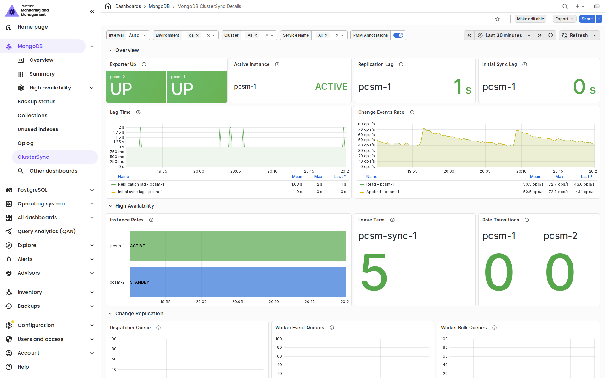

# MongoDB ClusterSync Details

This dashboard follows a migration that Percona ClusterSync for MongoDB (PCSM) runs from a source MongoDB cluster to a target cluster, for example from MongoDB Atlas to Percona Server for MongoDB. It shows the source cluster, PCSM, and the target cluster side by side, so you can check the sync and its impact on both clusters in one place.

Use it to confirm that the migration is healthy and doesn't overload the source or the target, to follow replication progress, and to find where a slow or stuck sync is losing time.

## Prerequisites

To populate every panel of this dashboard, make sure that:

- PCSM 1.0.0 or later is running. PMM does not support earlier PCSM versions.
- Each PCSM instance is added to PMM as an external service. For the steps, see [Monitor Percona ClusterSync for MongoDB](../../install-pmm/install-pmm-client/connect-database/external.md#monitor-percona-clustersync-for-mongodb).
- The source and target clusters are monitored by PMM, and every service of a cluster is added with the same `--cluster` value. For the steps, see [Add MongoDB service to PMM](../../install-pmm/install-pmm-client/connect-database/mongodb.md#step-3-add-mongodb-service-to-pmm).
- For sharded clusters, the shard and config server `mongod` members are monitored, not only the `mongos` routers. The oplog and replication panels need data from `mongod` members.
- The PMM monitoring user has the `read` role on the `local` database, which the oplog window panels need. For the required privileges, see [Set up MongoDB monitoring permissions](../../install-pmm/install-pmm-client/connect-database/mongodb.md#step-1-set-up-mongodb-monitoring-permissions).

If PMM monitors at least one MongoDB service, open the dashboard from **MongoDB > ClusterSync**. Otherwise, go to **All dashboards > Browse all dashboards** and open **MongoDB ClusterSync Details** in the **MongoDB** folder.

## Work through the dashboard

The dashboard is organized as four questions that you answer from top to bottom. Stop as soon as everything is green.

To check a migration:
{.power-number}

1. In **1 · Is the migration healthy?**, check the source, PCSM, and target columns. Red or yellow tiles show where to look.
2. In **2 · Is replication progressing?**, confirm that the initial clone advances and that the lag stays well below the source oplog window.
3. If the lag grows or the sync stalls, expand **3 · Why is replication slow or stuck?** to find where events pile up.
4. If PCSM itself misbehaves, for example after a failover, check **4 · Are the ClusterSync instances healthy?**.

Hover the **ⓘ** icon on any panel to see what the panel shows, what normal looks like, and what to check if it isn't normal. The collapsed **How to use this dashboard** row at the top of the dashboard summarizes this guidance.

A healthy migration looks like this:

- **Members Down** is `0` for the source and the target.
- Exactly one PCSM instance is ACTIVE.
- **Replication Lag** stays under 10 seconds and doesn't grow.
- The source oplog window stays far above the lag.
- Target disk usage stays below 80%.

## Filters

Use the filters at the top of the dashboard to select what to show:

- **Source Cluster**: The MongoDB cluster that PCSM replicates from.
- **Environment**, **ClusterSync Cluster**, and **ClusterSync Instance**: The PCSM instances to show. If you add every instance of one HA group with the same `--cluster` value, select that cluster to see the whole group.
- **Target Cluster**: The MongoDB cluster that PCSM replicates to.

The **Source Cluster** and **Target Cluster** lists show the `cluster` label of the MongoDB services that PMM monitors. A cluster that is added without `--cluster` doesn't appear in these lists.

## Panels that show only the active instance

In a high availability (HA) group, only the ACTIVE PCSM instance replicates data. The lag, change replication, initial sync, and pipeline panels show the ACTIVE instance only. The **4 · Are the ClusterSync instances healthy?** row shows every instance.

## Migration health

The **1 · Is the migration healthy?** row has three columns: the source cluster on the left, PCSM in the middle, and the target cluster on the right. The header of each cluster column links to the [MongoDB ReplSet Summary](dashboard-mongodb-replset-summary.md) and [MongoDB Sharded Cluster Summary](dashboard-mongodb-cluster-summary.md) dashboards for that cluster.

### Source cluster

The source column shows whether the source is healthy and how much load the sync puts on it:

- **Members Down**: Shows the number of source members that PMM reports as down.
- **Max Node CPU**: Shows the highest CPU usage among the hosts that run source members. This panel needs `node_exporter` on the hosts, so it shows **No node_exporter** for clusters that PMM monitors remotely, such as MongoDB Atlas.
- **Oplog Window**: Shows the smallest oplog window among the source members. PCSM resumes change replication from the source oplog. If the lag or the initial clone takes longer than the oplog window, the resume point is lost and the sync must restart. The tile is red below 1 hour and yellow below 6 hours.
- **Internal Replication Lag**: Shows the highest replication lag of a secondary within the source cluster. This is the source's own replication, not the PCSM lag. The panel shows `0` when the replica sets have no secondaries.
- **Operations**: Shows operations per second on the source. During the initial clone, this includes the PCSM reads. Source writes are the changes that PCSM must replicate.
- **Operation Latency**: Shows the average latency of the slowest source member by operation type. A rise that starts with the sync means that PCSM affects production traffic on the source.

### ClusterSync

The middle column shows the state of the sync:

- **Instances Up**: Shows whether PMM can collect metrics from each PCSM instance. **DOWN** means that PCSM is not running or its metrics endpoint is not reachable. **unknown** means that PMM has no data for the instance, for example because its host or PMM Client is down. Click a value to open the [Node Summary](dashboard-node-summary.md) dashboard for that host.
- **Active Instance**: Shows the PCSM instance that holds the HA lease and runs the sync.
- **Replication Lag**: Shows how far the target is behind the source, in logical seconds. PCSM also reports `0` before replication starts.
- **Initial Sync Lag**: Shows how far the initial sync is from catching up with the source, in logical seconds. After the initial sync completes, PCSM keeps reporting the last value until the process restarts.
- **Lag Time**: Shows the replication lag and the initial sync lag over time.
- **Change Events Rate**: Shows change events read from the source and applied to the target per second. **Read** can stay above **Applied** without a backlog, because PCSM skips some events without counting them as applied, such as replayed events and events for excluded namespaces. A backlog shows as growing queues in the **3 · Why is replication slow or stuck?** row.

### Target cluster

The target column shows whether the target keeps up with the PCSM writes:

- **Members Down**: Shows the number of target members that PMM reports as down.
- **Max Node CPU**: Shows the highest CPU usage among the hosts that run target members.
- **Disk Space Used**: Shows the fullest filesystem among the hosts that run target members. The initial clone copies the whole source dataset, so check that the target has enough space. The tile is yellow above 80% and red above 90%.
- **Internal Replication Lag**: Shows the highest replication lag of a secondary within the target cluster. Secondaries that fall behind the PCSM write load slow down majority writes, and therefore the sync.
- **Operations**: Shows operations per second on the target. During a migration, most writes come from PCSM.
- **Operation Latency**: Shows the average latency of the slowest target member by operation type. High write latency is the most common reason that the lag grows.

**Disk Space Used** reads filesystem metrics from `node_exporter`. It doesn't know which mount holds the MongoDB data, so it reports the fullest filesystem on each host. For members without `node_exporter`, the panel falls back to the filesystem size that MongoDB reports. The fallback requires the service to be added with [`--enable-all-collectors`](../../use/commands/pmm-admin/add.md#collector-flags).

## Replication progress

The **2 · Is replication progressing?** row shows the progress of the initial clone of the source data, and the lag against the source oplog window:

- **Copy Progress**: Shows the share of the estimated data size that PCSM has copied to the target.
- **Copied vs Estimated Size**: Shows bytes inserted into the target against the estimated total size.
- **Copy Throughput**: Shows bytes per second read from the source and inserted into the target. Low read throughput points to the source or the network. Insert throughput well below read throughput points to the target.
- **Documents Copied per Second**: Shows documents read from the source and inserted into the target.
- **Batch Duration**: Shows the duration of the latest read batch and insert batch. Growing read batches point to the source, and growing insert batches point to the target.
- **Lag vs Source Oplog Window**: Shows the PCSM replication lag and initial sync lag against the smallest source oplog window, on a logarithmic scale. Keep the oplog window line far above both lag lines.

The copy counters belong to each PCSM process, and PCSM resets them when it restarts or fails over. **Copy Progress** is accurate only for an uninterrupted clone. If an instance becomes ACTIVE after a restart or failover, the copy panels show **No clone data in this process** for it.

## Replication bottlenecks

The collapsed **3 · Why is replication slow or stuck?** row shows where events wait inside the PCSM replication pipeline. Expand it when the lag grows or the sync stalls.

PCSM reads change events from the source, and a dispatcher routes each event to a replication worker. Each worker groups events into bulk writes and flushes them to the target. By default, PCSM starts one worker per CPU core.

The row shows the following panels for the ACTIVE instance:

- **Dispatcher Queue**: Shows events waiting between the change stream reader and the dispatcher. A growing queue means that the workers can't take events fast enough.
- **Worker Event Queues**: Shows events waiting in the workers' inbound queues, as a total and for the fullest single worker.
- **Worker Bulk Queues**: Shows bulk writes waiting to be written to the target, as a total and for the fullest single worker. Bulks that pile up mean that writes to the target are the bottleneck.
- **Worker Events Applied**: Shows events applied per second by all workers.
- **Flush Duration (p99)**: Shows the 99th percentile duration of bulk writes to the target. Rising flush duration points to a slow target.
- **Flush Batch Size (p99)**: Shows the 99th percentile number of operations per bulk write.

The same row shows the event queue, events applied, and flush duration of individual workers, with the 10 busiest workers in each panel. One worker far above the others points to a hot collection or document.

PCSM reports worker metrics only after it routes its first change event, so the worker panels show `0` during the initial clone and while the source has no writes. The flush panels show **Waiting for first flush** until PCSM writes its first bulk to the target.

## ClusterSync instance health

The **4 · Are the ClusterSync instances healthy?** row shows every PCSM instance, whether it is ACTIVE or STANDBY.

The following panels show availability and HA roles:

- **Instance Availability**: Shows whether PMM could collect metrics from each instance over time.
- **Instance Roles**: Shows the role of each instance over time. The ACTIVE instance replicates data, and STANDBY instances wait to take over.
- **Lease Term**: Shows the current HA lease term for each cluster. The term increases every time a different instance takes over.
- **Role Transitions**: Shows how many times each instance changed its role in the selected time range. An instance that starts and becomes ACTIVE counts one transition.

The following panels show the resources of each PCSM process:

- **CPU Usage**: Shows the CPU used by each process, where 100% is one full core.
- **Resident Memory**: Shows the resident memory of each process. Steady growth can lead to an out-of-memory kill and a failover.
- **File Descriptors**: Shows open and maximum file descriptors.
- **Goroutines and Threads**, **Go Heap**, and **GC Pause Duration**: Show the Go runtime state of each process. Steady growth of goroutines or heap points to a leak.

## Panels with no data

Most empty panels come from the monitoring setup, not from the migration. The following table lists the messages that the panels show and how to fix them:

| Panel shows | Cause | Fix |
|---|---|---|
| **Needs mongod members** | PMM monitors only the `mongos` routers of the cluster, or the `mongod` members have a different `cluster` label. | Add the shard and config server `mongod` members to PMM with the same `--cluster` value as the routers. |
| **No node_exporter** | The cluster hosts have no `node_exporter`, for example because PMM monitors the cluster remotely. | Install PMM Client on the database hosts, or ignore the panel for DBaaS clusters. |
| **No members** | No MongoDB service in PMM has the selected `cluster` label. | Check the **Source Cluster** or **Target Cluster** filter, and the `--cluster` value of the services. |
| Empty **Oplog Window** with `mongod` members monitored | The PMM monitoring user can't read the `local` database. | Grant the `read` role on the `local` database to the PMM monitoring user. |
| **Needs PCSM 1.0+** | PCSM is earlier than 1.0.0, which doesn't report HA metrics. | Upgrade PCSM. |
| **Waiting for first flush** | PCSM hasn't written any change replication bulk to the target yet. | No action needed. The panels fill in after the initial clone when the source receives writes. |
