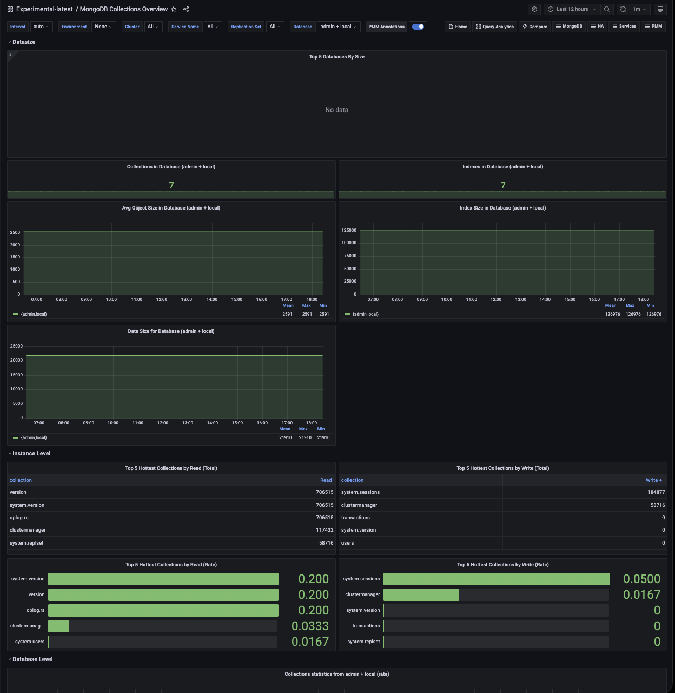

# MongoDB Collections Overview

This dashboard gives you a view of database and collection-level activity in MongoDB. Use it to understand how your data is distributed across databases, which collections are getting the most traffic, and how different operation types break down over time.

Use the filters at the top to scope the view to a specific service, cluster, replication set, or database.

## Data size

### Top 5 Databases By Size

Shows the five largest databases in your instance or cluster as time series lines, measured in bytes. The legend table below the chart includes the mean, max, and min size for each database over the selected time range.

Use this to understand which databases are consuming the most storage and how their size is changing over time. A steadily growing line is expected for active databases. A sudden jump can indicate a bulk import, a runaway process, or unexpectedly large documents being written.

Note that data in this panel comes from the primary node only in a replica set.

### Collections in Database

Shows the current number of collections in the selected database as a single number.

Use this alongside **Indexes in Database** to get a quick sense of the database's structure. A much higher index count relative to collection count means each collection has many indexes, which increases write overhead and memory usage.

### Indexes in Database

Shows the current total number of indexes across all collections in the selected database.

High index counts improve read performance but slow down writes and increase memory pressure. Use this to spot databases where index sprawl may be contributing to performance issues.

### Avg Object Size in Database

Shows the average document size in bytes for the selected database over time. This is calculated as `dataSize` divided by the number of documents.

Use this to understand your typical document size and track how it changes. A rising average can mean documents are growing (for example, arrays being appended to), which affects memory usage, query performance, and backup size. A sudden drop may indicate a bulk delete or compaction.

### Index Size in Database

Shows the total size of all indexes in the selected database over time, in bytes.

Use this to track index memory consumption. If index size is growing faster than data size, you may have indexes accumulating without a corresponding increase in documents, which can happen when TTL indexes aren't cleaning up data as expected, or when new indexes are being created without removing old ones.

### Data Size for Database

Shows the total uncompressed data size in the selected database over time, in bytes.

Note that this value represents the logical data size before WiredTiger compression, so it will typically be larger than the actual storage used on disk. Use this to track data growth trends and plan capacity. Compare with **Index Size** to understand the ratio of index overhead to actual data.

## Instance Level

### Top 5 Hottest Collections by Read (Total)

Shows the five most-read collections in the selected database as a table, with the database name, collection name, and total read count since the service started.

Use this to identify which collections are driving the most read traffic. High read counts on a small number of collections can point to candidates for caching or index optimization.

### Top 5 Hottest Collections by Write (Total)

Shows the five most-written collections in the selected database as a table, with the database name, collection name, and total write count (inserts, updates, and deletes combined) since the service started.

Use this to find collections under the heaviest write load. Collections with very high write counts are the most sensitive to index overhead, as every write must update all indexes on that collection.

### Top 5 Hottest Collections by Read (Rate)

Shows the five most-read collections as a horizontal bar gauge, ranked by current read rate (reads per second) using a stable rate window. Collection names are kept visible for long names.

Unlike the Total panels above, this reflects recent activity rather than cumulative counts, so it's more useful for spotting what's hot right now. Use it during an incident or after a deployment to see which collections are suddenly receiving more traffic than usual.

### Top 5 Hottest Collections by Write (Rate)

Shows the five most-written collections as a horizontal bar gauge, ranked by current write rate (inserts, updates, and deletes per second) using a stable rate window. Collection names are kept visible for long names.

Use this alongside the Read Rate panel to get a full picture of which collections are under the most active load right now. A collection appearing in both the read and write rate charts is handling high traffic on both sides and is worth watching closely for performance issues.

## Database Level

### Collections statistics for $database (rate)

Shows the rate of operations per second for the selected database, broken down by operation type: `Commands`, `Insert`, `Update`, `Remove`, `Getmore`, and `Queries`. Each line in the chart represents one operation type for one database.

Use this to understand the current workload mix hitting each database. A spike in Remove rate can signal a bulk cleanup job. A spike in `Getmore` can indicate large cursor-based queries paginating through results. The legend table shows mean, max, and min rates to help you compare types over the time range.

### Collections statistics for $database (summary)

Shows the cumulative operation counts for the selected database over the selected time range, broken down by the same operation types as the rate panel above.

Use this alongside the rate panel to distinguish between a high burst of activity in a short window and sustained ongoing load. High cumulative counts with a flat rate line mean the activity happened earlier in the time range.

### Collections statistics $database

Shows a per-collection breakdown of total operation counts for the selected database, with one row per collection and columns for `Queries`, `Insert`, `Remove`, `Update`, and `Getmore`.

Use this to drill down from the dashboard-level summaries to individual collections. The table is sorted by **Queries** descending by default. 

Sort by any other column to find collections with the highest count for a specific operation type. 
If you've selected multiple databases using the filter, a separate table appears for each one.
