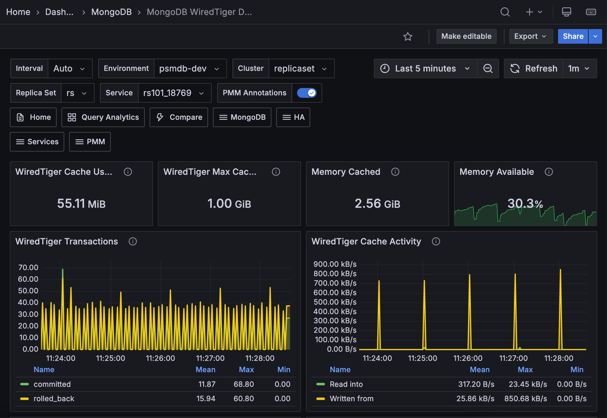

# MongoDB InMemory Details

This dashboard helps you monitor MongoDB instances that use the InMemory storage engine. It shows cache usage, transaction rate, session activity, and node resource use.

## InMemory Storage

Shows the current state of the InMemory cache at a glance. Use these panels to quickly assess how much of your configured memory is in use and whether your data is approaching the configured size limit.

### InMemory Data Size

Shows the amount of data currently stored in the InMemory cache in its uncompressed format. This reflects the actual working dataset in memory, not how data is stored on disk.

This value will always be lower than the limit shown in **InMemory Max Data Size**. If it's consistently close to that limit, consider increasing the configured cache size to avoid evictions or degraded performance.

### InMemory Max Data Size

Shows the maximum amount of data the InMemory storage engine is configured to hold. Once your dataset reaches this limit, MongoDB begins evicting data to make room for new writes, which can impact performance.

You can adjust this limit by setting `storage.inMemory.engineConfig.inMemorySizeGB` in the MongoDB configuration file or by passing the `--inMemorySizeGB` flag at startup.

### InMemory Available

Shows the percentage of InMemory capacity that is still free, calculated as the ratio of unused space to the total configured size. The panel uses color-coded thresholds: green when availability is healthy, orange as it drops below 10%, and red when critically low.

Use this panel to detect when your dataset is approaching its configured limit. Proactively increasing capacity before this panel turns red helps avoid write stalls or data eviction under load.

### InMemory Dirty Pages

Shows the percentage of pages in the InMemory cache that contain modified data not yet consolidated. A small percentage of dirty pages is normal during active write workloads.

If this value is persistently high (above 30%, marked orange, or above 50%, marked red), it may indicate that the configured InMemory size is too small for the current write rate and the engine is under pressure to consolidate data faster than it can.

## InMemory Engine

These panels help you understand how hard the InMemory storage engine is working over time. You can see how quickly activity is growing, how close the cache is to its limit, and how many sessions and pages the engine is handling.

### InMemory Transactions

Shows how many transactions the InMemory engine commits each second. Spikes usually mean a burst of writes or mixed read and write traffic.

Use this panel with latency and cache pressure panels to understand cause and effect. If transaction rate stays high while dirty pages keep rising, the engine may be nearing its throughput limit.

### InMemory Capacity

Shows the configured cache limit (**Maximum**) and current cache usage (**Used**) over time, in bytes. When **Used** gets close to **Maximum**, the engine is running out of headroom.

Use this panel together with **InMemory Available** to spot growth trends early. If **Used** keeps climbing without leveling off, increase cache size before performance starts to drop.

### InMemory Sessions

Shows how many sessions and open cursors the InMemory engine is handling over time. A moderate and stable level is normal.

If these counts stay high or keep rising, especially when cursors do not drop, you may have long-running operations, too many concurrent connections, or cursor leaks in application code. Check this panel together with **Connections** and **Cursors** in MongoDB Summary for a clearer diagnosis.

### InMemory Pages

Shows how many pages are currently stored in the InMemory cache. This number naturally moves up and down as the working dataset and access pattern change.

Use this panel to see how the cache reacts to workload shifts. A sudden drop can indicate a restart or cache flush. A long plateau near capacity often means the dataset is larger than available memory.

## Operations

These panels track MongoDB document-level operations, locking behavior, query execution efficiency, and OS-level memory events on the selected node.

### Document Changes

Shows the rate of document-level operations per second, including inserts, updates, deletes, and returned documents on both primary and secondary nodes. Also includes replicated write operations (`repl_inserted`, `repl_updated`, `repl_deleted`) and documents removed by TTL expiration (`ttl_deleted`).

Use this panel to understand the write and read workload profile of the node, monitor replication activity, and track whether TTL-based cleanup is running at the expected rate.

### Queued Operations

Shows the number of operations currently waiting to acquire a global lock, broken down into read and write queues. A value of zero is the expected baseline under normal operation.

If this queue does not return to zero, and especially if it keeps growing, lock contention is likely. The most common cause is long-running write operations. Check this panel with **Operations Latency** to confirm whether queueing is driving slower response times.

### Scanned and Moved Objects

Shows how many objects are scanned each second during query execution, split into data objects (`scanned_objects`) and index entries (`scanned`). If scanned objects are much higher than returned documents, queries may be doing full collection scans or using low-selectivity indexes.

Use this panel to spot query efficiency problems. High `scanned_objects` values compared to actual query results usually point to missing or inefficient indexes that add unnecessary load.

### Page Faults

Shows OS-level memory page faults per second on the node running MongoDB. Page faults happen when the OS must load data from disk because it is not in RAM, and they can come from MongoDB or other processes on the same host.

In an InMemory deployment, a sustained rise in page faults is an important warning sign because the engine depends on RAM. If page faults keep increasing, the host is likely under memory pressure, either because it needs more RAM or because other processes are competing for memory.

## MongoDB Summary

Gives you a quick health and activity summary for the selected MongoDB service.

### MongoDB Uptime

Shows how long the selected MongoDB instance has been running since its last restart. The panel highlights recent restarts with color thresholds: red for under 5 minutes, orange for under 1 hour, and green for over 1 hour.

Use this panel to quickly verify that the service has not restarted unexpectedly, especially after maintenance or during incident response.

### QPS

Shows total query operations per second across all operation types (excluding internal commands) for the selected service. It gives you a quick view of current request load.

Use this panel with resource metrics to connect throughput changes to system behavior. If QPS spikes while latency or queued operations also rise, you are likely seeing a workload surge that needs investigation.

### Latency

Shows average command execution latency in microseconds for the selected MongoDB service. Low and stable latency usually means the instance is responding well.

Sudden spikes or a slowly rising baseline are early warning signs. Compare this panel with **Queued Operations** and **InMemory Transactions** to tell whether latency is coming from lock contention, throughput saturation, or cache pressure.

### Connections

Shows active client connections to MongoDB over time. Connection counts that stay high can put pressure on both MongoDB and the operating system.

Use this panel to track connection trends and identify high-demand periods. If the count stays near the configured maximum, tune application-side connection pooling to reduce pressure on the database.

### Cursors

Shows open cursors on the selected MongoDB service over time, broken down by state. Cursors are pointers to query result sets and expire after 10 minutes by default.

A rising count of open or pinned cursors is worth investigating. It often indicates long-running queries or application code that is not closing cursors properly, which can eventually exhaust server resources.

## Node Summary

Provides OS-level metrics for the host running the selected MongoDB service. Because the InMemory engine keeps all data in RAM, node memory and CPU health are especially important.

### RAM

Shows total physical memory available on the node. In containerized environments, this reflects the container memory limit, not total host memory.

Use this panel as a baseline when reviewing pressure indicators such as **Memory Available** and **Disk I/O and Swap Activity**.

### Memory Available

Shows the percentage of memory currently available for application use. On modern Linux kernels, this includes reclaimable cache and buffer memory, so it is more useful than raw free memory.

The panel turns orange below 5% and red when available memory is very low.

For InMemory deployments, this value must stay safely above zero. If the OS runs out of available memory, it starts swapping, which severely hurts performance for an engine that depends on RAM.

### Virtual Memory

Shows total virtual memory on the node, calculated as RAM plus swap space. In containerized environments, this reflects container memory and swap limits.

### Disk Space

Shows total disk capacity across all monitored partitions on the node. In some setups, such as overlapping or shared mount points, this value can be over-reported.

### Min Space Available

Shows the lowest free-space percentage across monitored disk partitions. The panel turns orange below 5% and green at 20% or higher.

Use this panel to quickly identify the most constrained partition. Even in InMemory deployments, disk space still matters because MongoDB writes journal files, logs, and diagnostic data to disk.

### CPU Usage

Shows CPU time by mode (user, system, iowait, steal, and others) as a percentage of total capacity over time.

High `iowait` can point to disk bottlenecks, and high `steal` can indicate resource contention in virtualized or cloud environments. For InMemory deployments, watch for `system` CPU spikes, which can signal OS memory-management pressure.

### CPU Saturation and Max Core Usage

Shows CPU saturation as normalized load (running processes divided by available cores), along with peak utilization on any single core.

Use this panel to see whether the node is CPU-bound and whether load is evenly distributed or concentrated on one core. High **Max Core Usage** with low overall CPU usage usually points to a single-threaded bottleneck, not a total capacity issue.

### Disk I/O and Swap Activity

Shows disk read and write throughput (bytes per second) together with swap read (**Swap In**) and write (**Swap Out**) activity. Disk writes appear on the negative Y axis.

For InMemory deployments, sustained swap activity is a critical warning sign. Swapping means the OS is using disk as overflow memory, which directly undermines InMemory performance. If **Swap Out** stays non-zero, the node needs more RAM.

### Network Traffic

Shows inbound and outbound network throughput (bytes per second) for the node. Outbound traffic appears on the negative Y axis.

Use this panel to spot network saturation or unexpected traffic spikes. Sudden drops in inbound traffic can indicate client connectivity issues, while high outbound traffic can correlate with replication or large query result sets sent to clients.
