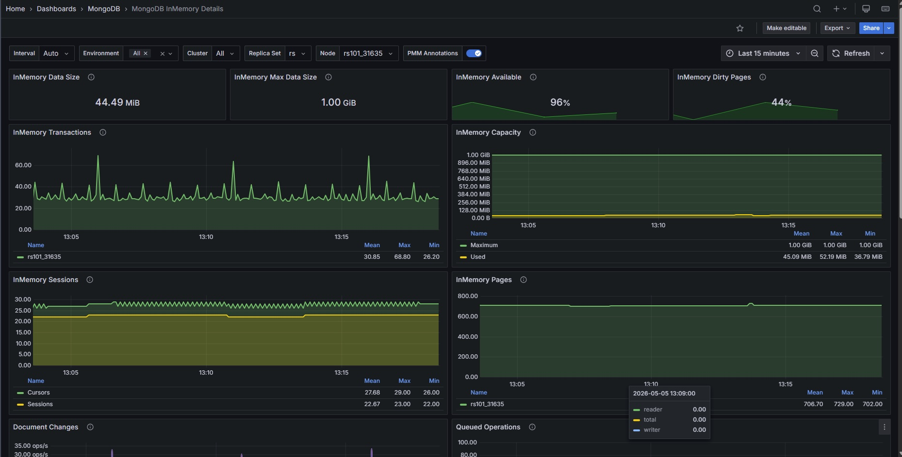

# MongoDB InMemory Details

This dashboard focuses on the InMemory storage engine. It shows cache usage, eviction behavior, transaction activity, and the underlying node health for any MongoDB instance running with `--storageEngine inMemory`.

Use the filters at the top to scope the view to a specific service.

## Overview

### InMemory Data Size

Shows the current amount of uncompressed data in the InMemory cache in bytes.

Use this alongside **InMemory Max Data Size** to understand how full the cache is in absolute terms.

A value that keeps climbing toward the maximum is a signal to plan a cache size increase before you run out of headroom.

### InMemory Max Data Size

Shows the configured maximum size of the InMemory cache in bytes as a single number. This is the hard ceiling for how much data can reside in memory at once. It corresponds to the `--inMemoryCacheSizeGB` startup parameter.

Use this as your reference point when reading the **InMemory Available** and **InMemory Capacity** panels: all usage figures are relative to this limit.

### InMemory Available

Shows the percentage of InMemory cache that is still available, as a single number. The gauge turns orange at 90% used (10% remaining) and red at 95% used (5% remaining).

When this value is consistently low, your working dataset is close to the cache limit. Because the InMemory engine keeps all data in memory and discards it on shutdown, running near the limit increases eviction pressure and can degrade performance. 

If you regularly see orange or red, consider increasing `--inMemoryCacheSizeGB` or reducing the dataset size.

### InMemory Dirty Pages

Shows the percentage of InMemory cache occupied by dirty pages (modified data not yet consolidated) as a single number. The gauge turns orange at 30% and red at 50%.

Dirty pages are changes that MongoDB has accepted but not yet cleaned up internally. When this percentage climbs, your writes are arriving faster than they can be processed, which puts pressure on the cache and can slow down your queries.

If this stays elevated, check **InMemory Cache Eviction** to see whether MongoDB is struggling to free space fast enough to keep up with your workload.

### InMemory Transactions

Shows the rate of internal transactions per second, broken down by type (begin, commit, rollback).

A high rollback rate is expected and not a cause for concern, since MongoDB uses rollbacks internally even for read queries to keep your data views consistent. Focus instead on whether transaction activity correlates with growing **Queued Operations**, which would mean your queries are starting to wait on locks.

### InMemory Capacity

Shows the configured maximum cache size and the currently used cache size over time, both in bytes, as two lines on the same chart.

Use this to track cache utilization trends. If the used line is trending toward the max line, you're approaching the cache limit. A sudden drop in used size can mean a large portion of data expired or was explicitly removed. A flat used line near the max means the cache is effectively full and eviction is keeping usage in check.

### InMemory Sessions

Shows the number of open cursors and sessions over time.

Cursors represent active query positions inside the storage engine. A large number of open cursors often means long-running queries or applications that open cursors without closing them promptly. 

If this number grows continuously without returning to a baseline, investigate whether your application is leaking cursors.

### InMemory Pages

Shows the number of pages in the InMemory cache over time, broken down into dirty pages (modified, not yet reconciled) and total pages.

Use this to understand the composition of the cache. A high proportion of dirty pages relative to total pages means the engine is under write pressure and may be struggling to keep up with reconciliation. 

Watch this alongside **InMemory Dirty Pages** (the percentage stat) to get both the proportion and the absolute scale.

### InMemory Concurrency Tickets

Shows the number of available concurrency tickets for read and write operations over time. Write tickets are plotted on the negative Y axis so reads and writes can be read independently at the same scale.

MongoDB limits simultaneous operations using a ticket system. When available tickets approach zero, new operations must wait. A sustained drop toward zero on either axis means the engine is saturated for that operation type and latency will rise.

If you see this frequently, the workload may need tuning (fewer simultaneous connections, index improvements to reduce scan time) or the concurrency limits may need adjusting.

### Queued Operations

Shows the number of operations queued because they are waiting for a lock, broken down by read and write queues.

Any value above zero means lock contention is occurring. A small queue that resolves quickly is usually normal. A queue that grows and stays elevated means long-running operations are blocking others, which will increase latency across the board. Use this panel alongside **InMemory Concurrency Tickets** to distinguish between ticket exhaustion and lock contention.

### Document Changes

Shows the rate of document operations per second, stacked by type: inserts, updates, deletes, returned (query results), replicated write operations, and TTL deletes.

Use this to understand the overall write workload and its composition. A sudden spike in TTL deletes means a large amount of data is expiring at once, which can briefly increase cache eviction activity. A spike in replicated writes on a secondary means replication is catching up. 

Compare the insert and delete rates to understand net data growth.

### InMemory Cache Eviction

Shows the rate of modified (dirty) pages evicted from the InMemory cache per second.

The InMemory engine only evicts modified pages, which happens during data compaction when dirty pages are consolidated and removed. 

A consistently high eviction rate means the cache is under sustained write pressure. If eviction spikes correlate with performance degradation, consider increasing the cache size so the engine has more room before it must evict.

### Scanned and Moved Objects

Shows the rate of objects scanned per second, broken down by data objects and index objects. Also shows the rate of documents moved to a new location per second.

Scanned objects measure how much data and index the query engine is reading to satisfy queries. High scan rates relative to returned documents indicate full or partial collection scans, which can be improved with indexes. 

The moved documents metric only applies to the MMAPv1 storage engine, which is no longer used in modern MongoDB versions; expect this to show zero on current deployments.

### Page Faults

Shows the rate of operating system memory page faults per second.

A page fault occurs when a process accesses a memory page that isn't currently in RAM, either because it was never loaded yet or because it was swapped out. 

For the InMemory storage engine, page faults won't come from MongoDB data access (all data stays in the cache in RAM), so they typically come from MongoDB's own process memory or from other processes on the host. 

A consistently high rate can indicate memory pressure on the host. Check **Memory Available** in the node section to confirm.

## MongoDB Summary

### MongoDB Uptime

Shows how long the MongoDB instance has been running since its last restart, in seconds. The display turns green once the instance has been up for at least one hour.

A recently restarted instance will have a low uptime. For the InMemory engine, a restart means all data is gone, so a low uptime here is more significant than for a persistent storage engine. Investigate unexpected restarts immediately.

### QPS

Shows the current query throughput in operations per second, excluding internal command traffic.

Use this as a baseline reference for the instance's overall load. Compare against your normal operating range to spot unexpected spikes or drops.

### Latency

Shows the average command latency in microseconds.

Rising latency alongside stable QPS usually points to a resource bottleneck (cache pressure, lock contention, or CPU saturation). Use this alongside **Queued Operations** and **InMemory Concurrency Tickets** to narrow down the cause.

### Service

Shows the name of the current service as a link. Click it to open the **MongoDB Instance Summary** dashboard for this service.

### Connections

Shows the number of active connections to the MongoDB instance over time.

Monitor this against your configured `maxIncomingConnections` limit. A connection count climbing toward the limit means the instance is approaching saturation. A sudden drop to zero or near-zero means the instance became unreachable.

### Cursors

Shows the number of open cursors over time, broken down by state (idle, timed out, etc.).

Cursor accumulation without a corresponding increase in active queries usually points to cursors not being closed by the application. Timed-out cursors can cause application errors and indicate queries that ran longer than the cursor timeout.

## Node Summary

### System Uptime

Shows how long the host node has been running since its last boot.

A low value means the host was recently restarted. For an InMemory MongoDB instance, a host restart implies a MongoDB restart and full data loss, so correlate this with **MongoDB Uptime** to confirm.

### Load Average

Shows the host's 1-minute load average.

Values above the number of CPU cores mean the system is overloaded. Use this alongside **CPU Usage** to see which CPU modes are contributing to the load.

### RAM

Shows the total installed RAM on the host.

Use this as context when reading the **InMemory Max Data Size** and **Memory Available** panels. The InMemory cache must fit within available host RAM along with all other processes.

### Memory Available

Shows how much RAM is currently free on the host.

For InMemory deployments, this matters both for the MongoDB cache and for the OS's own memory needs. If available memory drops below a safe margin (roughly 10-15% of total RAM), the OS may start swapping, which will cause page faults and degrade performance.

### Virtual Memory

Shows the total virtual memory allocated by processes on the host.

A very high virtual memory figure relative to physical RAM isn't always a problem (many allocations are never actually used), but a sustained increase can indicate memory growth worth investigating.

### Disk Space

Shows the total disk capacity on the host. Links to the Disk Details dashboard for more information.

Even though the InMemory engine doesn't persist data, MongoDB still writes logs and diagnostic data to disk. Make sure there's enough free space for these.                           

### Min Space Available

Shows the percentage of free space on the most-utilized filesystem on the host.

A low value here means one of the host's filesystems is nearly full. Even for InMemory deployments, a full disk can cause MongoDB to crash if it can't write logs or temporary files.

### Node

Shows the name of the host node as a link. Click it to open the Node Summary dashboard for this host.          

### CPU Usage

Shows CPU utilization over time, stacked by mode: user, system, iowait, steal, and others.

A high user percentage means application processes (including MongoDB) are driving the load. A high iowait percentage means the CPU is often waiting for disk I/O, which is unusual for InMemory deployments and may indicate another process doing disk work. 

A high steal percentage means the host's vCPU is being time-sliced by the hypervisor.

### CPU Saturation and Max Core Usage

Shows normalized CPU load (load average divided by CPU count) and the utilization of the most-loaded CPU core over time.

The normalized load shows whether the system is overloaded overall. The max core metric shows whether work is concentrated on a single core, which can create a bottleneck even when overall CPU usage looks low.

### Disk I/O and Swap Activity

Shows disk read throughput (positive Y axis) and disk write throughput (negative Y axis), plus swap I/O, over time. Links to the Disk Performance dashboard.

Persistent disk activity on an InMemory MongoDB host usually comes from logging, other processes, or OS activity rather than MongoDB data writes. Swap activity is a warning sign: if the host is swapping, it means physical RAM is exhausted and performance will degrade significantly.

### Network Traffic

Shows inbound network throughput (positive Y axis) and outbound network throughput (negative Y axis) over time.

Unexpected spikes in network traffic on an InMemory host can indicate replication traffic, a client sending or receiving large result sets, or backup activity.
