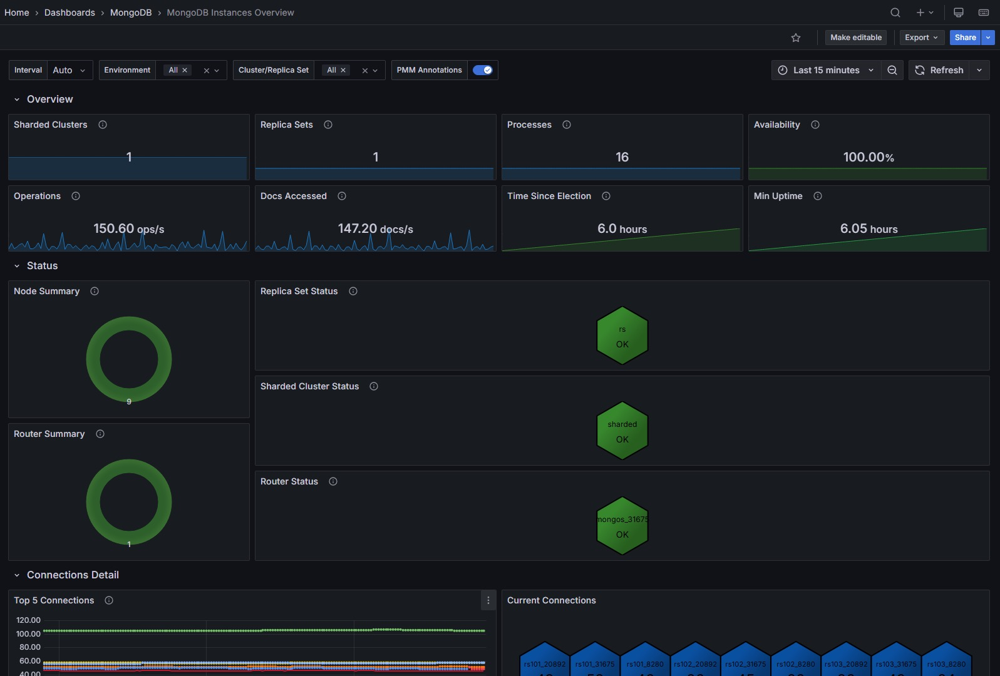

# MongoDB Instance Summary

Provides detailed metrics for a single MongoDB instance, including performance, operations, and system resource usage.

## Overview

At the top of the dashboard, summary panels show key metrics at a glance:

- **Node**: Link to the Node Summary dashboard for the underlying host.
- **MongoDB Uptime**: How long the MongoDB instance has been running. The display turns orange after one hour and green after 24 hours. A low value may mean the instance was restarted unexpectedly.
- **QPS**: Queries per second, excluding administrative commands. Use this as a baseline for the instance's overall load.
- **Latency**: Average command latency in microseconds. Rising latency alongside stable QPS usually points to a resource bottleneck.
- **ReplSet**: Name of the replica set this instance belongs to. Click to open the MongoDB ReplSet Summary dashboard.
- **Current ReplSet State**: Current role of this instance. Normal values are PRIMARY, SECONDARY, and ARBITER. A state of STARTUP2 means the instance is in initial sync. Click to open the MongoDB ReplSet Summary dashboard.

## ReplSet States

Shows a timeline of replica set state transitions over the selected time range, color-coded by state.

Use this to identify elections, failovers, or unexpected role changes. A transition away from PRIMARY or SECONDARY and back again can indicate a brief network issue or an election. See [Replica Set Member States](https://docs.mongodb.com/manual/reference/replica-states/) for a full list of states and their meanings.

## Service Summary

Detailed summary information for the selected MongoDB service.

## Command Operations

Shows operation rates per second over time, broken down by type: legacy wire protocol operations (`query`, `insert`, `update`, `delete`, `getmore`), replicated operations (`repl_insert`, `repl_update`, `repl_delete`), and TTL index deletions (`ttl_delete`).

Use this to understand what the instance is doing and how the workload is composed. A rising `repl_*` rate on a secondary means it is actively applying changes from the primary. 

Compare regular and replicated operation rates to distinguish client-driven load from replication catch-up traffic

## Latency Detail

Shows average operation latency in microseconds over time, broken down by type: read, write, and command.

Use this to spot which operation type is responsible for latency increases. If read latency rises while write latency stays flat, the cause is likely on the query side (missing indexes, large scans). If all types rise together, the bottleneck is more likely a shared resource like CPU or lock contention.

## Connections

Shows the number of active incoming TCP connections to the MongoDB instance over time.

Monitor this against your configured `maxIncomingConnections` limit. A count climbing toward the limit means the instance is approaching saturation. A sudden drop to zero or near-zero means the instance became unreachable.

## Cursors

Shows the number of open cursors over time, broken down by state, including idle cursors.

A large and growing cursor count usually means cursors are not being closed by the application after use. This consumes server memory and can eventually cause issues. If the count keeps rising without a corresponding increase in active queries, investigate whether your application is leaking cursors.

## Document Operations

Shows the rate of documents per second inserted, updated, deleted, or returned over time.

Note that document counts don't map 1-to-1 with operation counts: a single update operation can affect multiple documents. Use this alongside **Command Operations** to understand both the operation rate and the data throughput it generates.

## Queued Operations

Shows the number of operations waiting for a lock over time, broken down by read and write queues.

Any value above zero means lock contention is occurring. A small queue that resolves quickly is usually normal. A queue that grows and stays elevated means long-running operations are blocking others, which will increase latency across the board.

## Query Efficiency

Shows two efficiency ratios over time: documents returned versus documents scanned (Document), and index entries scanned versus documents scanned (Index).

A Document ratio close to 100% means queries are returning almost everything they scan, which is ideal. A low ratio means the query engine is scanning many more documents than it returns, which typically indicates a missing or unused index. 

A consistently low **Index ratio** means queries are relying on collection scans rather than index lookups.

## Scanned and Moved Objects

Shows the rate of data objects and index entries scanned per second, plus the rate of documents moved to a new location.

High scan rates relative to documents returned (visible in **Query Efficiency**) indicate collection scans that may benefit from indexes. The moved documents metric only applies to the MMAPv1 storage engine, which is no longer used in modern MongoDB versions; expect this to show zero on current deployments.

## getLastError Write Time

Shows the rate of time spent per second executing `getLastError` commands to confirm write concern, in milliseconds.

`getLastError` is a legacy write concern mechanism used by older drivers. If you see activity here, your application is using an older driver version. Monitor for spikes, which can indicate write concern timeouts or slow writes.

## getLastError Write Operations

Shows the rate of `getLastError` commands per second, broken down into Total (all commands) and Timeouts (commands that failed to confirm within the timeout).

A rising Timeouts line means write concern confirmations are frequently failing to complete in time, which can indicate slow writes, replication lag, or an overly strict write concern setting. If both Total and Timeouts are non-zero, older drivers are still in use.

## Assert Events

Shows the rate of assert events per second over time, broken down by type.

Asserts are internal consistency checks. Occasional asserts are normal. A spike or sustained high value means something unexpected is happening internally and you should check the MongoDB logs for details.

## Page Faults

Shows the rate of operating system memory page faults per second.

A page fault occurs when a process accesses a memory page that isn't currently in RAM, either because it was never loaded yet or because it was swapped out. High page fault rates on a MongoDB instance usually mean the working set no longer fits in RAM and MongoDB is frequently fetching data from disk. Check **Memory Available** in the node section to confirm whether the host is under memory pressure.

## System Resources

The lower section shows host-level metrics:

- **System Uptime**: How long the host has been running. The display turns orange after 5 minutes and green after 1 hour. A low value may mean an unexpected host restart.
- **Load Average**: One-minute load average. Turns orange at 10 and red at 20. Values above the number of CPU cores mean the host is overloaded.
- **RAM**: Total physical memory on the host.
- **Memory Available**: Percentage of memory currently available for applications. Turns orange below 5% and red below that. On modern Linux kernels, this is not the same as free memory alone.
- **Virtual Memory**: Total of RAM plus swap space on the host.
- **Disk Space**: Total disk capacity across all partitions. Note that this value can be over-reported in some installations where the same storage is counted multiple times.
- **Min Space Available**: Lowest free disk space percentage across all partitions. Turns orange below 5% and green above 20%. A low value means at least one filesystem is nearly full.
- **Node**: Link to the Node Summary dashboard for the underlying host.

## CPU Usage

Shows CPU utilization over time as a stacked chart, broken down by mode: user, system, iowait, steal, and others.

A high user percentage means application processes (including MongoDB) are driving the load. A high iowait percentage means the CPU is frequently waiting for disk I/O, which can point to a working set that doesn't fit in memory. A high steal percentage means the host's vCPU is being time-sliced by the hypervisor.

## CPU Saturation and Max Core Usage

Shows normalized CPU load (load average divided by CPU count) and the maximum utilization of any single CPU core over time.

The normalized load shows whether the system is overloaded overall: values above 1.0 mean processes are waiting for CPU. The Max CPU Core Utilization line (on the right axis) shows whether work is concentrated on a single core, which can be a bottleneck even when overall CPU looks healthy.

## Disk I/O and Swap Activity

Shows disk read throughput (positive Y axis) and disk write throughput (negative Y axis), plus swap in and swap out activity over time. Links to the Disk Performance dashboard for more detail.

Swap activity is a warning sign: if the host is swapping, RAM is exhausted and performance will degrade significantly. A sustained increase in disk reads can indicate that the working set has grown beyond what fits in memory.

## Network Traffic

Shows inbound network throughput (positive Y axis) and outbound network throughput (negative Y axis) in bytes per second.

Unexpected spikes can indicate replication traffic, a client sending or receiving large result sets, or a backup in progress.
