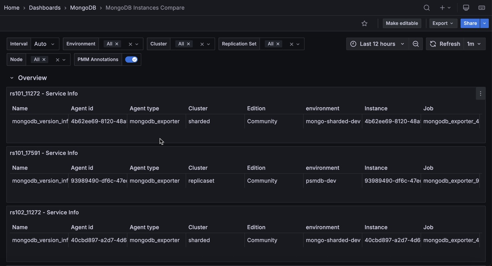

# MongoDB Instances Compare

This dashboard lets you compare multiple MongoDB services side by side.

Select two or more services using the **Service Name** filter at the top, and each panel repeats once per service so you can spot differences in behavior, load, or resource usage across your fleet.

Use this dashboard when you need to compare a healthy instance against a degraded one, benchmark instances after configuration changes, or check whether load is distributed evenly across services.

## Overview

A row of stat panels showing the current value of key metrics for each selected service. Each panel repeats horizontally so you can compare values across services at a glance:

- **Service Info**: Metadata table for each selected service, including service name, node name, MongoDB version, cluster, replication set, node type, and other PMM labels. Use this to verify you are comparing equivalent services.
- **MongoDB Uptime**: How long the service has been running. Turns orange after 5 minutes and green after 1 hour. A recently restarted service may show temporarily different behavior in other panels. Click to open the **MongoDB Instance Summary** for that service.
- **Current QPS**: Current query throughput in operations per second, excluding commands. Use this to compare load levels across services.
- **DB Connections**: Current number of active connections. Use this alongside the **Connections** timeseries below to see which services are under connection pressure.
- **Latency**: Average command latency in milliseconds. Turns orange at 90ms and red at 95ms. Use this for a quick health check before drilling into the **Latency** timeseries for detail.
- **Opened Cursors**: Total number of open cursors across all cursor states. A high value on one service relative to others can indicate cursor leaks or long-running queries on that service.
- **Replica Set**: The name of the replica set each service belongs to. Click to open the MongoDB Replica Set Summary.

## Connections

Shows the number of current and available connections over time for each selected service, using a logarithmic scale.

Use this to compare connection usage patterns across services. The "available" line shows remaining connection capacity. When it approaches zero, the service is near its connection limit. 

A service with much higher current connections than others may be receiving uneven traffic or have connection pooling misconfigured. Click a series to open the **MongoDB Instance Summary** for that service.

## Cursors

Shows the number of open cursors over time, broken down by state (including idle cursors), for each selected service.

Use this to compare cursor behavior across services. A service with a steadily growing cursor count relative to others may have an application not closing cursors properly. Click a series to open the **MongoDB Instance Summary** for that service.

## Query Efficiency

### Latency

Shows average operation latency in microseconds over time, broken down by operation type (read, write, command), for each selected service. Uses a logarithmic scale. 

Use this to compare latency profiles across services. If one service has higher read latency but similar write latency, the difference is likely query-related (indexes, working set size).

If all latency types are elevated on one service, look at resource contention (CPU, memory, lock queues). Click a series to open the **MongoDB Instance Summary** for that service.

### Scan Ratios

Shows two scan efficiency ratios over time for each selected service:

- **Index**: Index entries scanned per document returned. Lower is better. A value close to 1 means index scans are highly selective. A high value means many index entries are being scanned to return few documents, which can indicate a poorly selective index.
- **Document**: Documents returned per document scanned. Higher is better. A value close to 1 means almost every document scanned is returned. A low value means many documents are being scanned but few match the query, which usually points to a missing or unused index.

Use this to compare query efficiency across services. A service with worse ratios than others may have different query patterns, different indexes, or a different data distribution. Click a series to open the **MongoDB Instance Summary** for that service.

### Index Filtering Effectiveness

Shows the ratio of full document scans to total scan operations (index + document) over time, for each selected service, as a percentage.

A value close to 0% means most scans are going through indexes (good). A value close to 100% means most scans are full document scans, which suggests queries are not using indexes effectively.

Use this alongside **Scan Ratios** to understand whether query inefficiency is consistent across services or isolated to one. Click a series to open the **MongoDB Instance Summary** for that service.

## Operations

### Requests

Shows operation rates per second over time, broken down by legacy wire protocol type (`query`, `insert`, `update`, `delete`, `getmore`, `command`), for each selected service.

Use this to compare the workload mix across services. If one service has significantly higher insert or update rates, it may be handling a disproportionate share of write traffic.

Click a series to open the **MongoDB Instance Summary** for that service.

### Document Operations

Shows the rate of documents per second inserted, updated, deleted, or returned for each selected service.

Use this alongside **Requests** to understand both the operation rate and the volume of data each operation touches. A service with similar request rates but much higher document counts may be processing bulk operations or larger result sets. Click a series to open the **MongoDB Instance Summary** for that service.

### Queued Operations

Shows the number of operations queued waiting for a lock, broken down by read and write queues, for each selected service.

Any queued operations mean lock contention is occurring. Use this to compare contention levels across services. A service with consistently higher queue depths than others is likely experiencing more write conflicts or long-running operations that are blocking others.

Click a series to open the **MongoDB Instance Summary** for that service.

## Memory

### Used Memory

Shows MongoDB memory usage in megabytes over time, broken down by type (resident, virtual, and mapped), for each selected service. Uses a logarithmic scale.

Resident memory is the physical RAM MongoDB is actively using. Virtual memory includes memory-mapped files and other allocations.

A service with much higher resident memory than others may have a larger working set or different caching behavior. If resident memory is growing continuously, the working set may be expanding beyond available RAM.

Click a series to open the **MongoDB Instance Summary** for that service.
