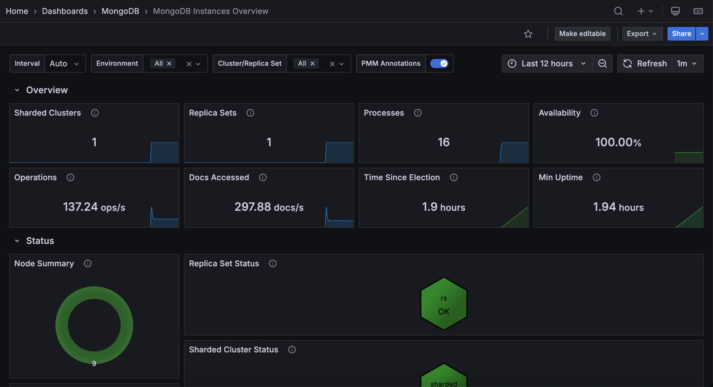

# MongoDB Instances Overview

This dashboard provides a high-level view of all MongoDB deployments monitored by PMM, including sharded clusters, replica sets, and standalone instances.

Start with this dashboard to get a quick view of overall fleet health before drilling into specific instances or replica sets.

## Overview

### Sharded Clusters

Shows the total number of sharded clusters currently monitored by PMM as a single number.

### Replica Sets

Shows the number of replica sets that are not part of a sharded cluster.

### Processes

Shows the total number of MongoDB processes (mongod and mongos) currently monitored across all environments and clusters as a single number.

### Availability

Shows the percentage of time each cluster or replica set had a primary node available during the selected time range.

Color thresholds show availability health: dark green means 100% availability (primary was always present), dark yellow means availability was between 50% and 100%, and dark red means availability was below 50% or no data was recorded. Use this to quickly spot replica sets that experienced prolonged primary outages during the time range.

### Operations

Shows the total rate of read and write operations per second across all selected instances, excluding administrative commands.

Use this for a quick sense of overall fleet throughput. A spike here means something is driving unusually high traffic across your deployment.

### Docs Accessed

Shows the rate of documents inserted, updated, deleted, or returned per second across all selected instances.

Use this alongside **Operations** to understand both the operation rate and the volume of data each operation is touching fleet-wide.

### Time Since Election

Shows how long ago the most recent replica set election occurred.

The display turns dark red if an election happened less than 5 minutes ago, dark yellow for elections between 5 minutes and 1 hour ago, and dark green for elections older than 1 hour. A recent election (red or yellow) is worth investigating to find out whether it was a planned failover or an unexpected event.

### Min Uptime

Shows the lowest uptime value among all monitored MongoDB processes.

The display turns red when the minimum uptime is zero (meaning at least one process just started or restarted), orange when it is under 5 minutes, and green once it is over 1 hour. A red or orange value means at least one instance restarted recently. Use this to catch unexpected restarts without having to check each instance individually.

## Status

### Node Summary

A donut chart showing the distribution of mongod node states across your fleet. Nodes in healthy states (PRIMARY, SECONDARY, ARBITER) are grouped as OK. Nodes in any other state are grouped as CHECK and shown in red.

A large OK segment means your fleet is healthy. Any CHECK slice means some nodes are in unexpected states and should be investigated. Click through to find the affected instances.

### Replica Set Status

A hexagon grid showing the health of each replica set, with one hexagon per replica set. Green means OK; red means CHECK. Click any hexagon to open the Replica Set Summary dashboard for that replica set.

Use this to scan your entire replica set fleet at once. Red hexagons pinpoint which replica sets need attention.

### Sharded Cluster Status

A hexagon grid showing the health of each sharded cluster. Click any hexagon to navigate to the Sharded Cluster Summary dashboard for that cluster.

### Router Status

A hexagon grid showing the status of each mongos router, with one hexagon per router. Green means OK; red means CHECK. Click any hexagon to open the Router Summary dashboard for that router.

## Connections Details

### Top 5 Connections

Shows a time series of the five services with the highest current TCP connection counts, plus a red reference line for the fleet average.

Use this to spot which services are absorbing the most connections and whether any stand out relative to the average. A service with connections far above the average may be receiving uneven traffic or have a connection pooling issue.

### Current Connections

A hexagon grid showing the current connection count for each service. Click any hexagon to open the **MongoDB Instance Summary** for that service.

Use this to see the full fleet at once after checking the Top 5 time series. Services with higher connection counts stand out by color.

## Opcounters Details

### Top 5 Command Operations

Shows a time series of the five services with the highest rate of command operations per second, plus a red reference line for the fleet average.

### Command Operations

A hexagon grid showing the current command operation rate for each service. Click any hexagon to open the **MongoDB Instance Summary** for that service.

### Top 5 Getmore Operations

Shows a time series of the five services with the highest getmore rate per second, plus a red reference line for the fleet average.

Getmore operations fetch additional results from an open cursor. A high getmore rate means services are paginating through large result sets. Use this to identify services with heavy cursor-based query patterns.

### Getmore Operations

A hexagon grid showing the current getmore rate for each service. Click any hexagon to open the **MongoDB Instance Summary** for that service.

### Top 5 Delete Operations

Shows a time series of the five services with the highest delete command rate per second, plus a red reference line for the fleet average.

### Delete Operations

A hexagon grid showing the current delete rate for each service. Click any hexagon to open the **MongoDB Instance Summary** for that service.

### Top 5 Insert Operations

Shows a time series of the five services with the highest insert command rate per second, plus a red reference line for the fleet average.

### Insert Operations

A hexagon grid showing the current insert rate for each service. Click any hexagon to open the **MongoDB Instance Summary** for that service.

### Top 5 Update Operations

Shows a time series of the five services with the highest update command rate per second, plus a red reference line for the fleet average.

### Update Operations

A hexagon grid showing the current update rate for each service. Click any hexagon to open the **MongoDB Instance Summary** for that service.

### Top 5 Query Operations

Shows a time series of the five services with the highest query (find) operation rate per second, plus a red reference line for the fleet average.

### Query Operations

A hexagon grid showing the current query rate for each service. Click any hexagon to open the **MongoDB Instance Summary** for that service.

## Document Operations Details

These panels count the actual number of documents affected by operations, not the number of operations issued. A single update command can affect many documents, so document counts can be much higher than operation counts for bulk workloads.

### Top 5 Document Delete Operations

Shows a time series of the five services with the highest rate of documents deleted per second, plus a red reference line for the fleet average.

### Document Delete Operations

A hexagon grid showing the current document delete rate for each service. Click any hexagon to open the **MongoDB Instance Summary** for that service.

### Top 5 Document Insert Operations

Shows a time series of the five services with the highest rate of documents inserted per second, plus a red reference line for the fleet average.

### Document Insert Operations

A hexagon grid showing the current document insert rate for each service. Click any hexagon to open the **MongoDB Instance Summary** for that service.

### Top 5 Document Return Operations

Shows a time series of the five services with the highest rate of documents returned per second, plus a red reference line for the fleet average.

### Document Return Operations

A hexagon grid showing the current document return rate for each service. Click any hexagon to open the **MongoDB Instance Summary** for that service.

### Top 5 Document Update Operations

Shows a time series of the five services with the highest rate of documents updated per second, plus a red reference line for the fleet average.

### Document Update Operations

A hexagon grid showing the current document update rate for each service. Click any hexagon to open the **MongoDB Instance Summary** for that service.

## Queued Operations Details

Queued operations are operations waiting to acquire a lock. Any value above zero means lock contention is occurring. Use these panels to identify which services are experiencing the most contention.

### Top 5 Queued Read Operations

Shows a time series of the five services with the highest number of read operations queued waiting for a lock, plus a red reference line for the fleet average.

### Queued Read Operations

A hexagon grid showing the current read queue depth for each service. The hexagon turns orange when any operations are queued (1 or more). Click any hexagon to open the **MongoDB Instance Summary** for that service.

### Top 5 Queued Write Operations

Shows a time series of the five services with the highest number of write operations queued waiting for a lock, plus a red reference line for the fleet average.

### Queued Write Operations

A hexagon grid showing the current write queue depth for each service. The hexagon turns orange when any operations are queued (1 or more). Click any hexagon to open the **MongoDB Instance Summary** for that service.
