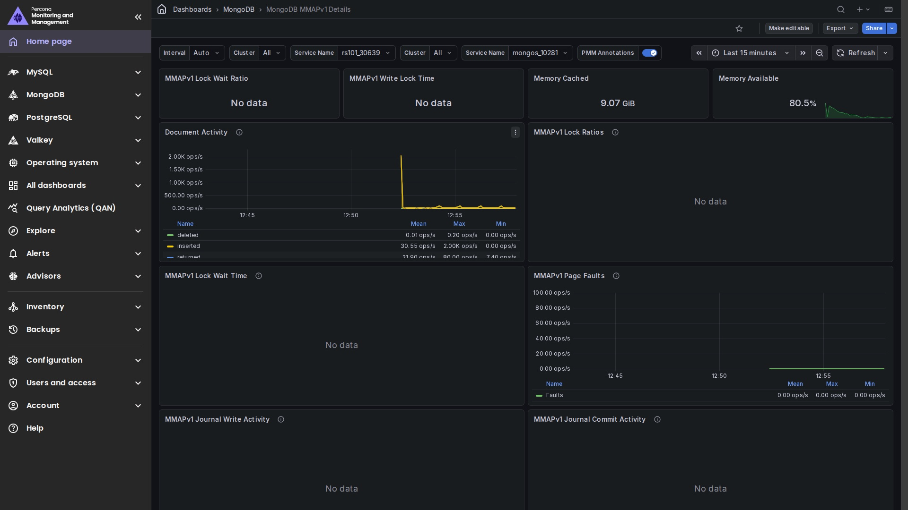

# MongoDB MMAPv1 Details

This dashboard shows detailed metrics for MongoDB instances running the MMAPv1 storage engine. It covers locking behavior, journal activity, memory usage, and host-level resources.

MMAPv1 was deprecated in MongoDB 4.0 and removed in MongoDB 4.4. If you are seeing data in this dashboard, the monitored instance is running MongoDB 4.2 or earlier.

Use the filters at the top to scope the view to a specific service or node.

## Overview

### MMAPv1 Lock Wait Ratio

Shows the fraction of time the instance spent waiting to acquire a global lock. The display turns orange at 90 and red at 95.

A high value means a large portion of time is being consumed by lock contention rather than doing actual work. This is one of the primary performance indicators for MMAPv1, which uses a global write lock.

### MMAPv1 Write Lock Time

Shows the average time in milliseconds spent acquiring global write locks. The display turns orange at 90ms and red at 95ms.

Use this alongside **MMAPv1 Lock Ratios** below to understand both the frequency and duration of write lock waits. Rising values here directly impact write throughput and read latency on MMAPv1 instances.

### Memory Cached

Shows the total amount of memory in the OS page cache on the host, in bytes.

MMAPv1 relies heavily on the OS page cache to serve data, since it memory-maps its data files. 

A healthy MMAPv1 deployment should have a large portion of its working set in the page cache. If this value is small relative to the dataset size, expect high page fault rates.

### Memory Available

Shows the percentage of memory currently available for use on the host.

### Document Activity

Shows the rate of documents per second affected by each operation type, as a stacked chart. Series include `inserted`, `updated`, `deleted`, and `returned` (query results), plus replicated write operations (`repl_inserted`, `repl_updated`, `repl_deleted`) and TTL index deletions (`ttl_deleted`).

Use this to understand the overall data throughput and its composition. A spike in `ttl_deleted` means a large batch of documents expired at once. High `repl_*` rates on a secondary mean replication is catching up.

Compare insert and delete rates to track net data growth.

### MMAPv1 Lock Ratios

Shows the fraction of time spent waiting to acquire locks over time, as a single `Lock Wait` line.

Use this to see lock contention trends over time. A value that stays consistently high or is trending upward means the instance is under increasing write pressure.

Correlate spikes here with application activity in **Client Operations** to identify which workloads are causing contention.

## MMAPv1 Lock Wait Time

Shows the time spent per second waiting to acquire locks in microseconds, broken down by lock scope (`Global`, `Database`, `MMAPV1Journal`) and lock type (read, write).

Use this to identify which lock level is causing the most contention. Write locks at the `Global` or `Database` level block all other operations. `MMAPV1Journal` lock waits indicate journal commit pressure. 

The legend table shows mean, max, and min values to help identify the worst offenders over the time range.

## MMAPv1 Page Faults

Shows the rate of operating system memory page faults per second.

A page fault occurs when a process accesses a memory page that isn't currently in RAM, either because it was never loaded yet or because it was swapped out. 

For MMAPv1, data is accessed through memory-mapped files, so page faults happen whenever MongoDB reads data that isn't in the OS page cache. 

High page fault rates mean the working set is larger than available RAM and MongoDB is frequently reading from disk. 

Check **Memory Cached** and **Memory Available** in the overview to confirm whether the host is under memory pressure.

## MMAPv1 Journal Write Activity

Shows the throughput of journal operations in MB/s over time. Two series are shown:

- **Journaled** (data written to the in-memory journal buffer) 
- **Write to Data Files** (data flushed from the journal to the actual data files on disk).

The **Journaled** series reflects write activity hitting the journal. The **Write to Data Files** series shows how fast flushed data lands on disk. 

If **Write to Data Files** lags significantly behind **Journaled**, the disk is struggling to keep up with the write rate.

## MMAPv1 Journal Commit Activity

Shows the rate of journal commit operations per second over time, broken down by state.

Journal commits happen periodically (by default every 100ms) to ensure durability. A consistently high commit rate means the instance is under sustained write load. Spikes can indicate bursts of write activity.

## MMAPv1 Background Flushing Time

Shows the average time in milliseconds that background flush operations take, measured over the full uptime of the mongod process.

MMAPv1 uses a background flusher that periodically writes dirty pages from memory to data files on disk. A rising trend here means flushes are taking longer, usually because the working set is growing or the disk is becoming a bottleneck. 

Use this alongside **Disk I/O** in the node section to confirm disk throughput is sufficient.

## Queued Operations

Shows the number of operations waiting in the global lock queue over time, broken down by read and write queues.

Any value above zero means lock contention is occurring. A queue that grows and stays elevated means long-running write operations are blocking reads and other writes. 

This is one of the most impactful performance problems on MMAPv1 instances and typically requires reducing write concurrency, optimizing slow queries, or migrating to WiredTiger.

## Client Operations

Shows operation rates per second as a stacked chart, broken down by legacy wire protocol type (`query`, `insert`, `update`, `delete`, `getmore`) and replicated operations (`repl_insert`, `repl_update`, `repl_delete`). Command operations are excluded.

Use this to understand the workload mix and how it is composed. A high repl_* rate on a secondary means it is catching up on replication. 

Correlate spikes in specific operation types with lock contention patterns in **MMAPv1 Lock Wait Time** to identify which workloads are driving contention.

## Scanned and Moved Objects

Shows the rate of objects scanned per second, broken down by data objects (`scanned_objects`) and index entries (`scanned`). Also shows the rate of documents moved per second (`moved`).

High scan rates relative to documents returned indicate collection scans that could benefit from indexes. 

The `moved` metric is specific to MMAPv1: documents are moved to a new location on disk when they grow beyond their originally allocated space due to updates that increase document size. 

A high move rate means documents are frequently growing, which increases fragmentation and causes additional I/O. Consider using padding factors or migrating to WiredTiger to avoid this problem.

## MMAPv1 Memory Usage

Shows OS memory usage over time in bytes, broken down into three series: **Mapped** (memory-mapped files that MongoDB has mapped into its address space), **Unmapped** (page cache memory not mapped by MongoDB), and **Swap Cached** (data in swap that was recently accessed and may be returned to RAM).

Mapped memory represents MongoDB's data files loaded into virtual memory via `mmap`. A large and growing Mapped value is expected as MongoDB opens more data files. If **Swap Cached** is non-zero and growing, the host is actively using swap, which will severely degrade performance.

## MMAPv1 Memory Dirty Pages

Shows the number of dirty memory pages on the host over time on a logarithmic scale. Three lines are shown: **Total Dirty Pages** (pages modified in memory but not yet flushed to disk), **Soft Dirty Page Threshold** (the background writeback threshold from the kernel), and **Hard Dirty Page Threshold** (the limit at which the kernel will block writes to force flushing).

Dirty pages accumulate as data is modified in the page cache. The kernel's background writeback process flushes them to disk. If **Total Dirty Pages** frequently approaches or exceeds the **Hard Dirty Page Threshold**, the kernel is throttling writes, which will directly increase lock wait times and latency on the MongoDB instance.

## MongoDB Summary

### Host

Shows the name of the host node as a link. Click it to open the **Node Summary** dashboard for this host.

### MongoDB Uptime

Shows how long the MongoDB instance has been running since its last restart. The display turns red when uptime is near zero, orange when it is under 5 minutes, and green once it is over 1 hour.

A recently restarted instance may show temporarily different behavior in the panels above as the OS page cache warms up. 

MMAPv1 instances depend heavily on the page cache, so cold restarts can cause elevated page fault rates until the working set is loaded back into memory.

### QPS

Shows the current query throughput in operations per second, excluding commands.

### Latency

Shows the average command latency in microseconds.

### Connections

Shows the number of active incoming connections to the MongoDB instance over time.

Monitor this against your configured `maxIncomingConnections` limit. A connection count climbing toward the limit means the instance is approaching saturation. A sudden drop to zero or near-zero means the instance became unreachable.

### Cursors

Shows the number of open cursors over time, broken down by state.

A large and growing cursor count usually means cursors are not being closed by the application after use. Timed-out cursors can cause application errors and indicate queries that ran longer than the cursor timeout.

## Node Summary

### System Uptime

Shows how long the host has been running since its last boot. The display turns red when under 5 minutes and green after 1 hour.

### Load Average

Shows the 1-minute load average for the host. Turns orange at 10 and red at 20. Values above the number of CPU cores mean the system is overloaded.

### RAM

Shows the total installed RAM on the host.

### Memory Available

Shows the percentage of memory currently available for use. Turns red below 5% and green above 10%. On modern Linux kernels, this is not the same as free memory alone.

For MMAPv1 deployments, available memory directly affects page cache capacity. If available memory is low, the OS has less room for the page cache, which increases page fault rates in MongoDB.

### Virtual Memory

Shows total virtual memory (RAM + swap) on the host.

### Disk Space

Shows the total disk capacity across all partitions. Links to the Disk Details dashboard. Note that this value can be over-reported in some installations where the same storage is counted multiple times.

### Min Space Available

Shows the lowest free disk space percentage across all partitions. Turns red below 5% and green above 20%. A low value means at least one filesystem is nearly full.

### Node

Shows the name of the host node as a link. Click it to open the **Node Summary** dashboard for this host.

## CPU Usage

Shows CPU utilization over time as a stacked chart, broken down by mode: user, system, iowait, steal, and others.

A high iowait percentage means the CPU is frequently waiting for disk I/O. For MMAPv1 deployments, high iowait combined with high page fault rates is a strong signal that the working set no longer fits in the page cache and MongoDB is reading from disk constantly.

## CPU Saturation and Max Core Usage

Shows normalized CPU load (load average divided by CPU count) and the utilization of the most-loaded CPU core over time.

The normalized load shows whether the system is overloaded overall. Values above 1.0 mean processes are waiting for CPU. The Max CPU Core Utilization line shows whether work is concentrated on a single core.

## Disk I/O and Swap Activity

Shows disk read throughput (positive Y axis) and disk write throughput (negative Y axis), plus swap in and swap out activity over time. Links to the Disk Performance dashboard.

For MMAPv1, sustained high disk reads indicate that MongoDB is frequently fetching data from disk due to page cache misses. High disk writes indicate background flushing activity or journal commits. Swap activity is a serious warning: if the host is swapping, the page cache has been evicted and MongoDB performance will degrade significantly.

## Network Traffic

Shows inbound network throughput (positive Y axis) and outbound network throughput (negative Y axis) in bytes per second.

Unexpected spikes can indicate replication traffic, a client sending or receiving large result sets, or a backup in progress.
