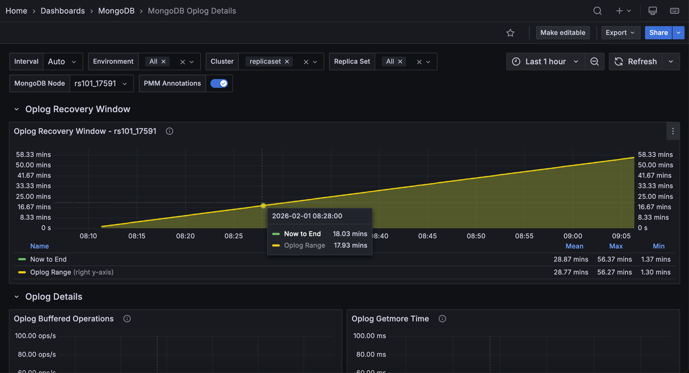

# MongoDB Oplog Details

This dashboard shows oplog activity for your MongoDB replica set members, including the recovery window, buffer usage, processing times, and write volume. 

Use it to monitor replication health and confirm that your oplog is large enough to support your backup and recovery strategy.

## Oplog Recovery Window

Shows two time series per service: **Oplog Range** (the total time span covered by the oplog from oldest to newest entry) and **Now to End** (the time from the current moment back to the oldest oplog entry, which is the effective recovery window).

The recovery window tells you how far back in time you can restore using oplog replay. If your backup takes longer than the recovery window, a secondary that falls behind may not be recoverable to a consistent point in time. 

A shrinking window means the oplog is rolling over faster than expected. Consider increasing the oplog size. Click a series to open the **MongoDB Instance Summary** for that service.

## Oplog Buffered Operations

Shows the rate of replication buffer operations applied per second.

Secondaries buffer incoming oplog entries and apply them in batches. A sustained high rate means the secondary is actively catching up with the primary. 

A rate that drops to zero and stays there may indicate replication has stalled. Click a series to open the **MongoDB Instance Summary** for that service.

## Oplog Getmore Time

Shows the time in milliseconds spent on `getmore` commands against the oplog collection.

Secondaries use `getmore` to continuously fetch new oplog entries from the primary. Rising `getmore` time means the secondary is spending more time fetching entries, which can delay how quickly it applies changes and increase replication lag. 

Click a series to open the **MongoDB Instance Summary** for that service.

## Oplog Processing Time

Shows how much time (ms/s) a secondary spends in each oplog apply phase:

- **Document Preload**: Preloads documents into memory before apply.
- **Index Preload**: Preloads index values.
- **Batch Apply**: Performs the actual write phase.

Rising time in any phase means the secondary is under pressure during replication. 

A consistently high **Batch Apply** time points to disk or CPU as the bottleneck. 

High **Document Preload** or **Index Preload** time suggests the working set is not fitting in memory. 

Click a series to open the **MongoDB Instance Summary** for that service.

## Oplog Buffer Capacity

Shows current buffer usage (**Used**) against the maximum buffer size (**Max**) in bytes.

The replication buffer holds oplog entries that have been fetched but not yet applied.

If **Used** approaches **Max**, the secondary is falling behind faster than it can apply entries and the buffer is filling up. 

This typically precedes a significant increase in replication lag. Click a series to open the **MongoDB Instance Summary** for that service.

## Oplog Operations

Shows the rate of operations per second in each phase of oplog application: **Document Preload**, **Index Preload**, and **Batch Apply**.

Use this alongside **Oplog Processing Time** to distinguish throughput from latency. 

High operation counts with high processing time means the secondary is applying many operations slowly. Low counts with high processing time means individual operations are expensive. 

Click a series to open the **MongoDB Instance Summary** for that service.

## Oplog GB/Hour

Shows the average gigabytes of oplog data generated by the primary per hour.

Use this to validate your oplog sizing. If your oplog retention (shown in **Oplog Recovery Window**) is shorter than your backup window, increase the oplog size. 

A rising value means write activity on the primary is increasing.
