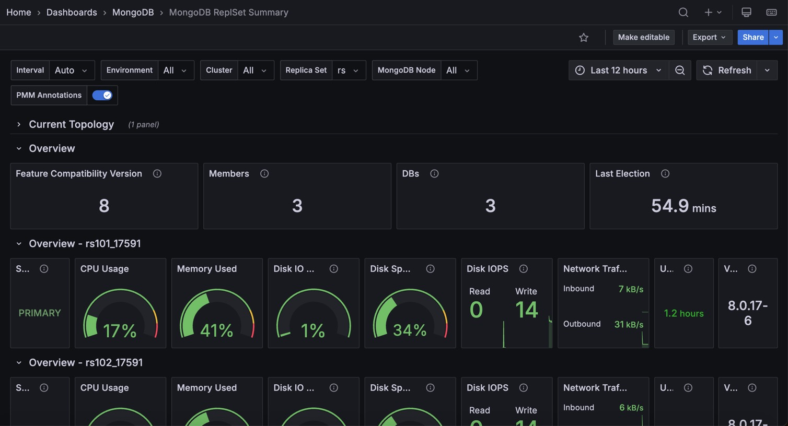

# MongoDB ReplSet Summary

This dashboard gives you a consolidated view of a MongoDB replica set, covering member states, database activity, replication health, and host-level resources. 

Use it to monitor the health of a specific replica set and drill into nodes that need attention.

## Members

A hexagon grid showing the current state of each replica set member. Each hexagon displays the member's service name and role. Green means PRIMARY, yellow means SECONDARY, dark yellow means ARBITER, and red means a problem state such as DOWN, RECOVERING, or ROLLBACK.

Use this for an instant topology view of the entire replica set. Any red hexagon means a member is in an unexpected state and needs investigation before you check detailed metrics.

## Overview

### Feature Compatibility Version

Shows the Feature Compatibility Version (FCV) currently active in the selected replica set deployment. 

The FCV controls which features are available and determines data file format compatibility between MongoDB versions.

Check this after upgrades to confirm the FCV has been advanced as expected. A value lower than your MongoDB binary version is normal immediately after an upgrade, but should be updated once you are ready to enable new features. 

You cannot roll back to an older FCV without a full downgrade.

### Members

Shows the total number of members in the replica set.

A count lower than expected means a member may be offline or removed. Fewer members than planned reduces fault tolerance.

### DBs

Shows the total number of user-created databases in the replica set.

### Last Election

Shows the time elapsed since the most recent primary election.

A recent election is worth investigating to find out whether it was a planned failover or an unexpected event. Frequent elections indicate connectivity issues or node instability.

### Total data size

Shows how much storage your replica set is currently using for data and indexes on the primary node. System databases (`admin`, `local`, `config`) are excluded.

Check this panel regularly to understand your current storage footprint. If the value is growing faster than expected, check **Size of Collections** and **Number of Collections** panels in the **Collection Details** section to identify what is driving the growth. 

Use the trend in the **Data size over time** panel  to decide when to add storage capacity.

This panel requires the `dbstats` collector on the MongoDB exporter. To enable it, see [Add database services](https://per.co.na/pmm/pmm-admin-add).

### Data size over time

Shows how your replica set's total data and index size changes over the selected time 
range. 

Use this to spot growth trends, identify unexpected spikes, and plan when you 
will need to add storage capacity. 

A sudden increase may indicate a bulk data load, a missing TTL index, or runaway data growth that needs investigation.
Shows the total logical data size (uncompressed data plus indexes) across all user databases on the replica set primary. System databases (`admin`, `local`, and `config`) are excluded.

Use this metric to monitor data growth for the replica set, similar to the cluster data size view in Ops Manager. The **Data Size Over Time** graph shows the same total over the selected time range.

This panel requires the MongoDB exporter **dbstats** collector. Enable it by turning on **Enable all collectors** for the MongoDB service in PMM (or ensure `dbstats` is not listed under disabled collectors).

### State

Shows the current replica set state for each selected service: PRIMARY, SECONDARY, ARBITER, or a problem state such as RECOVERING, ROLLBACK, or DOWN. "Exporter is not connected" means PMM cannot reach the MongoDB exporter for that service.

To recover, verify that `pmm-agent` is running on that node, confirm PMM can reach the MongoDB exporter endpoint, and then restart `pmm-agent`. 

If the state persists, re-check MongoDB monitoring credentials and TLS settings, then re-register the MongoDB service in PMM.

Make sure to investigate any state other than PRIMARY, SECONDARY, or ARBITER.

### CPU Usage

Shows current CPU utilization as a gauge from 0 to 100%. Turns orange at 80% and red at 90%.

### Memory Used

Shows the percentage of total host memory currently in use. Turns orange at 80% and red at 90%.

### Disk IO Utilization

Shows the percentage of elapsed time the disk was busy servicing read or write requests.

A value approaching 100% over sustained periods suggests disk saturation. 

For storage that supports parallelism (SSDs, NVMe, RAID), high values do not always indicate a performance problem. Check I/O latency and queue depth alongside this value for a full picture.

### Disk Space Utilization

Shows how much of the filesystem where MongoDB stores data is currently in use. Turns orange at 80% and red at 90%.

Watch this to prevent disk full conditions that would cause MongoDB to stop accepting writes.

### Disk IOPS

Shows current read and write operations per second on the host disk.

Spikes in IOPS often correspond to increased query load, index builds, or compaction. A sudden sustained increase may indicate an I/O subsystem bottleneck.

### Network Traffic

Shows current inbound and outbound network throughput in bytes per second, excluding loopback traffic. Click to open **Network Details** for this node.

### Uptime

Shows how long the host has been running since its last boot. Red means under 5 minutes, orange means 5 minutes to 1 hour, green means over 1 hour.

A recent restart may indicate an unexpected crash or planned maintenance.

### Version

Shows the MongoDB version running on the selected service.

Check this after upgrades to confirm all members are running the expected version.

## Operations

### Command Operations

Shows operation rates per second, broken down by type: query, insert, update, delete, getmore, replicated write operations (repl_insert, repl_update, repl_delete), and TTL index document deletions.

Use this to understand the workload mix. A spike in `repl_*` operations on a secondary means it is catching up on replication. A high `ttl_delete` rate means a batch of documents expired at once.

### Top Hottest Collections by Read

Shows the five collections with the highest read operation rate per second.

Use this to identify which collections are driving the most read traffic. High-traffic collections are the first place to look when investigating read latency or indexing opportunities.

### Operation Latencies

Shows average operation latency in microseconds over time, broken down by operation type: reads, writes, and commands.

Rising read latency alongside normal write latency usually points to a query or index problem. If all operation types are elevated, look at resource contention such as CPU usage or lock queues.

### Top Hottest Collections by Write

Shows the five collections with the highest write operation rate per second, combining inserts, updates, and deletes.

Use this to identify which collections are driving the most write traffic and where write optimization would have the most impact.

### Query Efficiency

Shows two scan ratios over time:

- **Scanned objects / returned**: documents scanned per document returned. A value of 1 means every scanned document matched the query. Higher values mean queries are scanning many documents to return few, which usually indicates a missing or poorly selective index.
- **Scanned idx / returned**: index entries scanned per document returned. Lower is better.

Rising ratios indicate worsening query efficiency. Compare with **Command Operations** to identify which workloads are driving the inefficiency.

### Queued Operations

Shows the number of operations waiting to acquire a lock, broken down by read and write queues.

Any value above zero means lock contention is occurring. A queue that stays elevated points to long-running write operations blocking other work.

### Reads & Writes

Shows active readers, active writers, queued readers, and queued writers over time.

Use this alongside **Queued Operations** to understand whether contention is read-driven or write-driven. A growing queued writers count typically indicates write lock pressure.

### Average Connections

Shows current, available, and idle connections over time.

When current connections approach the maximum, the instance is near its connection limit. A high idle count suggests inefficient connection pooling. A sudden drop to zero means the instance became unreachable.

### Fragmentation Analysis

Shows the estimated fragmentation percentage for each collection, organized by database and node. The value is calculated as the ratio of free (unused) storage to total allocated storage, and the table is sorted from most to least fragmented. Only the top 100 collections are shown; admin and config databases are excluded.

Fragmentation builds up when documents are deleted or moved, leaving gaps in storage blocks that MongoDB has not yet reclaimed. A value of 30% means roughly 30% of that collection's allocated space is wasted. 

Use this table to identify collections worth compacting — run `compact` on the affected nodes during a maintenance window to reclaim disk space.

## Replication

### Replication Lag

Shows how many seconds each secondary is behind the primary. A red threshold line appears at 10 seconds.

Sustained lag above 10 seconds means the secondary cannot keep up with the primary write rate. 

Causes include network latency, I/O bottlenecks on the secondary, or excessive write load on the primary. Click a series to open the **MongoDB Instance Summary** for that service.

### Oplog Recovery Window

Shows the time span in seconds between the newest and oldest entries in the oplog.

This is the window within which a secondary can resync using the oplog alone. If replication lag approaches this value, the secondary may fall out of sync and require a full resync. 

A shrinking window means the oplog is rolling over faster than expected. 

Consider increasing the oplog size. Click a series to open the **MongoDB Instance Summary** for that service.

### Flow Control

Shows the rate of flow control events (`fc_count`) and the additional latency they introduce in microseconds (`fc_time`).

MongoDB uses flow control to throttle primary writes when secondaries fall behind. 

A non-zero and rising `fc_count` means the primary is being throttled to protect replication. Investigate secondary lag and resource usage when this appears.

### Oplog GB/Hour

Shows the average hourly oplog data written by the primary, displayed as a bar chart.

Use this to validate oplog sizing. If oplog GB/Hour is high relative to your configured oplog size, the **Oplog Recovery Window** will be short. A rising value means write activity on the primary is increasing.

## Member States

Shows the replica set state of each member over the selected time range as a state timeline. Each row represents one member, color-coded by state: green for PRIMARY, yellow for SECONDARY, dark yellow for ARBITER, and red for any problem state.

Use this to identify when role changes or state transitions occurred and whether they coincide with an incident.

## Nodes Overview

A table showing key host metrics for each node: uptime, load average, available memory, total RAM, virtual memory, disk space, and minimum available disk space. Click a node name to open the **Node Summary** dashboard for that node.

Use this to check host health across all replica set members without opening each node's dashboard individually.

## CPU Usage

Shows CPU utilization as a stacked time series, broken down by mode: user, system, iowait, and others.

High iowait combined with replication lag often means the secondary disk cannot keep up with oplog apply. High user or system time points to CPU-bound workloads.

## CPU Saturation and Max Core Usage

Shows normalized CPU load (running processes divided by CPU count) and the utilization of the most-loaded core over time.

Normalized load above 1.0 means processes are waiting for CPU time. A high **Max CPU Core Utilization** with low overall load means work is concentrated on a single core, which can bottleneck single-threaded workloads like oplog application.

## Disk I/O and Swap Activity

Shows disk read throughput (positive) and write throughput (negative) in bytes per second, plus swap in and swap out activity. Links to the Disk Performance dashboard.

Sustained swap activity means the host working set no longer fits in RAM, which will severely degrade MongoDB performance. 

High disk reads alongside replication lag suggest the secondary is reading from disk frequently due to a cold page cache.

## Network Traffic

Shows inbound network throughput (positive) and outbound network throughput (negative) in bytes per second.

Unexpected spikes can indicate replication traffic, a backup in progress, or a client sending or receiving large result sets.
