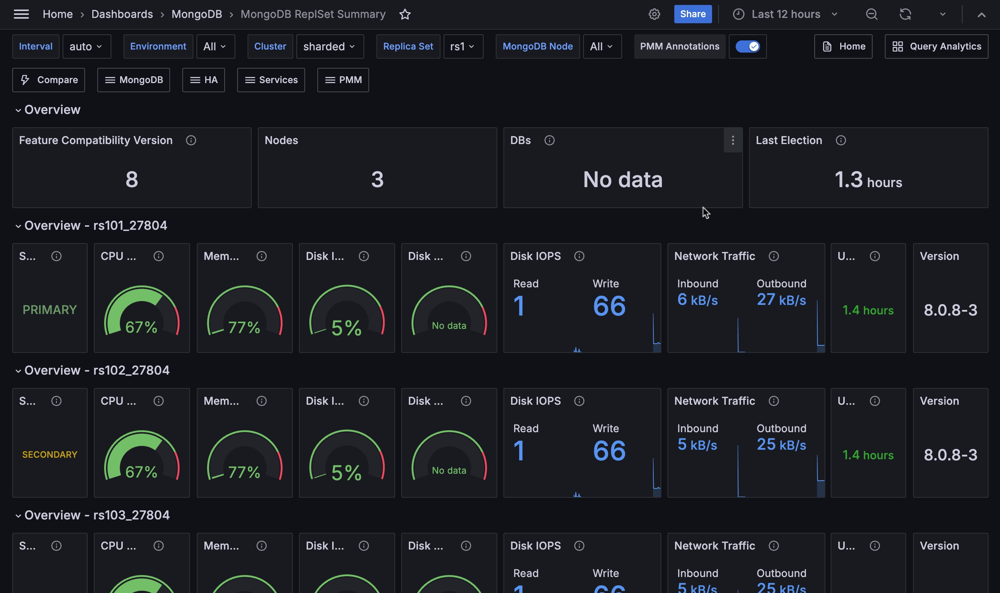

# MongoDB ReplSet Summary

## Replication Lag

MongoDB replication lag occurs when the secondary node cannot replicate data fast enough to keep up with the rate that data is being written to the primary node. It could be caused by something as simple as network latency, packet loss within your network, or a routing issue.

## Operations - by service name

Operations are classified by legacy wire protocol type (insert, update, and delete only).

## Max Member Ping Time - by service name

This metric can showygjhgj a correlation with the replication lag value.

## Max Heartbeat Time

Time span between now and last heartbeat from replicaset members.

## Elections

Count of elections. Usually zero; 1 count by each healthy node will appear in each election. Happens when the primary role changes due to either normal maintenance or trouble events.

## Oplog Recovery Window - by service name

Timespan 'window' between newest and the oldest op in the Oplog collection.
