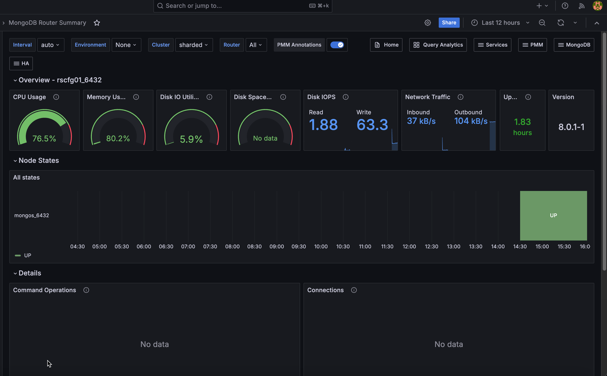

# MongoDB Router Summary

This dashboard monitors mongos router nodes in a sharded MongoDB cluster, covering router availability, resource usage, and query activity. Use it to confirm your routing layer is healthy and to identify routers under load.

## Current Topology

### Routers

A hexagon grid showing the current status of each mongos router. Green means the router is UP and reachable. Red means it is DOWN or unreachable.

Use this for an instant view of routing layer health across the cluster. Any red hexagon means a router is offline and clients connecting through it will fail.

## Overview

### CPU Usage

Shows current CPU utilization as a gauge from 0 to 100%. Turns orange at 80% and red at 90%.

### Memory Used

Shows the percentage of total host memory currently in use. Turns orange at 80% and red at 90%.

### Disk IO Utilization

Shows the percentage of elapsed time the disk was busy servicing read or write requests.

A value approaching 100% over sustained periods suggests disk saturation. For storage that supports parallelism (SSDs, NVMe, RAID), high values do not always indicate a problem. Check I/O latency and queue depth alongside this value for a full picture.

### Disk Space Utilization

Shows how much of the host filesystem is currently in use. Turns orange at 80% and red at 90%.

Watch this to prevent disk full conditions that would disrupt the router.

### Disk IOPS

Shows current read and write operations per second on the host disk.

Spikes in IOPS can indicate increased query routing load or background processes competing for disk.

### Network Traffic

Shows current inbound and outbound network throughput in bytes per second, excluding loopback traffic. Click to open **Network Details** for this node.

### Uptime

Shows how long the mongos process has been running since its last restart. Red means under 5 minutes, orange means 5 minutes to 1 hour, green means over 1 hour.

A recent restart may indicate a crash or planned maintenance. Mongos routers are stateless, so a restart is less disruptive than a mongod restart, but it still interrupts any in-flight connections.

### Version

Shows the mongos version running on the selected service.

Check this after upgrades to confirm all routers are running the expected version.

## Details

### Command Operations

Shows operation rates per second, broken down by type: query, insert, update, delete, getmore, replicated write operations, and TTL index document deletions.

Use this to understand the workload being routed. A spike in any operation type can help correlate with latency increases in **Operation Latencies**.

### Queued Operations

Shows the number of operations waiting to acquire a lock, broken down by read and write queues.

Any value above zero means lock contention is occurring. A queue that stays elevated points to long-running write operations blocking other work.

### Operation Latencies

Shows average operation latency in microseconds over time, broken down by operation type: reads, writes, and commands.

Rising read latency alongside normal write latency usually points to a query or index problem on the shards. If all operation types are elevated, look at resource contention on the router host or the shards it is routing to.

### Average Connections

Shows current, available, and idle connections over time.

When current connections approach the maximum, the router is near its connection limit. A high idle count suggests inefficient connection pooling from clients. A sudden drop to zero means the router became unreachable.

### Reads & Writes

Shows active readers, active writers, queued readers, and queued writers over time.

Use this alongside **Queued Operations** to understand whether contention is read-driven or write-driven. A growing queued writers count typically indicates write lock pressure being passed through from the shards.

### Query Efficiency

Shows two scan ratios over time:

- **Scanned objects / returned**: documents scanned per document returned. A value of 1 means every scanned document matched the query. Higher values indicate queries scanning many documents to return few, which usually points to a missing or poorly selective index on the target shard.
- **Scanned idx / returned**: index entries scanned per document returned. Lower is better.

Rising ratios indicate worsening query efficiency. Use this alongside **Operation Latencies** to confirm whether high latency is query-driven.

## Status

### Router Status

Shows the UP/DOWN status of each mongos router over the selected time range as a state timeline. Each row represents one router, with green meaning UP and red meaning DOWN.

Use this to identify when a router went down or came back up and whether outages coincide with other events such as deployments or network changes.
