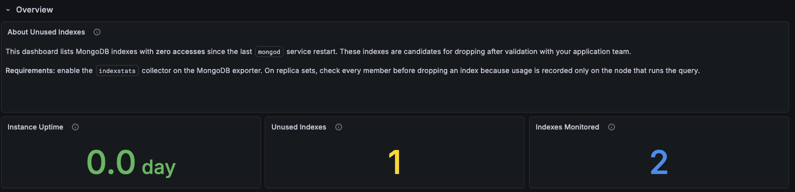

# MongoDB Unused Indexes

Surfaces MongoDB indexes that have had zero accesses since the last `mongod` restart, so you can identify candidates for removal and reduce write overhead, disk usage, and memory pressure.

Use the filters at the top to scope the view to a specific environment, cluster, replica set, MongoDB node, or database.

## Prerequisites

To use this dashboard, first enable the `indexstats` collector by passing `--enable-all-collectors` when [adding the MongoDB service](../../install-pmm/install-pmm-client/connect-database/mongodb.md), or run `pmm-admin inventory change agent mongodb-exporter` on an existing service.

## Overview

### Instance Uptime

Shows the minimum uptime across the selected MongoDB nodes since the last restart, in days.

Use this to assess how long index usage has been tracked. A node restarted recently may not have accumulated enough activity for its index stats to be meaningful. An index with zero accesses on a node that restarted an hour ago is very different from one that has been idle for weeks.
### Unused Indexes

Shows the count of indexes with zero accesses since the last restart. The `_id_` index is always excluded.

Use this as your headline number. A non-zero value means there are indexes that have not been used on the selected nodes since the last restart. Cross-reference with **Instance Uptime** before acting, as a short uptime makes this number less reliable.
### Indexes Monitored

Shows the total number of indexes tracked by the `indexstats` collector for the selected filters.

Use this alongside **Unused Indexes** to understand the proportion of unused indexes relative to the total. A high ratio on a long-running instance is a stronger signal than the same ratio on a recently restarted one.

## Unused Index Candidates

### Unused Indexes by Collection

Lists indexes with zero accesses since the last `mongod` restart. Each row shows the cluster, database, collection, index name, and service.

On replica sets, an index may appear unused on one member but still be accessed on another, since index usage is tracked per node. Review all replica set members and confirm with your application team before dropping any index.

## Index Access Activity

### Index Accesses Since Restart

Shows index access counts over time for the selected filters. Flat lines at zero confirm indexes that have never been used during the current uptime window.

Use this to distinguish indexes that have genuinely never been accessed from indexes that were active earlier in the selected time range but have since gone idle.

### Least Used Indexes

Shows the 20 indexes with the lowest total access counts since the last restart.

Use this to find rarely used indexes that have not yet reached zero but may still be worth reviewing. An index accessed only a handful of times on a busy instance is unlikely to be contributing meaningfully to query performance.

## See also

- [MongoDB Unused Indexes advisor check](../../advisors/checks/mongodb-unused-indexes.md)
- [Connect MongoDB to PMM](../../install-pmm/install-pmm-client/connect-database/mongodb.md)
