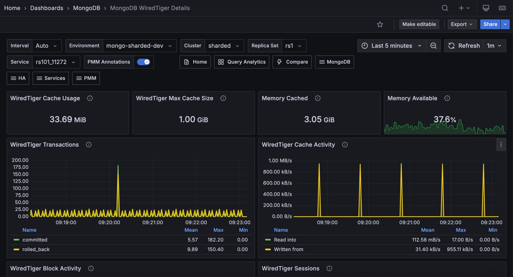

# MongoDB WiredTiger Details

This dashboard shows internal WiredTiger storage engine metrics for a MongoDB instance, covering cache usage, concurrency, checkpoint behavior, write-ahead log activity, and document-level operation counts. Use it to diagnose storage engine bottlenecks when query latency or throughput problems cannot be explained by query patterns alone.

## Overview

### WiredTiger Cache Usage

Shows the current amount of data in the WiredTiger cache in bytes. This is the uncompressed in-memory representation, which is larger than the on-disk size. Compare this with **WiredTiger Max Cache Size** to see how full the cache is.

### WiredTiger Max Cache Size

Shows the configured maximum size for the WiredTiger cache. The default is 50% of available RAM minus 1 GB, with a minimum of 256 MB. To change it, set `storage.wiredTiger.engineConfig.cacheSizeGB` in the config file or pass `--wiredTigerCacheSizeGB` on the command line. If **WiredTiger Cache Usage** is consistently close to this value, the cache is under pressure and eviction will be occurring.

### Memory Cached

Shows the amount of memory in the OS filesystem cache on the host. WiredTiger stores data in its own cache, but the OS filesystem cache also holds recently accessed data files. A large filesystem cache can reduce disk reads even when the WiredTiger cache is under pressure.

### Memory Available

Shows the percentage of system memory currently available for use. Turns orange at 90% and red at 95%. If available memory is critically low, the OS may begin evicting filesystem cache pages, which will increase disk reads for data not in the WiredTiger cache.

### WiredTiger Transactions

Shows the rate of WiredTiger internal transactions per second, broken down by type: begin, commit, and rollback.

A high rollback rate is expected and not a cause for concern, since MongoDB uses rollbacks internally even for read queries to keep your data views consistent. Focus instead on whether transaction activity correlates with growing **Queued Operations**, which would mean your queries are starting to wait on locks.

### WiredTiger Cache Activity

Shows the rate of data transfer between the WiredTiger cache and storage in bytes per second. Two series are shown: **Read into** (data loaded from storage into the cache) and **Written from** (dirty data flushed from the cache to disk).

Writes from the cache always go to disk. Reads into the cache may be served from the OS filesystem cache if the data is already in RAM. A sustained high **Read into** rate means the working set is not fitting in the WiredTiger cache and data is being loaded frequently.

## WiredTiger Block Activity

Shows the rate of data handled by the WiredTiger block manager per second, broken down by operation type (read, write, map read).

This tells you how much physical disk I/O MongoDB is doing behind the scenes. If you see high read rates, your working dataset doesn't fit in the cache and MongoDB is constantly loading data from disk, which slows down your queries. High write rates mean MongoDB is flushing a lot of modified data to disk, which can compete with reads for disk bandwidth.

## WiredTiger Sessions

Shows the number of open WiredTiger internal cursors and sessions over time.

Each MongoDB operation opens one or more WiredTiger cursors. A steadily growing cursor count can indicate cursors are not being closed promptly, which may eventually cause resource exhaustion.

Shows the number of available WiredTiger concurrency tickets for read (positive Y axis) and write (negative Y axis) operations over time.

MongoDB uses a ticket system to limit how many operations can run simultaneously in the storage engine. When available tickets drop toward zero, your new queries and writes must wait in line before they can execute, which directly increases your response times. This is one of the most direct indicators of storage engine saturation.

In newer MongoDB versions, the ticket pool is dynamically resized, so a temporarily low count may not indicate real saturation. However, if tickets are consistently depleted, your instance is genuinely overloaded. 

Check **Queued Operations** to confirm, and consider reducing concurrent connections, adding indexes to speed up operations, or scaling your hardware.

### Queued Operations

Shows the number of operations waiting to acquire a global lock, broken down by read and write queues over time.

Any value above zero means lock contention is occurring. A queue that grows and stays elevated points to long-running write operations blocking other work. Use this alongside **WiredTiger Concurrency Tickets Available** to distinguish between lock queue pressure and ticket exhaustion.

### WiredTiger Checkpoint Time

Shows the time spent in the WiredTiger checkpoint phase, displayed as a per-second average of a cyclical event that runs approximately every 60 seconds by default.

MongoDB periodically saves modified data to disk (roughly every 60 seconds). If this panel shows a rising trend, each save is taking longer, usually because your write volume is growing or your disk can't keep up. You may notice brief latency spikes during these saves. If checkpoint times keep climbing, check **Disk I/O and Swap Activity** to confirm whether your disk is the bottleneck.

### WiredTiger Cache Eviction

Shows the rate of cache page evictions per second, broken down by type (modified and unmodified pages).

When the cache is full, MongoDB must remove older data to make room for new requests. Removing unmodified data is fast and won't affect your performance. However, removing modified data requires writing to disk first, which is slower and can stall your application's operations. If you see a sustained high rate of dirty page evictions, your cache is too small for your workload and your queries will experience delays during write-heavy periods.

### WiredTiger Cache Capacity

Shows the configured maximum cache size (**Max**) alongside the current cache usage (**Used**) over time.

Use this to see how cache utilization trends over the selected time range. A **Used** line that hugs the **Max** line means the cache is always full and eviction pressure is constant. This is a signal to increase the cache size if memory allows, or to reduce the working set.

### WiredTiger Cache Pages

Shows the number of pages in the WiredTiger cache over time, broken down by state (clean, dirty, internal).

If dirty pages make up a large fraction of the total, your workload is generating changes faster than MongoDB can write them to disk. This buildup will eventually lead to longer checkpoint pauses and more aggressive eviction, both of which can increase your query latency.

### WiredTiger Log Operations

Shows the rate of WiredTiger write-ahead log (WAL) operations per second, broken down by type (write, sync, read, compress, compress failure, compress uncompressed, read). The WiredTiger WAL is also referred to as the journal.

If sync rates are high, MongoDB is frequently forcing data to disk, which can limit your write throughput on slower storage. High compress failure rates mean your write data isn't compressing well, so the journal takes up more space and disk bandwidth than usual.

## WiredTiger Log Activity

Shows the rate of data moved through the WiredTiger write-ahead log (journal) in bytes per second, broken down by operation type.

Rising log write rates indicate increasing write activity. If log sync bytes are high relative to log write bytes, individual writes are being fsynced frequently rather than batched, which can reduce write throughput.

### WiredTiger Log Records

Shows the rate of records appended to the WiredTiger internal log per second, broken down by type (compressed and uncompressed).

Use this alongside **WiredTiger Log Activity** to understand whether rising log volume is driven by more records or larger records.

### Document Changes

Shows the rate of document-level changes per second, broken down by operation type: `inserted`, `updated`, `deleted`, and `returned` (query results), plus replicated write operations (`repl_inserted`, `repl_updated`, `repl_deleted`) and TTL index deletions (`ttl_deleted`).

Use this to understand overall data throughput and its composition. A spike in `ttl_deleted` means a large batch of documents expired at once. High `repl_*` rates on a secondary mean replication is catching up. Compare insert and delete rates to track net data growth.

### Scanned and Moved Objects

Shows the rate of objects scanned per second, broken down into data objects (`scanned_objects`) and index entries (`scanned`). Also shows the rate of documents moved per second (`moved`).

High scan rates relative to documents returned point to collection scans that would benefit from better indexes. The `moved` metric applies to MMAPv1 only: documents are moved when they grow beyond their allocated space. If you see a non-zero `moved` rate, the instance is running MMAPv1.

### Page Faults

Shows the rate of OS memory page faults per second on the host. Page faults are not exclusive to MongoDB and can be caused by any process on the host.

For WiredTiger instances, page faults mean your data isn't available in any memory cache and must be read directly from disk, which is the slowest path for your queries. A sustained high rate tells you that your working dataset has outgrown the available memory on this host. Check **Memory Available** and **Memory Cached** in the Overview to confirm, and consider adding more RAM or reducing the dataset this instance handles.

## MongoDB Summary

### MongoDB Uptime

Shows how long the MongoDB instance has been running since its last restart. Red means under 5 minutes, orange means under 1 hour, green means over 1 hour.

A recent restart may cause temporarily elevated cache miss rates and page faults as the WiredTiger cache warms up.

### QPS

Shows the current query rate in operations per second, excluding commands.

### Latency

Shows the average command latency in microseconds.

### Service

Links to the **MongoDB Instance Summary** for the selected service.

### Connections

Tracks the number of active client connections to the MongoDB instance over time, averaged per service. The metric is collected from mongod, mongos, or generic MongoDB exporters depending on your deployment type.

Monitor this panel to detect unusual spikes or sustained growth in connection counts, which may indicate connection leaks, misconfigured connection pools, or increased load.

MongoDB enforces a hard cap via `maxIncomingConnections`, which you can tune using [Number of Connections](https://docs.mongodb.com/manual/administration/analyzing-mongodb-performance/#number-of-connections).

### Cursors

Tracks the number of open cursors per service, broken down by state. A cursor is a pointer to a query result set that MongoDB holds open while a client iterates over it.

Monitor this panel to detect cursor accumulation, which can indicate cursor leaks, long-running queries, or clients that are not closing cursors properly. Cursors with the `noTimeout` flag set never expire and require explicit closure by the application.

By default, idle cursors time out after 10 minutes. If cursor counts increase steadily beyond your normal query patterns, investigate for leaks or unclosed cursors.

## Node Summary

### System Uptime

Shows how long the host has been running since last boot. Red means under 5 minutes, green means over 1 hour.

### Load Average

Shows the 1-minute load average. Turns orange at 10 and red at 20. Values above the number of CPU cores indicate the system is overloaded.

### RAM

Shows the total physical memory on the host.

### Virtual Memory

Shows total memory including swap (RAM + swap).

### Disk Space

Shows total disk capacity across all partitions. Click to open **Disk Details**. Note this value can be over-reported on systems where the same storage is counted multiple times.

### Min Space Available

Shows the lowest free disk space percentage across all partitions. Red below 5%, orange at 5%, green above 20%.

### Node

Links to the **Node Summary** dashboard for the host.

## CPU Usage

Shows CPU utilization over time as a stacked chart, broken down by mode: user, system, iowait, steal, and others.

High iowait alongside elevated WiredTiger eviction or checkpoint times confirms that disk I/O is the bottleneck. High steal values in virtualized environments mean the host is competing for CPU with other tenants.

## CPU Saturation and Max Core Usage

Shows normalized CPU load (load average divided by CPU count) and the utilization of the most-loaded CPU core over time.

A normalized load above 1.0 means processes are waiting for CPU. If the max core utilization is high while normalized load is moderate, work is concentrated on a single core, which is common for single-threaded operations or heavily skewed workloads.

## Disk I/O and Swap Activity

Shows disk read and write throughput alongside swap in and swap out activity over time. Click to open **Disk Performance**.

For WiredTiger instances, high disk reads indicate cache misses and working set pressure. High disk writes indicate checkpoint flushing or heavy write throughput. Any swap activity is a serious warning: if the host is swapping, available memory for both the WiredTiger cache and the OS filesystem cache is critically low, and performance will degrade significantly.

## Network Traffic

Shows inbound and outbound network throughput in bytes per second, excluding loopback traffic.

Unexpected spikes can indicate replication traffic, a client sending or receiving large result sets, or a backup in progress.