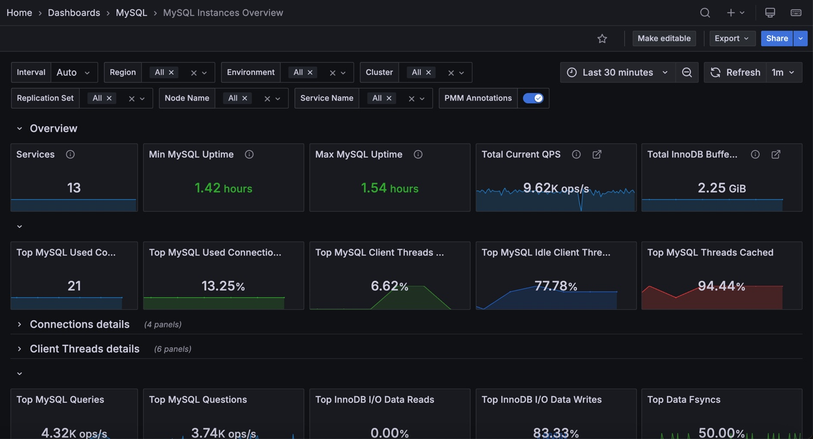

# MySQL Instances Overview

This dashboard provides a high-level view of all your MySQL instances in one place. It helps you quickly identify which instances need attention by highlighting connection issues, query performance problems, and resource utilization across your fleet.

Use the filters at the top to narrow down by Region, Environment, Cluster, Replication Set, Node Name, or Service Name.

## Overview

### Services
Shows the total number of MySQL services currently being monitored.

Use this to verify that all expected MySQL instances are reporting to PMM. If this count is lower than expected, you may have agents that are offline or not properly configured.

### Min MySQL Uptime
Shows the shortest uptime among all monitored MySQL instances. The color changes based on uptime: red for very recent restarts (under 5 minutes), orange for short uptimes (5 minutes to 1 hour), and green for longer uptimes (over 1 hour).

Use this to quickly spot if any instance has recently restarted. A red value indicates a very recent restart that may need investigation—check for crashes, maintenance events, or unexpected reboots.

### Max MySQL Uptime
Shows the longest uptime among all monitored MySQL instances, using the same color thresholds as Min MySQL Uptime.

Compare this with Min MySQL Uptime to understand the stability spread across your fleet. A large gap between min and max may indicate inconsistent maintenance schedules or stability issues on specific instances.

### Total Current QPS
Shows the combined queries per second across all monitored MySQL instances.

Use this to understand total workload across your MySQL fleet. Sudden spikes or drops can indicate application issues, traffic changes, or problems with specific instances.

### Total InnoDB Buffer Pool Size
Shows the combined InnoDB buffer pool size across all instances.

The buffer pool is critical for MySQL performance—it caches data and indexes in memory. Use this to understand your total memory allocation for MySQL caching and plan capacity accordingly.

## Connections

### Top MySQL Used Connections
Shows the highest number of connections that have been used simultaneously across all instances.

Use this to track peak connection usage. If this approaches your `max_connections` setting, consider increasing the limit or investigating connection pooling strategies.

### Top MySQL Used Connections (%)
Shows the highest percentage of used connections relative to `max_connections` across all instances.

### Top MySQL Client Threads Connected
Shows the highest percentage of connected threads relative to `max_connections` across all instances.

Use this to identify instances approaching their connection limits. Values turning orange (50%) or red (80%) indicate you're running low on connection capacity.

### Top MySQL Idle Client Threads
Shows the highest percentage of idle threads (connected but not actively processing) across all instances.

A high percentage of idle connections may indicate applications not properly closing connections or connection pool misconfiguration.

### Top MySQL Threads Cached
Shows the highest percentage of threads in the thread cache relative to `thread_cache_size`.

The thread cache stores threads for reuse, reducing the overhead of creating new threads. High values (orange/red) may indicate the thread cache is too small for your workload.

## Connections details

### Top 5 MySQL Used Connections
Shows connection usage trends over time for the five instances with the highest connection counts. A red line shows the average across all instances.

Use this to identify which instances are handling the most connections and spot unusual patterns over time. Click on any series to drill down to that instance's summary.

### MySQL Used Connections
Shows the connection usage percentage for each instance as a hexagon grid. Green indicates healthy usage (under 50%), orange shows moderate usage (50-80%), and red indicates high usage (over 80%).

Use this to quickly scan all instances for connection pressure. Click any hexagon to drill down to that instance's summary dashboard.

### Top 5 MySQL Aborted Connections
Shows aborted connection rates over time for the top five instances.

Aborted connections occur when a connection is interrupted mid-handshake, often due to bad credentials or network issues. If failed connection attempts from a host reach the `max_connect_errors` threshold, MySQL blocks that host from further connections. To unblock the host, run `FLUSH HOSTS`.

### Aborted Connections
Shows the rate of aborted connections per instance. Green indicates no issues, orange shows low abort rates (1-10/sec), and red indicates high abort rates (over 10/sec).

Rising aborted connections often indicate network issues, authentication problems, or applications not properly closing connections.

## Client Threads details

### Top 5 MySQL Client Threads Connected
Shows thread connection trends over time for the five instances with the most connected threads.

Threads Connected represents the number of open connections. Use this to track connection patterns and identify instances with unusually high connection counts.

### MySQL Client Threads Connected
Shows connected threads as a percentage of `max_connections` for each instance.

### Top 5 MySQL Active Client Threads
Shows active (non-sleeping) thread trends over time for the top five instances.

Active threads (Threads Running) represent connections actually doing work, as opposed to connected threads that may be idle. A high ratio of active to connected threads indicates efficient connection usage, while a low ratio suggests many idle connections.

### MySQL Idle Client Threads
Shows idle thread percentage for each instance. Higher idle percentages (orange/red) may indicate connection pool issues or applications holding connections unnecessarily.

### Top 5 MySQL Thread Cached
Shows thread cache usage over time for the top five instances.

The `thread_cache_size` variable sets how many threads the server should cache for reuse. When a client disconnects, its thread is placed in the cache if not full. Requests for threads are satisfied by reusing cached threads when possible—only when the cache is empty is a new thread created.

This setting is auto-sized in MySQL 5.6.8 and above (capped at 100). High thread creation rates with a low cache hit ratio may indicate the cache is too small for your workload.

### Percentage of Cached MySQL Threads
Shows thread cache utilization for each instance. High values approaching the cache limit may benefit from increasing `thread_cache_size`.

## Queries & Questions

### Top MySQL Queries
Shows the highest query rate (statements per second) across all instances.

### Top MySQL Questions
Shows the highest question rate across all instances. Questions count only statements sent by clients, excluding stored procedure internals.

### Top InnoDB I/O Data Reads
Shows the highest percentage of InnoDB I/O operations that are reads across all instances.

This represents reads as a proportion of total I/O (reads + writes + fsyncs). Use this to understand the read/write balance of your busiest instance.

### Top InnoDB I/O Data Writes
Shows the highest percentage of InnoDB I/O operations that are writes across all instances.

This represents writes as a proportion of total I/O. Higher percentages indicate write-heavy workloads that may benefit from write-optimized storage or tuning.

### Top Data Fsyncs
Shows the highest percentage of InnoDB I/O operations that are fsyncs across all instances. Green indicates normal fsync ratios (under 60%), orange shows elevated ratios (60-90%), and red indicates very high fsync activity (over 90%).

High fsync percentages may indicate durability-focused configurations or storage that's struggling to keep up with sync requests.

## Queries & Questions details

### Top 5 MySQL Queries
Shows query rate (statements per second) for the top five instances over time.

MySQL Queries counts all statements executed, including those in stored procedures. Use this to identify your busiest instances and spot workload changes.

### MySQL QPS
Shows the current queries per second for each instance as a hexagon grid.

Use this to quickly compare query load across instances and identify outliers that may need investigation.

### Top 5 MySQL Questions
Shows the question rate for the top five instances over time.

Questions count only statements sent by clients, excluding statements executed within stored programs and internal commands like COM_PING, COM_STATISTICS, and prepared statement operations. Compare with Queries to understand how much of your workload comes from stored procedures versus direct client statements.

### MySQL Questions in Queries
Shows the ratio of Questions to Queries for each instance. Green (under 50%) indicates significant stored procedure usage, orange (50-90%) shows mixed workload, and red (over 90%) means most activity is direct client queries.

Use this to understand workload composition—a low ratio means stored procedures handle much of the work.

## InnoDB I/O details

### Top 5 Data Reads
Shows InnoDB data read rates (OS file reads) for the top five instances over time.

High read rates may indicate queries scanning more data than necessary, insufficient buffer pool size, or read-heavy workloads. Compare with buffer pool hit ratios to determine if more memory would help.

### Percentage of Data Read
Shows data reads as a percentage of total InnoDB I/O operations (reads + writes + fsyncs) for each instance. This helps you understand the read/write balance of your workload.

### Top 5 Data Writes
Shows InnoDB data write rates for the top five instances over time.

High write rates indicate write-heavy workloads. Monitor alongside fsync rates and disk I/O to ensure your storage can keep up with write demand.

### Percentage of Data Writes
Shows data writes as a percentage of total InnoDB I/O operations for each instance. Higher percentages indicate write-heavy workloads.

### Top 5 Data Fsyncs
Shows fsync operation rates for the top five instances over time.

Fsyncs flush data to disk to ensure durability. The frequency is influenced by the `innodb_flush_method` configuration option. High fsync rates can impact performance on storage with slow sync operations.

### Percentage of Data Fsyncs
Shows fsync operations as a percentage of total InnoDB I/O for each instance. High fsync percentages may indicate durability settings that prioritize safety over performance.

## Temporary Objects, Selects, Sorts, and Locks

### Top MySQL Temporary Objects
Shows the highest rate of temporary object creation (temporary tables, disk-based temporary tables, and temporary files combined) across all instances. Green indicates normal activity (under 50/sec), orange shows moderate rates (50-100/sec), and red indicates high rates (over 100/sec) that may need optimization.

### Top MySQL Selects
Shows the highest rate of select operations (full joins, range scans, full table scans) across all instances. Green indicates normal activity (under 100/sec), orange shows elevated rates (100-200/sec), and red indicates high rates (over 200/sec) that may need optimization.

High select rates, especially full joins and full table scans, often indicate missing indexes or inefficient queries.

### Top MySQL Sorts
Shows the highest sort operation rate across all instances.

### Top MySQL Aborted Connections
Shows the highest rate of aborted connections (failed connection attempts plus unexpected client disconnections) across all instances. Green indicates no issues, orange shows low abort rates (1-10/sec), and red indicates high abort rates (over 10/sec).

### Top MySQL Table Locks
Shows the highest table lock rate (immediate and waited locks combined) across all instances. Green indicates healthy lock rates (under 10/sec), orange shows moderate rates (10-100/sec), and red indicates high lock contention (over 100/sec).

## Temporary Objects details

### Top 5 MySQL Temporary Objects
Shows how often the top five instances create temporary objects over time.

This includes temporary tables, disk-based temporary tables, and temporary files. When temporary objects spill to disk, they're slower than those kept in memory. High rates often point to queries you should optimize, or suggest you may need to increase `tmp_table_size` or `max_heap_table_size`.

### MySQL Temporary Objects
Shows the temporary object creation rate for each instance. Green indicates normal activity (under 50/sec), orange shows moderate rates (50-100/sec), and red indicates high rates (over 100/sec) that may need query optimization or `tmp_table_size` adjustments.

### Top 5 MySQL Selects
Shows select operation rates over time for the top five instances.

This includes selects not done efficiently with indexes: Select Scan (full table scans), Select Range (range scans), and Select Full Join (joins without indexes). High rates, especially full joins and full table scans, often indicate missing indexes or inefficient queries that need optimization.

### MySQL Selects
Shows the select operation rate (full joins, range scans, full table scans) for each instance. Green indicates normal activity (under 100/sec), orange shows elevated rates (100-200/sec), and red indicates high rates (over 200/sec) that likely need query optimization.

## Sorts details

### Top 5 MySQL Sorts
Shows sort operation rates for the top five instances, including row sorts, range sorts, merge passes, and scan sorts.

High sort rates may indicate queries that could benefit from better indexing or query restructuring.

### MySQL Sorts
Shows sort rates per instance. Green is healthy, orange (5000+) and red (10000+) indicate heavy sorting that may impact performance.

## Locks details

### Top 5 MySQL Table Locks
Shows table lock rates over time for the top five instances.

Table locks include both immediate (granted) and waited locks. Rising waited locks indicate lock contention that may impact performance. For InnoDB tables, these are often row-level locks despite being counted as table locks.

### MySQL Table Locks
Shows table lock rates per instance. Green is healthy, orange (10+) and red (100+) indicate potential contention issues.

## Network

### Top MySQL Incoming Network Traffic
Shows peak incoming network traffic rate across all instances.

### Top MySQL Outgoing Network Traffic
Shows peak outgoing network traffic rate across all instances.

### Top MySQL Used Query Cache
Shows the highest query cache utilization percentage across instances.

### Top Percentage of File Openings to Opened Files
Shows the highest ratio of file open operations to currently open files.

### Top Percentage of Opened Files to the Limit
Shows how close instances are to their `open_files_limit`.

## Network details

### Top 5 MySQL Incoming Network Traffic
Shows incoming network traffic trends for the top five instances by traffic volume.

Use this to understand network utilization and identify instances receiving heavy traffic.

### Top 5 MySQL Outgoing Network Traffic
Shows outgoing network traffic trends for the top five instances.

Use this alongside incoming traffic to understand data flow patterns and identify bandwidth-constrained instances.

## Query Cache details

### MySQL Query Cache Size
Shows the configured query cache size for each instance.

### MySQL Used Query Cache
Shows query cache memory usage per instance.

Note: The query cache is deprecated in MySQL 5.7 and removed in MySQL 8.0 due to scalability issues. If you're using older MySQL versions, consider disabling it (`query_cache_type=0`, `query_cache_size=0`) for better performance in concurrent environments.

## Files details

### Top 5 MySQL File Openings
Shows file opening rates for the top five instances.

Frequent file openings add overhead. If rates are high, consider increasing `table_open_cache` to keep more files open.

### Percentage of File Openings to Opened Files
Shows this ratio per instance. High values (orange 50%+, red 90%+) indicate frequent file opening that may benefit from increasing `table_open_cache`.

### Top 5 MySQL Opened Files
Shows the count of currently opened files over time for the top five instances.

Monitor this alongside `open_files_limit` to ensure instances have sufficient file handles. If counts approach the limit, increase `open_files_limit` to avoid errors.

### Percentage of Opened Files to the Limit
Shows how close each instance is to its `open_files_limit`. High values indicate you may need to increase the limit to avoid file handle exhaustion.

## Table Openings

### Top Open Cache Miss Ratio
Shows the highest cache miss ratio across all instances.

### Min MySQL Opened Table Definitions
Shows the minimum table definition opening rate across instances.

### Top MySQL Opened Table Definitions
Shows the highest rate of table definition openings across instances.

### Top MySQL Open Table Definitions
Shows the highest count of currently open table definitions.

### Top Open Table Definitions to Definition Cache
Shows how full the table definition cache is across instances. High utilization (orange 40%+, red 90%+) may require increasing `table_definition_cache`.

## Table Openings details

### Lowest 5 Open Cache Hit Ratio
Shows cache hit ratios for the five instances with the lowest hit rates over time.

The table open cache stores file descriptors for open tables. Low hit ratios indicate the cache is undersized, causing MySQL to repeatedly open and close table files. Consider increasing `table_open_cache` for instances with consistently low hit ratios.

### Open Cache Miss Ratio
Shows the cache miss ratio per instance. Lower is better—high miss ratios (orange 50%+, red 90%+) indicate the table open cache is undersized and may benefit from increasing `table_open_cache`.

## MySQL Open and Cached Table Definitions details

### MySQL Table Definition Cache
Shows the configured table definition cache size for each instance.

### Top 5 MySQL Opened Table Definitions
Shows table definition opening rates over time for the top five instances.

High opening rates may indicate the `table_definition_cache` is too small, forcing MySQL to repeatedly parse table definitions. Consider increasing the cache size for better performance.

### Top 5 MySQL Open Table Definitions
Shows the count of open table definitions over time for the top five instances.

### Percentage of Open Table Definitions to Table Definition Cache
Shows cache utilization per instance. Instances approaching their limits (orange 40%+, red 80%+) may benefit from a larger `table_definition_cache` size.