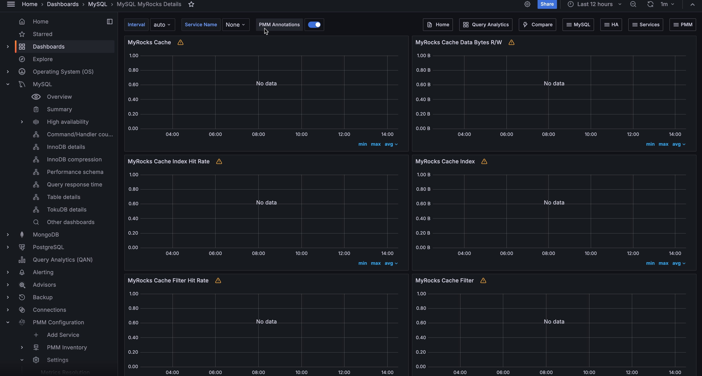

# MySQL MyRocks Details

The [MyRocks](http://myrocks.io) storage engine developed by Facebook based on the RocksDB storage engine is applicable to systems which primarily interact with the database by writing data to it rather than reading from it. RocksDB also features a good level of compression, higher than that of the InnoDB storage engine, which makes it especially valuable when optimizing the usage of hard drives.

PMM collects statistics on the MyRocks storage engine for MySQL in the Metrics Monitor information for this dashboard comes from the *Information Schema* tables.

## Metrics

- MyRocks cache
- MyRocks cache data bytes R/W
- MyRocks cache index hit rate
- MyRocks cache index
- MyRocks cache filter hit rate
- MyRocks cache filter
- MyRocks cache data bytes inserted
- MyRocks bloom filter
- MyRocks memtable
- MyRocks memtable size
- MyRocks number of keys
- MyRocks cache L0/L1
- MyRocks number of DB ops
- MyRocks R/W
- MyRocks bytes read by iterations
- MyRocks write ops
- MyRocks WAL
- MyRocks number reseeks in iterations
- RocksDB row operations
- MyRocks file operations
- RocksDB stalls
- RocksDB stops/slowdowns
