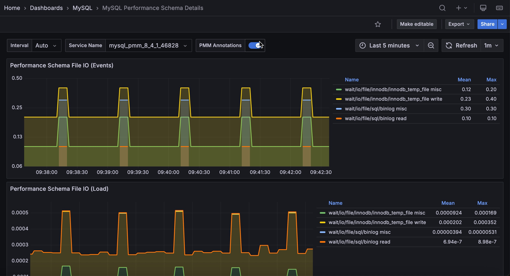

# MySQL Performance Schema Details



The MySQL Performance Schema dashboard helps determine the efficiency of communicating with Performance Schema. This dashboard contains the following metrics:

- Performance Schema file IO (events)
- Performance Schema file IO (load)
- Performance Schema file IO (Bytes)
- Performance Schema waits (events)
- Performance Schema waits (load)
- Index access operations (load)
- Table access operations (load)
- Performance Schema SQL and external locks (events)
- Performance Schema SQL and external locks (seconds)
- Performance Schema memory usage (current Bytes)
- Performance Schema memory allocation rate (Bytes)
- Performance Schema memory free rate (Bytes)

## Performance Schema memory

The three memory panels break down server memory by Performance Schema memory instrument, using `performance_schema.memory_summary_global_by_event_name`. Use the **Memory Event** filter at the top of the dashboard to narrow the panels to specific instruments.

!!! note alert alert-primary "Server configuration required"
    Memory instruments are disabled by default in MySQL and Percona Server. Until they are enabled, these three panels show *No data* even though the rest of the dashboard is populated.

    Enable them at server start-up with the [`performance-schema-instrument`](https://dev.mysql.com/doc/refman/8.4/en/performance-schema-options.html#option_mysqld_performance-schema-instrument) option:

    ```ini
    performance_schema=ON
    performance-schema-instrument='memory/%=ON'
    ```

    `performance-schema-instrument` cannot be set in a session, so a server restart is required.
