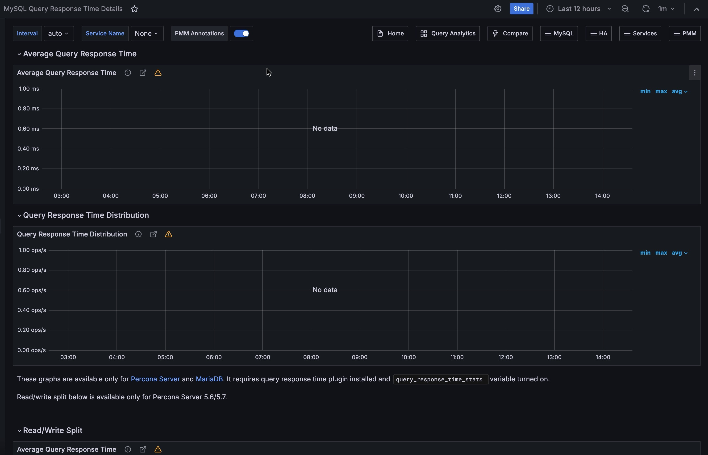

# MySQL Query Response Time Details

!!! warning "Dashboard availability"
    This dashboard is only accessible via the **Dashboards** folder for MariaDB users. This dashboard only works with Percona Server for MySQL 5.7 (End of Life) and MariaDB 10.0.4+ when the Query Response Time plugin is enabled. It is not compatible with MySQL 8.0+.
    
    **For MySQL 8.0+ users:** Use [Query Analytics (QAN)](../../use/qan/index.md) with Performance Schema to monitor query performance and response times.

## Overview

This dashboard displays query response time metrics collected using the Response Time Distribution plugin. The data is sourced from the `INFORMATION_SCHEMA.QUERY_RESPONSE_TIME` table.

### Supported versions

- **Percona Server for MySQL**: 5.7 only (available through Post-EOL support program)
- **MariaDB**: 10.0.4+
- **NOT supported**: MySQL 8.0+ or Percona Server for MySQL 8.0+

### Prerequisites

The Query Response Time plugin must be installed and enabled. See [Query Response Time configuration](../../install-pmm/install-pmm-client/connect-database/mysql/mysql.md#query-response-time) for setup instructions.

## Dashboard panels

### Average Query Response Time

Shows the average query response time across all queries, calculated by dividing the total execution time (in seconds) by the total number of queries.

**Data source**: [`INFORMATION_SCHEMA.QUERY_RESPONSE_TIME`](https://www.percona.com/doc/percona-server/5.7/diagnostics/response_time_distribution.html#QUERY_RESPONSE_TIME)

### Query Response Time Distribution

Displays the count of queries grouped by response time buckets:

- **100 ms - 1 s**: Queries completing between 100 milliseconds and 1 second
- **1 s - 10 s**: Queries completing between 1 and 10 seconds
- **> 10 s**: Queries taking longer than 10 seconds

### Average Query Response Time (Read/Write Split)

**Available only in Percona Server for MySQL 5.7**

Shows the average response time split between READ and WRITE operations, providing visibility into different query types' performance characteristics.

**Data sources**: 
- [`QUERY_RESPONSE_TIME_READ`](https://www.percona.com/doc/percona-server/5.7/diagnostics/response_time_distribution.html#QUERY_RESPONSE_TIME_READ)
- [`QUERY_RESPONSE_TIME_WRITE`](https://www.percona.com/doc/percona-server/5.7/diagnostics/response_time_distribution.html#QUERY_RESPONSE_TIME_WRITE)

**Reference**: [Percona Server logging queries in separate read and write tables](https://www.percona.com/doc/percona-server/5.7/diagnostics/response_time_distribution.html#logging-the-queries-in-separate-read-and-write-tables)

### Read Query Response Time Distribution

**Available only in Percona Server for MySQL 5.7**

Shows READ query counts grouped by response time buckets:

- **100 ms - 1 s**
- **1 s - 10 s**
- **> 10 s**

### Write Query Response Time Distribution

**Available only in Percona Server for MySQL 5.7**

Shows WRITE query counts grouped by response time buckets:

- **100 ms - 1 s**
- **1 s - 10 s**
- **> 10 s**

## Alternative for MySQL 8.0+

For MySQL 8.0 and later versions, this dashboard is not available. Instead, use:

- **[Query Analytics (QAN)](../../use/qan/index.md)** with Performance Schema as the query source
- **[MySQL Performance Schema Details](dashboard-mysql-performance-schema-details.md)** dashboard
- **[MySQL Instance Summary](dashboard-mysql-instance-summary.md)** dashboard for general performance metrics

## Related topics

- [Connect MySQL databases to PMM](../../install-pmm/install-pmm-client/connect-database/mysql/mysql.md)
- [Query Analytics](../../use/qan/index.md)
- [Percona Server Response Time Distribution documentation](https://www.percona.com/doc/percona-server/5.7/diagnostics/response_time_distribution.html)