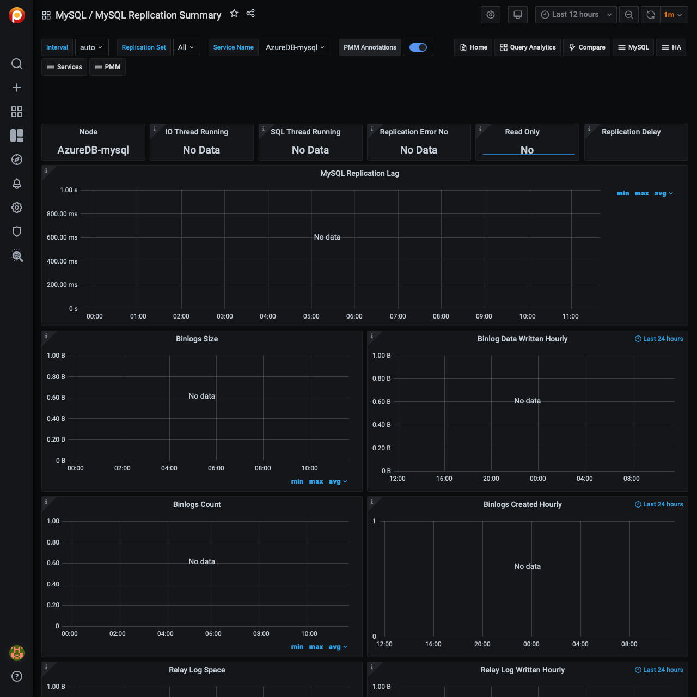

# MySQL Replication Summary

## IO Thread Running

This metric shows if the IO Thread is running or not. It only applies to a secondary host.

SQL Thread is a process that runs on a secondary host in the replication environment. It reads the events from the local relay log file and applies them to the secondary server.

Depending on the format of the binary log it can read query statements in plain text and re-execute them or it can read raw data and apply them to the local host.

### Possible values

Yes
: The thread is running and is connected to a replication primary

No
: The thread is not running because it is not launched yet or because an error has occurred connecting to the primary host

Connecting
: The thread is running but is not connected to a replication primary

No value
: The host is not configured to be a replication secondary

IO Thread Running is one of the parameters that the command
`SHOW SLAVE STATUS` returns.

## SQL Thread Running

This metric shows if the SQL thread is running or not. It only applies to a secondary host.

### Possible values

Yes
:   SQL Thread is running and is applying events from the relay log to the local secondary host

No
:   SQL Thread is not running because it is not launched yet or because of an error occurred while applying an event to the local secondary host

## Replication Error No

This metric shows the number of the last error in the SQL Thread encountered which caused replication to stop.

One of the more common errors is *Error: 1022 Duplicate Key Entry*. In such a case replication is attempting to update a row that already exists on the secondary. The SQL Thread will stop replication to avoid data corruption.

## Read only

This metric indicates whether the host is configured to be in *Read Only* mode or not.

### Possible values

Yes
:   The secondary host permits no client updates except from users who have the SUPER privilege or the REPLICATION SLAVE privilege.

    This kind of configuration is typically used for secondary hosts in a replication environment to avoid a user can inadvertently or voluntarily modify data causing inconsistencies and stopping the replication process.

No
:    The secondary host is not configured in *Read Only* mode.

## MySQL Replication Delay

This metric shows the number of seconds the secondary host is delayed in replication applying events compared to when the primary host applied them, denoted by the `Seconds_Behind_Master` value, and only applies to a secondary host.

Since the replication process applies the data modifications on the secondary asynchronously, it could happen that the secondary replicates events after some time. The main reasons are:

- **Network round trip time** - high latency links will lead to non-zero replication lag values.

- **Single threaded nature of replication channels** - primary servers have the advantage of applying changes in parallel, whereas secondary ones are only able to apply changes in serial, thus limiting their throughput. In some cases Group Commit can help but is not always applicable.

- **High number of changed rows or computationally expensive SQL** - depending on the replication format (`ROW` vs `STATEMENT`), significant changes to the database through high volume of rows modified, or expensive CPU will all contribute to secondary servers lagging behind the primary.

Generally adding more CPU or Disk resources can alleviate replication lag issues, up to a point.

## Binlog Size

This metric shows the overall size of the binary log files, which can exist on both primary and secondary servers.

The binary log (also known as the *binlog*) contains events that describe database changes: `CREATE TABLE`, `ALTER TABLE`, updates, inserts, deletes and other statements or database changes.

The binlog file is read by secondaries via their IO Thread process to replicate database changes modification on the data and on the table structures. There can be more than one binlog file depending on the binlog rotation policy (for example using the configuration variables `max_binlog_size` and `expire_logs_days`) or because of server reboots.

When planning the disk space, take care of the overall dimension of binlog files and adopt a good rotation policy or think about having a separate mount point or disk to store the binlog data.

## Binlog Data Written Hourly

This metric shows the amount of data written hourly to the binlog files during the last 24 hours. This metric can give you an idea of how big is your application in terms of data writes (creation, modification, deletion).

## Binlog Count

This metric shows the overall count of binary log files, on both primary and secondary servers.

## Binlogs Created Hourly

This metric shows the number of binlog files created hourly during the last 24 hours.

## Relay Log Space

This metric shows the overall size of the relay log files. It only applies to a secondary host.

The relay log consists of a set of numbered files containing the events to be executed on the secondary host to replicate database changes.

The relay log has the same format as the binlog.

There can be multiple relay log files depending on the rotation policy adopted (using the configuration variable `max_relay_log_size`).

As soon as the SQL thread completes to execute all events in the relay log file, the file is deleted.

If this metric contains a high value, the variable `max_relay_log_file` is high too. Generally, this not a serious issue. If the value of this metric is constantly increased, the secondary is delaying too much in applying the events.

Treat this metric in the same way as the [MySQL Replication Delay](#mysql-replication-delay) metric.

## Relay Log Written Hourly

This metric shows the amount of data written hourly into relay log files during the last 24 hours.
