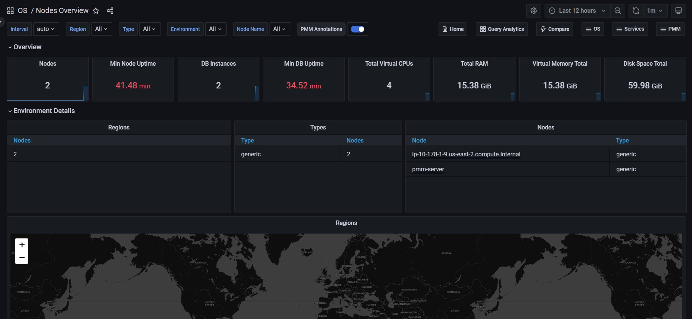

# Nodes Overview

The Nodes Overview dashboard provides details about the efficiency of work of the following components. Each component is represented as a section in the dashboard.

- CPU
- Memory & Swap
- Disk
- Network

The **CPU** section offers the **CPU Usage**, **CPU Saturation and Max Core Usage**, **Interrupts and Context Switches**, and **Processes** metrics.

In the **Memory** section, you can find the **Memory Utilization**, **Virtual Memory Utilization**, **Swap Space**, and **Swap Activity** metrics.

The **Disk** section contains the **I/O Activity**, **Global File Descriptors Usage**, **Disk IO Latency**, and **Disk IO Load** metrics.

In the **Network** section, you can find the **Network Traffic**, **Network Utilization Hourly**, **Local Network Errors**, and **TCP Retransmission** metrics.
