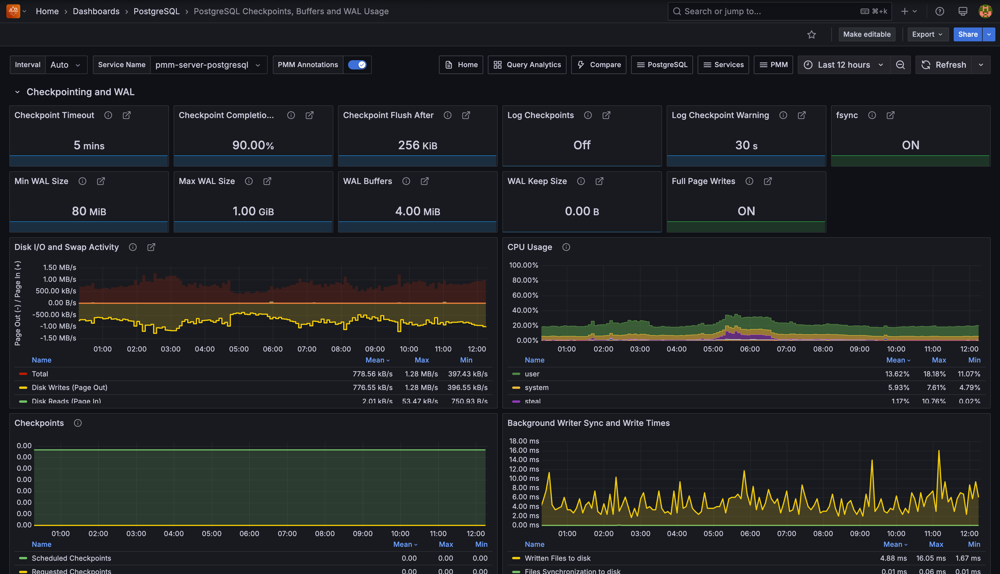

# PostgreSQL Checkpoints, Buffers and WAL Usage

This dashboard monitors PostgreSQL's checkpoint behavior, buffer management, and Write-Ahead Log (WAL) activity to help you identify I/O bottlenecks and optimize your database performance. 

Use this to correlate checkpoint activity with disk I/O patterns and understand their impact on your storage subsystem.

## Checkpointing and WAL

### Checkpoint Timeout
Shows the maximum time PostgreSQL waits between automatic WAL checkpoints. This controls how often PostgreSQL automatically saves your database changes to ensure data recovery after crashes. 

Longer intervals mean fewer checkpoint interruptions but potentially longer recovery times.

### Checkpoint Completion Target
Shows what percentage of the checkpoint interval PostgreSQL uses to spread out checkpoint writes. For example, 0.9 (90%) means PostgreSQL tries to complete checkpoints within 90% of the timeout period. 

This helps you avoid I/O spikes by spreading checkpoint work over time instead of rushing to finish.

### Checkpoint Flush After
Shows the data threshold that triggers PostgreSQL to force the operating system to write checkpoint data to storage. 

When PostgreSQL writes more than this amount during a checkpoint, it tells the OS to flush the data immediately rather than buffering it. 

This helps prevent large write bursts that could overwhelm your storage.

### Log Checkpoints
Shows whether PostgreSQL records checkpoint activity in your server logs. When ON, PostgreSQL logs details about each checkpoint including how many buffers it wrote and how long the process took. 

Use this to monitor checkpoint performance and identify I/O bottlenecks.

### Log Checkpoint Warning
Shows the time threshold for checkpoint frequency warnings. When checkpoints happen closer together than this setting (because WAL fills up too quickly), PostgreSQL logs a warning suggesting you increase `max_wal_size`.

 If you see these warnings frequently, your WAL size is too small for your workload.

### fsync
Shows whether PostgreSQL forces writes to physically reach your disk storage. 

When `ON` (green), PostgreSQL ensures your data survives system crashes by calling fsync() after writes. 

When `OFF` (red), PostgreSQL runs faster but you risk losing data during power failures or crashes—only disable this for testing environments.

### Min WAL Size
Shows the minimum WAL disk space reserved for recycling. WAL files below this threshold are recycled rather than removed at checkpoints, to ensure enough space for WAL usage spikes during batch operations.

### Max WAL Size
Displays the soft limit for WAL growth during automatic checkpoints. 

While WAL can exceed this under heavy load or failing archiving, staying within this limit helps you prevent forced checkpoints.

### WAL Buffers
Shows shared memory allocated for WAL data not yet written to disk. The default (`-1`) selects 1/32nd of shared_buffers, helping you optimize write performance.

### WAL Keep Size
Indicates minimum past log segments retained in `pg_wal` directory for standby servers. 

This ensures your replicas can retrieve the WAL segments they need to stay synchronized.

### Full Page Writes
Shows whether PostgreSQL writes full page content to WAL after checkpoints. When ON (green), it ensures data integrity after system failures.

When OFF (red), PostgreSQL runs faster but your data could become corrupted during system failures.

### Disk I/O and Swap Activity
Correlates disk I/O patterns with checkpoint activity:

- **Disk Reads/Writes**: Page-level I/O operations
- **Swap In/Out**: Memory pressure indicators

High swap activity during checkpoints suggests your system has memory constraints.

### CPU Usage
Displays CPU utilization breakdown showing you the impact of checkpoint and I/O operations on your system resources. Spikes during checkpoints indicate CPU-bound I/O operations.

### Checkpoints
Tracks checkpoint frequency:

- **Scheduled Checkpoints**: triggered by `checkpoint_timeout` or `CHECKPOINT` command
- **Requested Checkpoints**: forced by insufficient `max_wal_size` or server shutdown

Frequent requested checkpoints indicate that you should `increase max_wal_size`.

### Background Writer Sync and Write Times

Tracks how long PostgreSQL spends:

- **Syncing files to disk**: time to `fsync` files during checkpoints
- **Writing files to disk**: time to write dirty buffers

High values mean your I/O subsystem is struggling during checkpoints.

### WAL Writes
Shows Write-Ahead Log generation rate in bytes per second. 

Use this to plan your WAL storage capacity and identify heavy write periods. 

This metric requires a custom query collector to populate the data.

### WAL Writes Per Checkpoint Timeout
Displays WAL bytes written grouped by `checkpoint_timeout` intervals. 

When bars exceed the red Max WAL size line, consider increasing `max_wal_size` to reduce forced checkpoints.

## Buffers and Background Writer

### Shared Buffers
Shows memory allocated for database shared memory buffers.

We recommend setting this to 25% of your system's RAM, but avoid going above 40%.

PostgreSQL uses this memory as its primary cache to store frequently accessed data pages.

### BgWriter LRU Max Pages

Shows the maximum number of dirty pages the background writer flushes during each cleaning round. 

Higher values allow more aggressive cleaning but may impact foreground query performance.

### BgWriter Delay
Shows how long PostgreSQL waits between background writer cleaning rounds. Shorter delays mean more frequent cleaning but higher CPU overhead. 

Longer delays reduce CPU usage but may leave more dirty buffers for checkpoints to handle, potentially causing I/O spikes.

### BgWriter Flush After
Shows the data threshold that triggers PostgreSQL to ask the operating system to write buffered data to storage. 

When the background writer accumulates more than this amount of dirty data, it tells the OS to flush writes immediately rather than waiting. 

This helps prevent large write bursts during checkpoints.

### BgWriter LRU Multiplier
Shows the multiplier PostgreSQL uses to estimate how many buffers to clean in the next background writer round. 

Higher values make the background writer more aggressive at cleaning buffers based on recent usage patterns. 

Lower values result in more conservative cleaning that may leave work for checkpoints.

### BgWriter Stats Reset
Shows when PostgreSQL last reset the background writer statistics.

Use this timestamp to understand how long your current background writer metrics have been accumulating. Reset statistics after configuration changes to get clean baseline measurements for tuning.

### Buffers Read
Monitors buffers loaded into shared memory from either page cache (memory) or disk I/O. 

High rates indicate your working set exceeds available memory.

### Buffers Written
Shows buffer write activity by source:

- **During checkpoints**: bulk writes during checkpoint operations
- **By the background writer**: proactive cleaning of dirty buffers
- **Directly by a backend**: emergency writes when no clean buffers available

Backend writes indicate insufficient background writer activity.

### Fsync Backend Calls
Shows `fsync` calls made directly by backend processes. High values mean your backends are waiting for writes to finish, suggesting you should tune your checkpoint or background writer settings.

### Background Writer Stops due to LRU max Reached
Tracks when background writer stops because it reached `bgwriter_lru_maxpages` limit. 

Frequent stops suggest you should increase this limit to allow more aggressive buffer cleaning.