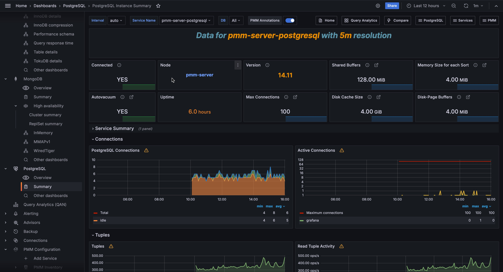

# PostgreSQL Instance Summary

This dashboard shows a detailed overview of a single PostgreSQL instance, monitor its performance metrics, and dive deep into query activity.

This is essential for database administrators who need to troubleshoot specific PostgreSQL services, analyze query performance, investigate connection issues, or monitor database activity patterns. 

Start here when you need to focus on one specific PostgreSQL instance, investigate slow queries, check connection usage, or analyze database-specific performance trends.

## Service
Shows essential information about your PostgreSQL instance including service name, version, uptime in days, and the server hostname. The server name is clickable to navigate to detailed node monitoring. This gives you quick access to basic instance identification and health information.

## Connections
Shows current connection counts with total open connections and currently active connections highlighted. Monitor this to ensure you're not approaching connection limits. High connection counts may indicate connection pooling issues or application problems.

## Slow Queries
Shows the count of queries that exceeded your configured slow query threshold over the selected time range. Focus on reducing this number, considering that high slow query counts indicate performance problems that need query optimization or indexing improvements.

## Connections Overview
Shows connection trends over time broken down by connection state (active, idle, etc.) with a total connections line. Watch for spikes in total connections or unusual patterns. Sudden increases may indicate application issues or connection leaks.

## Connections per Database
Shows the distribution of connections across different databases in your PostgreSQL instance as a donut chart. 

Use this to identify which databases consume the most connections. Uneven distribution may indicate workload imbalances or specific database issues.

## QPS (Queries Per Second)
Shows the top 5 databases by transaction commit rate, indicating query throughput. Monitor this to understand your workload patterns. Consistent QPS indicates steady performance while spikes may require investigation.

## Number of Locks
Shows current lock counts by lock type and database over time. Watch for lock spikes or sustained high lock counts as these can indicate lock contention issues, long-running transactions, or deadlock situations that need attention.

## Tuples
Shows tuple operation rates (fetched, returned, inserted, updated, deleted) as horizontal bar gauges. Use this to understand your database activity patterns. High fetch-to-return ratios may indicate inefficient queries reading more data than needed.

## Queries
Shows a detailed table of recent queries with execution times, sorted by performance. Focus optimization efforts on queries with the highest execution times. This table helps you identify specific slow queries that need indexing or rewriting for better performance.
