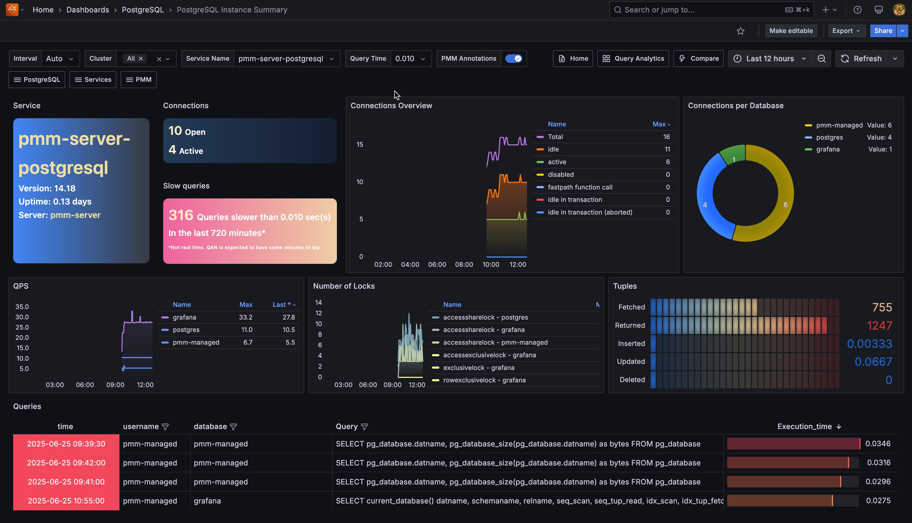

# PostgreSQL Instance Summary

## Number of Temp Files

Cumulative number of temporary files created by queries in this database since service start. All temporary files are counted, regardless of why the temporary file was created (e.g., sorting or hashing), and regardless of the `log_temp_files` setting.

## Size of Temp Files

Cumulative amount of data written to temporary files by queries in this database since service start. All temporary files are counted, regardless of why the temporary file was created, and regardless of the `log_temp_files` setting.

## Temp Files Activity

Number of temporary files created by queries in this database. All temporary files are counted, regardless of why the temporary file was created (e.g., sorting or hashing), and regardless of the `log_temp_files` setting.

## Temp Files Utilization

Total amount of data written to temporary files by queries in this database. All temporary files are counted, regardless of why the temporary file was created, and regardless of the `log_temp_files` setting.

## Canceled Queries

Based on `pg_stat_database_conflicts` view
