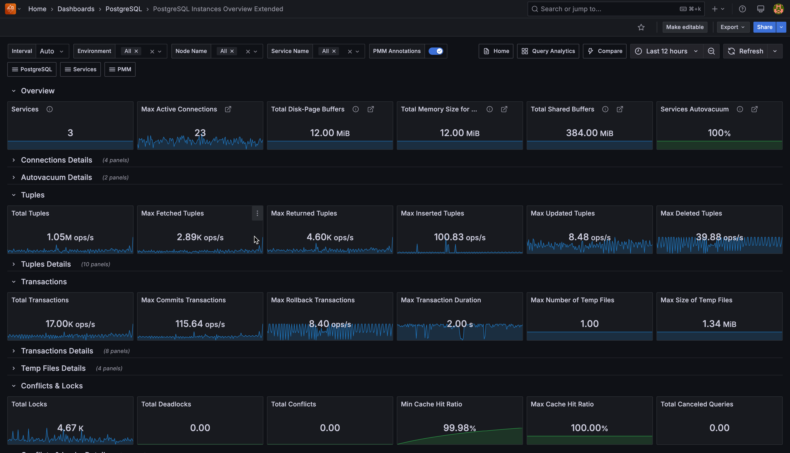

# PostgreSQL Instances Overview Extended

This dashboard shows an overview of all your PostgreSQL instances, compare performance across services, and identify which databases need attention. 

This is essential for database administrators managing multiple PostgreSQL services who need to quickly spot performance issues, resource bottlenecks, or configuration problems across their entire infrastructure. 

Start here when you need to compare performance across all your databases, identify your busiest services, find instances with connection or memory pressure, or get a high-level health check of your entire PostgreSQL environment.

## Overview 

### Services
Shows how many PostgreSQL services you're currently monitoring with PMM. This gives you a quick count of all active database instances under management across your infrastructure.
 
### Max Active Connections  
Shows the highest number of active connections recorded across all your monitored PostgreSQL services. 

Active connections are currently executing queries or operations. Use this to identify peak connection usage and plan capacity.

### Total Disk-Page Buffers (WAL Buffers)
Shows the total memory your PostgreSQL instances allocate for caching Write-Ahead Log entries before writing them to disk. 

The default auto-setting uses 1/32nd of your `shared_buffers` value. If you have heavy write workloads, consider manually tuning this setting higher than the default.

### Total Memory Size for each Sort (Work Memory)
Shows the total memory your PostgreSQL instances allocate for internal sort operations and hash tables before spilling to temporary disk files. 

Each complex query operation can use this amount of memory. Monitor this closely—if set too high with many concurrent users, you could exhaust system memory.

### Total Shared Buffers  
Shows the total memory allocated across all your PostgreSQL instances for shared memory buffers. 

Set this to 25% of your system's RAM, but keep it under 40% to leave memory for other processes. This is your primary database cache for frequently accessed data pages.

### Services Autovacuum
Shows what percentage of your monitored PostgreSQL services have autovacuum enabled. Keep this at 100% (green) unless you have a specific maintenance strategy. The solution to vacuum problems is usually to vacuum more often, not less.

## Connection Details

### Top 5 PostgreSQL Connections
Shows the five PostgreSQL services with the most total connections (both active and idle). Use this to identify which databases are experiencing the highest connection load and may need connection pooling.

### Idle Connections  
Shows each service's ratio of idle connections to maximum connections. 

High idle connection ratios may indicate applications not properly closing connections or inefficient connection management.

### Top 5 Active Connections
Focuses specifically on active connections (currently executing queries) across your top five busiest services.

Compare this with the total connections chart to understand your active vs. idle connection ratio.

## Active Connections
Shows each service as a hexagon displaying the ratio of active connections to maximum allowed connections. Active connections are currently executing queries or operations. 

Colors indicate connection pressure: green (healthy usage under 10%), yellow (moderate usage 50-90%), red (approaching limits over 90%). 

Click any hexagon to drill down to that service's detailed dashboard for further investigation.

## Autovacuum Details

### Autovacuum table
Lists all your PostgreSQL services and their autovacuum status in tabular format.

Use this to quickly audit which services might have autovacuum disabled and need attention.

### Autovacuum visual
Shows each service's autovacuum status as colored hexagons.

This provides a quick visual overview—any non-green hexagons indicate services that need autovacuum configuration review.

## Tuples

### Total Tuples
Shows the combined rate of all tuple operations (fetched, returned, inserted, updated, deleted) across your services.

This gives you an overall sense of your database activity level.

### Max Fetched Tuples
Shows the highest rate of tuples fetched from disk or cache across all services. 

High fetch rates may indicate queries scanning large amounts of data or missing indexes.

### Max Returned Tuples  
Shows the highest rate of tuples returned to clients.

This reflects the volume of data your applications are actually receiving from queries.

### Max Inserted Tuples
Shows the peak rate of new tuples being inserted.Monitor this during bulk insert operations or high-volume transaction periods.

### Max Updated Tuples
Shows the peak rate of existing tuples being modified.

High update rates combined with low commit rates may indicate inefficient update patterns.

### Max Deleted Tuples
Shows the highest rate of tuples being removed.Consistently high delete rates may require more frequent vacuuming to reclaim space.

## Tuple Details

### Top 5 Fetched Tuples Rate and  Fetched Tuples Rate
Time series and hexagon views showing which services are fetching the most data from storage.

Use these to identify services with heavy read workloads that might benefit from query optimization.

### Top 5 Returned Tuples Rate and Returned Tuples Rate  
Shows which services are returning the most data to applications.Large differences between fetched and returned tuples may indicate inefficient queries reading more data than needed.

### Top 5 Inserted/Updated/Deleted Tuples Rate
These paired charts show both trending data and current rates for write operations.

Monitor these during maintenance windows, bulk operations, or to identify unexpectedly high write activity.

## Transactions

### Total Transactions
Shows the combined rate of all transactions (both commits and rollbacks) across your services.

This provides an overall view of your transaction throughput.

### Max Commits Transactions
Shows the peak rate of successful transactions.This reflects your actual productive database work.

### Max Rollback Transactions  
Shows the highest rate of failed transactions.High rollback rates may indicate application errors, deadlocks, or constraint violations that need investigation.

### Max Transaction Duration
Shows the longest running transaction currently active across all services.Long-running transactions can block other operations and should be monitored closely.

### Max Number of Temp Files and  Max Size of Temp Files
Shows when PostgreSQL creates temporary files because operations exceed available memory. 

High temp file usage indicates you may need to increase work_mem or optimize queries to use less memory.

## Transaction Details

### Top 5 Commit Transactions and Top 5 Rollbacks Transactions
Time series showing transaction success and failure patterns. 

Use these to identify services with transaction issues or unusually high failure rates.

### Top 5 Duration of Active and Top 5 Duraction of Other Transactions
Shows which services have the longest-running transactions. 

Long-running transactions can impact performance and should be investigated, especially if they're blocking other operations.

## Temp Files Details

### Top 5 Number and Top 5 Size of Temp Files
Shows which services are creating the most temporary files or using the most temporary storage.

High temp file usage indicates memory pressure—consider increasing work_mem for complex queries or adding more RAM.

## Conflicts & Locks

### Total Locks
Shows the current number of locks held across all databases. 

Some locking is normal, but excessive locks may indicate lock contention issues or long-running transactions that need attention.

### Total Deadlocks
Shows the rate of deadlocks occurring across your PostgreSQL services. 

Deadlocks happen when transactions block each other—any deadlocks indicate application logic issues or transaction design problems that need fixing.

### Total Conflicts  
Shows the rate of recovery conflicts across your services.

Conflicts occur on standby servers when recovery processes interfere with queries—frequent conflicts may indicate you need to tune recovery settings.

### Min Cache Hit Ratio and Max Cache Hit Ratio
Shows the lowest and highest cache hit ratios across your services. 

Aim for 95%+ cache hit ratios—low ratios indicate insufficient shared_buffers or queries that scan too much data.

### Total Canceled Queries
Shows the total rate of queries canceled due to various conflicts (buffer pins, deadlocks, locks, snapshots, tablespace issues).

High cancellation rates indicate system stress or configuration problems that prevent queries from completing successfully.

## Conflicts & Locks Details

### Top 5 Locks
Shows which services currently hold the most database locks.Use this to identify services experiencing lock contention that might need query optimization or transaction restructuring.

### Locks visual
Displays each service's current lock count as colored hexagons.

This provides a quick visual overview of which services are experiencing the highest lock activity.

### Top 5 Deadlocks
Shows which services are experiencing the most deadlocks over time.

Deadlocks always indicate application issues—focus optimization efforts on services appearing in this chart.

### Deadlocks visual
Shows each service's deadlock rate as colored hexagons with thresholds.

Green (low), yellow (moderate), red (high)—any non-green hexagons need immediate attention.

### Top 5 Conflicts
Shows which services experience the most recovery conflicts.

This is primarily relevant for standby servers—high conflicts may indicate replica lag or recovery tuning needs.

### Conflicts visual
Displays each service's conflict rate as colored hexagons.Monitor this especially for read replicas where recovery conflicts can impact query performance.

## Cache Hit Details

### Top 5 Lowest Cache Hit Ratio
Shows the five services with the worst cache hit ratios.

Focus tuning efforts here—low cache hit ratios indicate either insufficient memory allocation or inefficient queries that scan too much data.

### Cache Hit Ratio Visual
Shows each service's cache hit ratio as colored hexagons with performance thresholds.

Red indicates poor cache performance (below 50%), yellow shows moderate performance (50-80%), green shows good performance (above 80%). Target 95%+ for optimal performance.

## Canceled Queries Details

### Top 5 Canceled Queries
Shows which services have the highest rate of canceled queries due to various conflicts.This combines all conflict types (buffer pins, deadlocks, locks, snapshots, tablespace issues) to identify services under the most stress.

### Canceled Queries 
Displays each service's query cancellation rate as colored hexagons.

Green (low cancellations), yellow (moderate), red (high)—services showing yellow or red need investigation for the root cause of query cancellations.

## Block Operations

### Total Blocks Operations
Shows the combined rate of all block-level read and write operations across your PostgreSQL services.

This gives you an overall sense of your storage I/O activity level.

### Max Blocks Writes
Shows the peak rate of block write operations across all services.

High write rates may indicate heavy INSERT/UPDATE activity or checkpoint pressure.

### Max Blocks Reads
Shows the peak rate of block read operations across all services. 

High read rates may indicate queries scanning large amounts of data or cache misses.

### Max Allocated Buffers
Shows the highest rate of buffer allocation across all services.

High allocation rates indicate memory pressure or heavy workloads requiring frequent buffer management.

### Total Written Files to Disk and Total Files Synchronization to Disk
Shows the time PostgreSQL spends writing files to disk and synchronizing them during checkpoints.High values indicate I/O system strain and may require storage optimization or checkpoint tuning.

## Block Operations Details

### Top 5 Read Operations with Blocks and Top 5 Write Operations with Blocks
Shows which services are performing the most block-level read and write operations.

Use these to identify services with heavy I/O workloads that might benefit from query optimization or storage improvements.

### Read/Write Operations with Blocks visuals
Displays each service's block I/O rates as colored hexagons.

Monitor these for services experiencing unusually high I/O activity that could impact performance.

## Buffer Operations Details

### Top 5 Allocated Buffers
Shows which services are allocating the most memory buffers.

High buffer allocation indicates active workloads—monitor this to understand memory usage patterns and identify services that might need more shared_buffers.

### Allocated Buffers
Displays each service's buffer allocation rate as hexagons.

This helps you quickly identify which services are the most memory-intensive.

### Top 5 Fsync Calls by a Backend
Shows which services have backends making the most direct fsync calls.

High values mean your backends are waiting for writes to finish—this suggests you need checkpoint or background writer tuning.

### Fsync Calls by a Backend
Shows each service's backend fsync rate as hexagons.

Services with high fsync rates may be experiencing I/O bottlenecks or insufficient background writer activity.

### Top 5 Written Directly by a Backend
Shows which services have backends writing buffers directly instead of letting the background writer handle them.

High backend writes indicate the background writer can't keep up—consider tuning bgwriter settings or increasing its aggressiveness.

### Written Directly by a Backend
Displays each service's direct backend write rate as hexagons.

Services showing high values need background writer optimization to reduce the load on query-processing backends.

### Top 5 Written by the Background Writer
Shows which services have the most active background writer activity.

This is generally good—it means the background writer is proactively cleaning dirty buffers before checkpoints need to handle them.

### Written by the background writer
Shows each service's background writer activity as hexagons. 

Higher values here (combined with lower backend writes) indicate healthy buffer management.

### Top 5 Written During Checkpoints
Shows which services write the most buffers during checkpoint operations.

High checkpoint writes combined with low background writer activity indicates the background writer isn't keeping up—consider tuning bgwriter settings.

### Written During Checkpoints 
Displays each service's checkpoint buffer write activity as hexagons.

Services with consistently high checkpoint writes need background writer optimization to spread the I/O load more evenly.

## Checkpoint Stats Details

### Top 5 Files Synchronization to Disk
Shows which services spend the most time synchronizing files to disk during checkpoints. 

High sync times indicate storage system strain—consider faster storage or checkpoint tuning to spread the load over longer periods.

### Files Synchronization to Disk
Displays each service's file synchronization activity as hexagons. 

Services showing high sync times may need storage optimization or `checkpoint_completion_target` tuning.

### Top 5 Written Files to Disk
Shows which services spend the most time writing files during checkpoint operations. 

High write times indicate either storage bottlenecks or checkpoints that need to handle too much data at once.

### Written Files to Disk Visual
Shows each service's checkpoint write time as hexagons. 

Services with high write times need either storage improvements or checkpoint configuration adjustments to reduce I/O pressure during checkpoint operations.